# **On democratic conventions in the year of 2016**

I've had the fortune to have attended the 2016 democratic conventions on
the precinct and district level. It has been a great learning
experience. There is no better way for a foreigner to see how democracy
works in the U.S. and further have a sense of participation than this.

On the precinct level, I chaired the district-43 precinct-1278 caucus
meeting on March 26th at Hamilton International Middle School, helping
dozens of people voice their support towards either Bernie Sanders or
Hillary Clinton. And I collected the votes from my precinct, aggregating
the numbers and presenting the result over to the next level. I was glad
to be able to participate as non-citizen Chair because we prepared a lot
on this, including my background material printouts stating my purpose
and experiences used to run for Chair, and polishing the skill of
"working the room". Plus, it was great to be able to know some great
people there who encouraged me to carry this on. Here is a photo of me
announcing the procedure of entire event to the voters from my precinct.

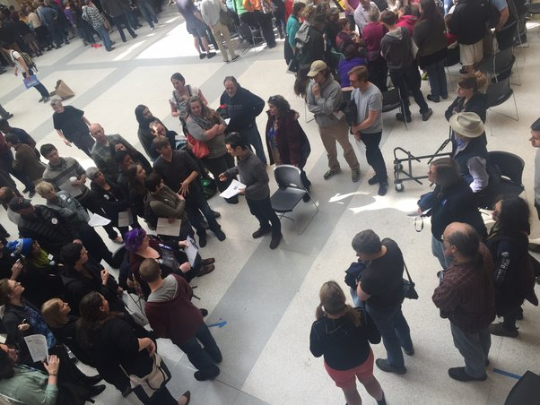

The legislative district level convention was held on April 17th at
Cascadia Elementary. This event was huge. The school hosted delegates in
the 43 Legislative District elected from each precinct, which is
proportional to the number of people who voted in the last election
season. In this convention, my goal is to get enough signatures from
participants to support me to get an official status as a non-voting
observational shadow delegate in the convention on the next level, and
also present another resolution on advancing the [<u>GIX
program</u>](https://www.washington.edu/gix/). I successfully collected
50 signatures, one of which is from a candidate running for 43rd
Legislative District Representative. With the signatures and the
well-prepared resolution paper, we managed to hand it in to the
committee, who is going to discuss which resolutions to pass. Again, I
learned a lot about "working the room" -- I had to practice what I had
to say to convince people over and over again. The feedback people gave
me as I practiced helped me figure out what's important to say for this
matter. I've also learned to not to take rejections personally in such
activities as people have the freedom. It turned out 32 signatures were
collected very quickly with a surprisingly high 98% success rate. See
the picture below.

Below is a picture taken at the convention.

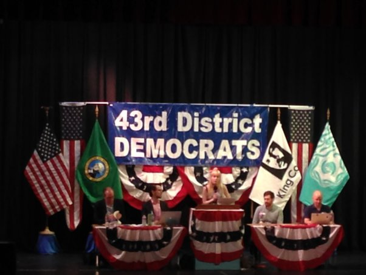

These experiences are truly rewarding, in terms of interpersonal skills
and being an activist. Looking forward, my goal is to go the national
democratic convention in July (which means I'll need to get support from
the conventions on the county level, state level, etc.), observe how
democracy in U.S. works in every detail, and present more resolutions
for good.

Thanks to my friends for offloading a lot of the workload, and a great
deal of planning. I was able to enjoy the fun of it and learn more from
it only because of them.

# **A pint of Arabic Coffee at Cedars of Lebanon Restaurant**

The restaurant sequesters itself just a little bit from the bustling
University Way. The food this restaurant serves, of all the middle
eastern restaurants around the University District, is outstanding. And
the staff is welcoming, giving the restaurant a family feel.

Quite unique among all the foods is the Arabic coffee. The coffee has a
bitter and alcohol flavor to it. Quite thick, too. After I finished the
coffee, the owner was so generous and refilled the cup. I asked what was
in the coffee that contributed to the alcohol flavor. She said it was
Cardamom, with a big grin. I said it was the first time I tried Arabic
Coffee. And I’ll definitely come back, have another cup of Arabic Coffee
and dig into more Lebanese food next time.

Another castle charted on my food and culture map!

# **Mingcong Zeng’s visit to Seattle**

Mingcong is a friend of mine since high school. Now he studies math at
Rochester as a PhD student. He and his wife paid a visit to Seattle and
the surrounding area before heading to Oregon where his advisor is going
to have a birthday party with students and colleagues.

It seems that in academic disciplines that have a strong theoretical
flavor (math, high energy physics theory, theoretical computer science),
protégés of a senior person like to celebrate the senior person’s
birthday by putting together a seminar-like fest, where people, senior
and young, get together to present their work. I like this form a lot;
It echoes the essence of a scholar’s career — bearing intellectual
fruits and academic offspring.

Another thing I appreciate a lot is the passion, intensity and integrity
a mathematician has towards basically everything. Much of mathematics
has not found real-world use; Mathematicians march on regardless, in
pursuit of the pinnacle of human knowledge in its most abstract form.
Because of this abstractness, mathematicians are passionately intense,
as their terse symbolic expressions encode rich information. In fact, in
a very good way, Mingcong literally can’t talk without math at all; He
even proved a theorem on the plane! In addition, the nature of
mathematical rigor entails that mathematicians are extremely honest to
their findings and the gems their predecessors have found/created. This
is something I think every serious academic discipline needs to learn
from the math world.

An interesting story told by Mingcong is that the tiny math circle he
belongs to, namely algebraic topology, cultivates a hippie culture. It
might actually be true for other math communities as well. For example,
I learned that Paul Erdős used drugs heavily throughout his career. And
in the same spirit, people in Mingcong’s circle often like to do
conferences in Oregon, where it’s legal to consume marijuana.
Interestingly, according to Mingcong, back in Rochester, where marijuana
is actually illegal, things can still happen, but in a dodgier way.

There’s a lot more I learned from him during his visit, for example, his
view on the subject he is studying v.s. combinatorics (“ad-hoc”). But
that’s another story for another time :)

# **Memorial weekend trip to LA**

For the memorial weekend, I hit the road to catch up with some old
friends in LA, where we also visited some legendary places that I had
been long waiting to see. I have to share this fantastic journey here to
always come back to later :)

Started the trip on Friday night. Took the I5 due south. After
meandering along the narrow roads in the mountains, I entered the flat
Central Valley by late night. It was a starry night. I parked on the
side of the road to see and breathe. The dome of the sky was a gorgeous
painting on an unreal canvas. The camera just couldn’t do justice. There
were spiral and elliptical galaxies in the distance too…

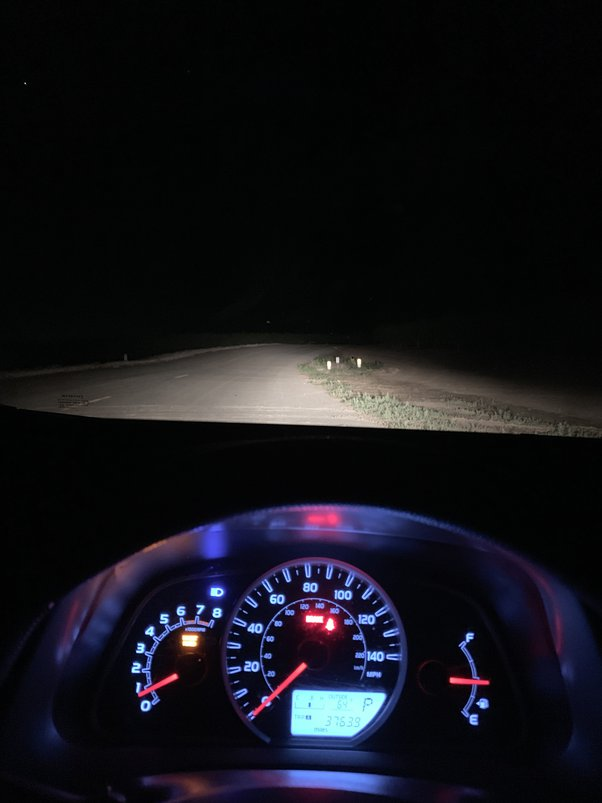

I was trying to reach LA proper by early morning, but was too road worn
at the 1/3 milestone near Firebaugh. So I checked in at Best Western
Apricot Inn, which is a nice little hotel surrounded by palm trees.

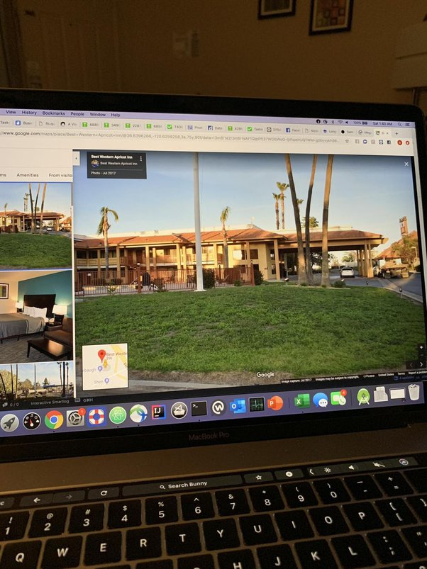

Checked out at around 9 the next morning, after a quick breakfast. A
local navy sailor sit across from me, chatting about his trip to
Washington for Memorial Day.

I filled up my car and entered the ramp into I5 quickly. Finally, I got
to see just how vast and dry the plain is. It’s absolutely an
agricultural miracle how this land produces the green veggies for the
densely populated cities on the coast, and even the world.

By noon, I found myself reaching the end of Central Valley, where the
giant Sierra Nevada and the hilly coastal range converge. The road
visually makes for a fine cut at the junction. SoCal here I come!

Before long, I was already driving down the scenic Jacarandas-decorated
roads accompanied by tall and vertical palm trees in San Gabriel Valley.
Literally minutes away from those old fellows with whom we used to prank
each other all the time 15 years ago, I was too excited to even capture
these purple wonders on the phone.

Finally we met. Kiddos are now all old farts (well, despite someone’s
strong protests :) What’s not changed? That sparkle in the eyes when we
all looked at each other and immediately knew wtf is going on.

Good old times :-)

The late lunch was in Sun Nong Dan, San Gabriel, allegedly a legendary
Korean joint. Mark Wiens tilted his head hard here at the cheesy ribs. I
couldn’t recall how the food was.

Next stop, the legendary Nest Teahouse in Arcadia. The teahouse is owned
by Steven, and the area is Steven’s hood. He took his talents to SoCal
from SoChina 14 years ago, and eventually amassed formidable commercial
dominance here. We couldn’t help but launched a shopping spree for free
:-) The guava tea was fantastic, at the boss’ recommendation.

We were chilling by the store. The afternoon breeze and the bright SoCal
sun in late May were a perfect background. 15 years passed by in the
blink of an eye. Last time we sat together, we were pupils in basic
school uniforms, a generation of Taiwanese singers were in their heydays
with their songs being played around our tiny campus over and over
again, and tropical thunderstorms came and left every afternoon…

This afternoon made me easily feel at home, despite that it’s my first
time coming to SoCal without a tourist group. I’ll definitely come
again, and potentially snatch one of those Jacarandas-y houses and stay…

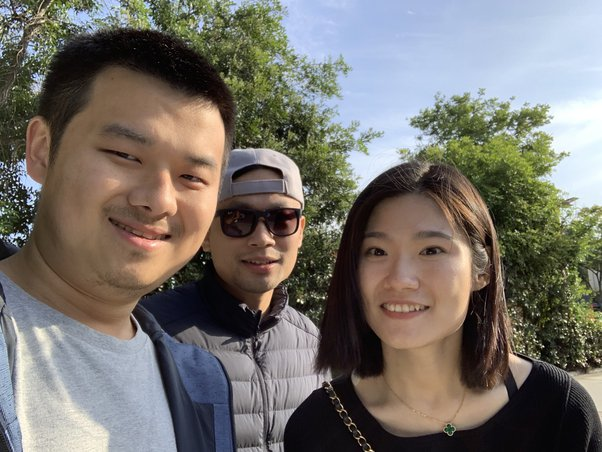

One more thing I couldn’t wait to do before the day ended was to visit
Caltech. Oh Caltech, where so many legends left their footprints.

I got there just in time, and was blown away by the simple elegance.

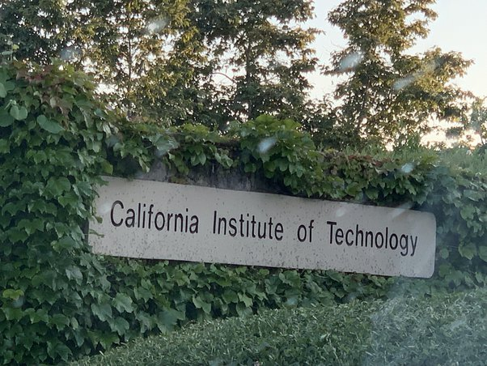

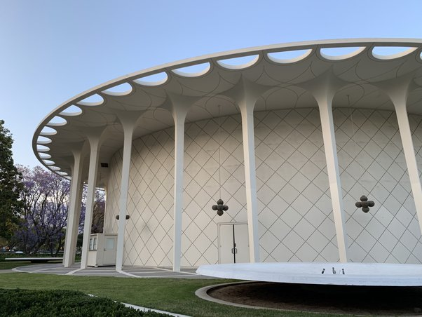

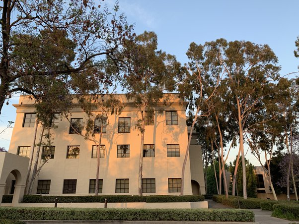

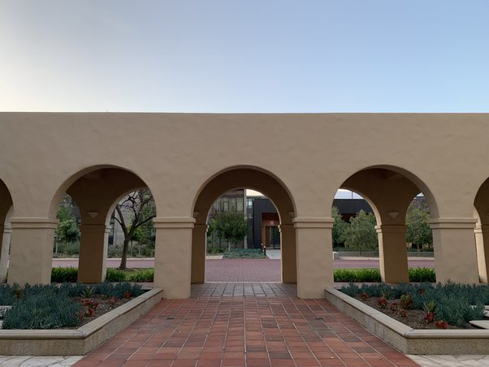

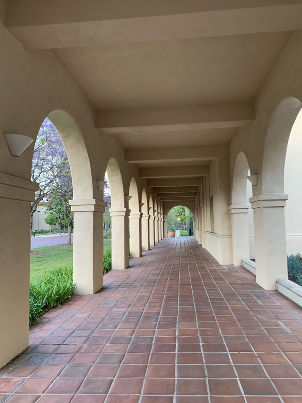

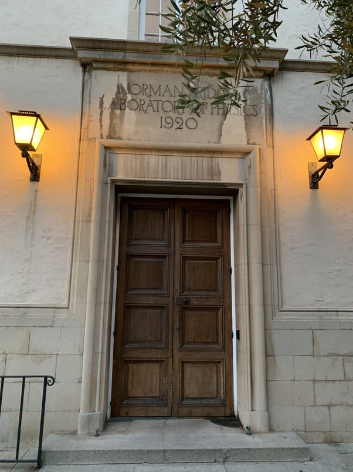

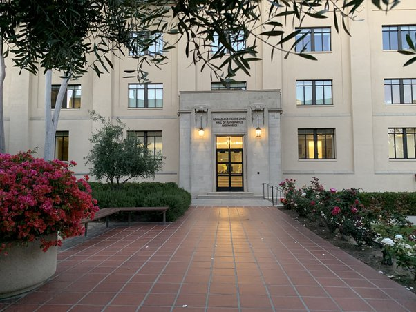

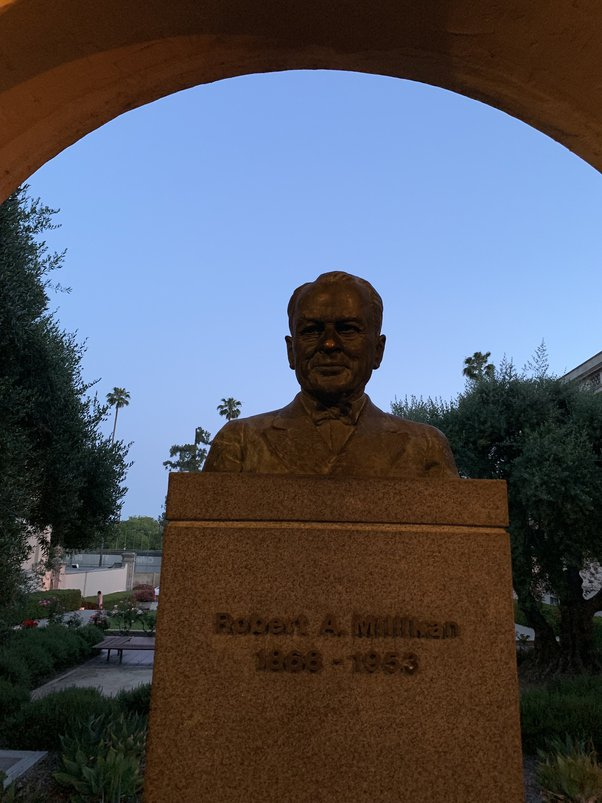

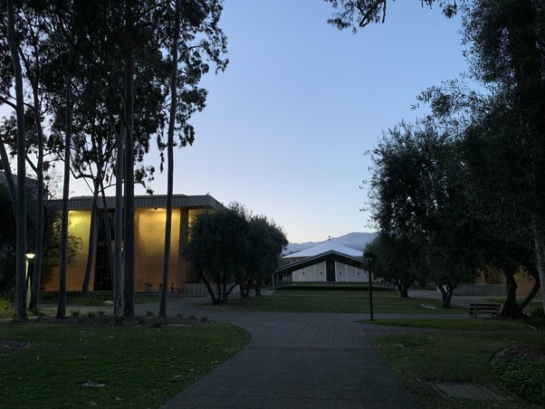

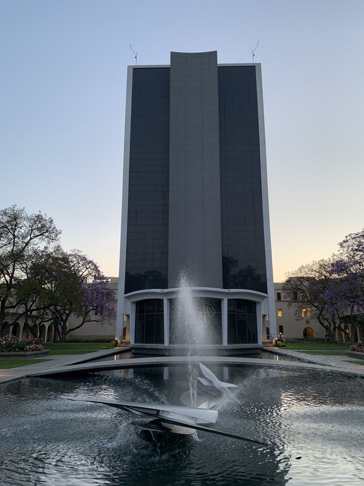

Gell-Mann passed away the day before.

Two students pointed me to the physics building (see pictures above)
which I asked for the direction to. Unfortunately I couldn’t get in.

To the setting sun I heard the birds say

> – Three quarks for Muster Mark!\
> Sure he hasn't got much of a bark\
> And sure any he has it's all beside the mark.

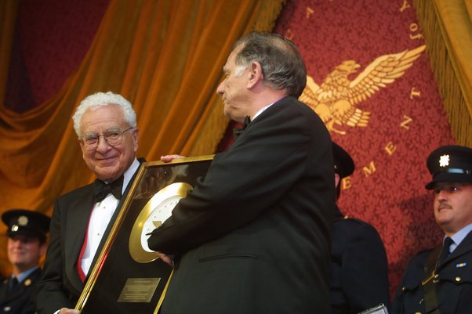

At night, we ventured out to see Staples Center, Walk of Fame and UCLA.
I totally missed the exit for each of the places at the first attempt.
It was truly mesmerizing how complex LA freeways are.

Waking up to a rare rainy morning in San Gabriel valley (The atmospheric
river never fails to locate me) the next day, I headed straight north to
the foot of San Gabriel Mountains. Here I came to find Feynman’s resting
place.

The Big Bang Theory crew visited the grave at night, though the Mountain
View Cemetery is actually open 8am-5pm.

It wasn’t an easy find, but the grounds were well worth a stroll. The
lofty San Gabriel Mountains are right there overlooking the park, and
history is all over the place. By the curb of the Founder’s Lawn rests
the physicist’s restless soul.

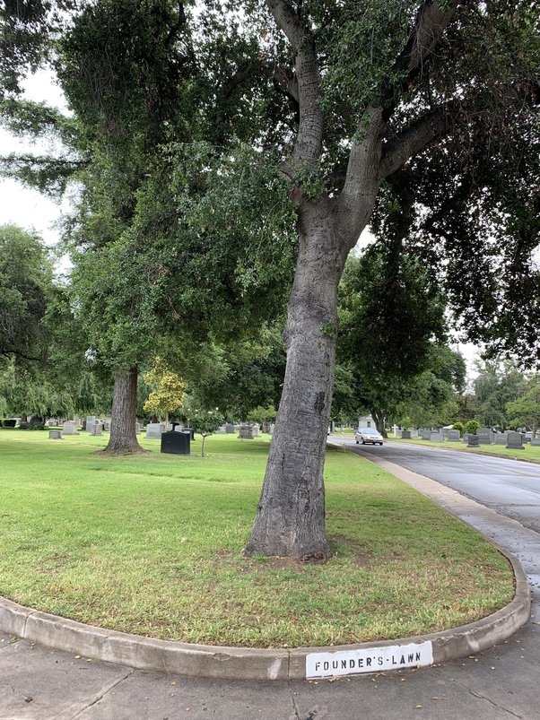

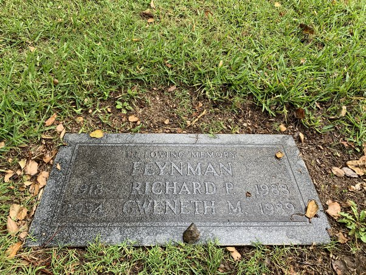

I put a stone on the top.

> No problem is too small or too trivial if we can really do something
> about it.

Could almost hear his words to Koichi as if he was speaking to my
doubts.

A trip to LA is incomplete without living like a local hombre for once.
For this we followed the noses (mostly Mark Wiens’ wise guidance) all
the way to Taquizas Gilberto in West Covina. Man, does the Taco Dinamita
spice up the taste buds. Sí, these are real dynamites, with lamb
tenderness explosions! You could tell how legendary this place is by
just how much local families love to flock here for lunch.

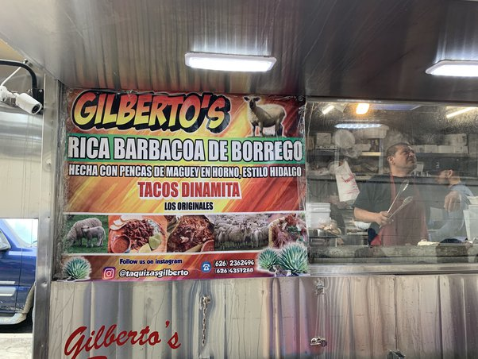

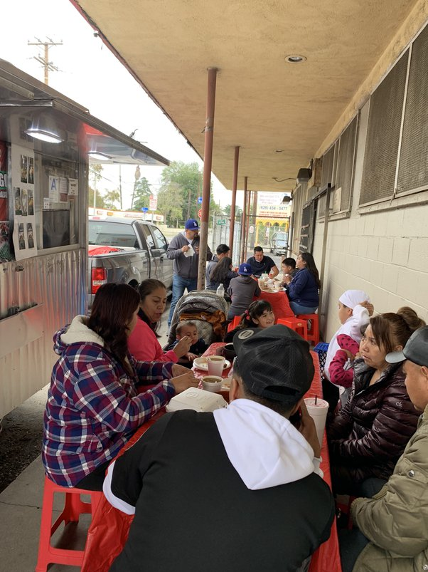

Once the tummy was filled, time for a beach walk, and for randomly
running into some stars!

Not Hollywood stars this time, but pranksters, a bunch of guys and gals
who troll people for a living. They pull practical jokes on strangers,
and sometimes even turn on a full d\*ck mode.

The OG has accumulated almost 10mil subscribers on YouTube. Nowadays
there are a hundred of pranksters following Vitaly’s blockbusters in one
way or another.

One thing they all do: “disturb the peace” at Venice Beach — that’s why
I had to visit where legends roam — indeed, a lot of the classics/crimes
were born/committed right here on the beach, for example:

\(1\) main street

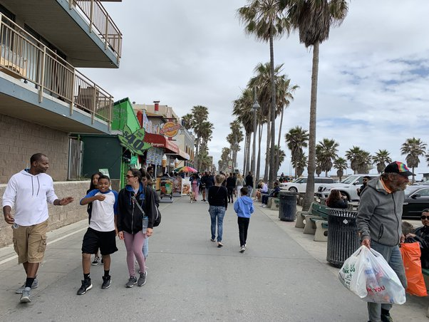

prank featuring (1): [<u>Disturbing The Peace Part
10</u>](https://www.youtube.com/watch?v=CDT2JNjN3FQ)

\(2\) basketball court

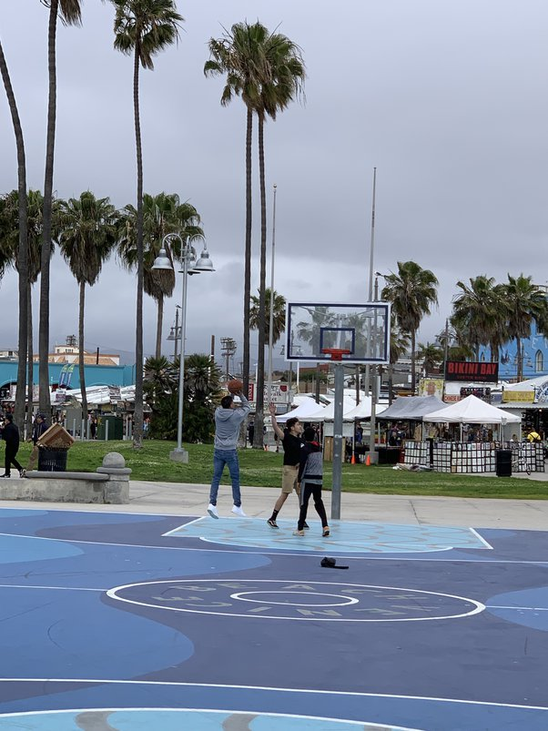

prank featuring (2): [<u>The Professor vs Pro Competition at Venice
Beach.. DESTROYS 6'3"
hooper</u>](https://www.youtube.com/watch?v=8KBzT4WLmWM) (not a prank
but meh)

\(3\) another basketball court

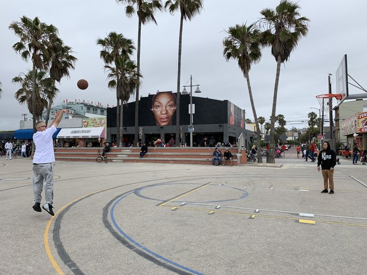

prank featuring (3): [<u>NERD PLAYS BASKETBALL AT VENICE
BEACH!!</u>](https://www.youtube.com/watch?v=J1JwJhhAeag)

\(4\) police station

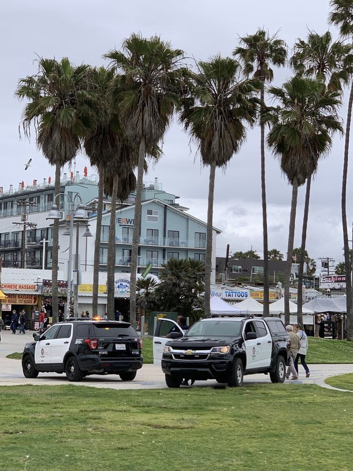

prank featuring (4): [<u>Coke Prank on
Cops</u>](https://www.youtube.com/watch?v=bLeHQFBMtmk)

\(5\) shower

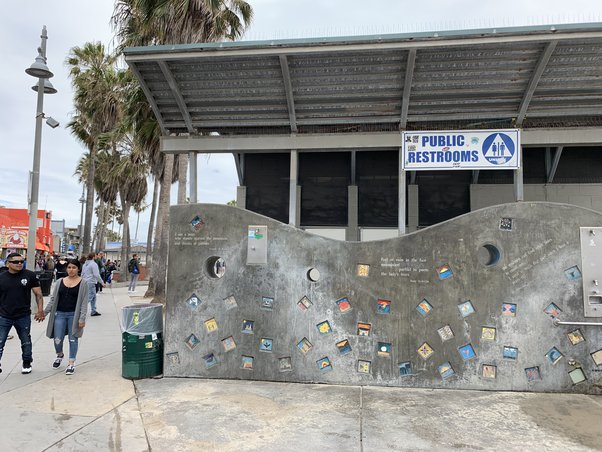

prank featuring (5): [<u>SHAMPOO PRANK PART 7! \|
HoomanTV</u>](https://www.youtube.com/watch?v=oVm7FkQI4BM) (not the same
location)

\(6\) skatepark

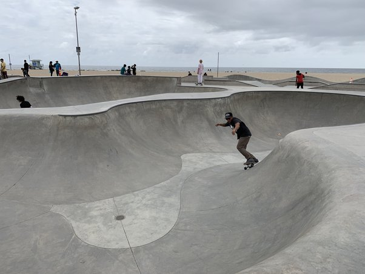

prank featuring (6): [<u>Cutting Skaters Off Wearing
Heelies</u>](https://www.youtube.com/watch?v=upqsg0t-oCw)

\(7\) another skate boarding field

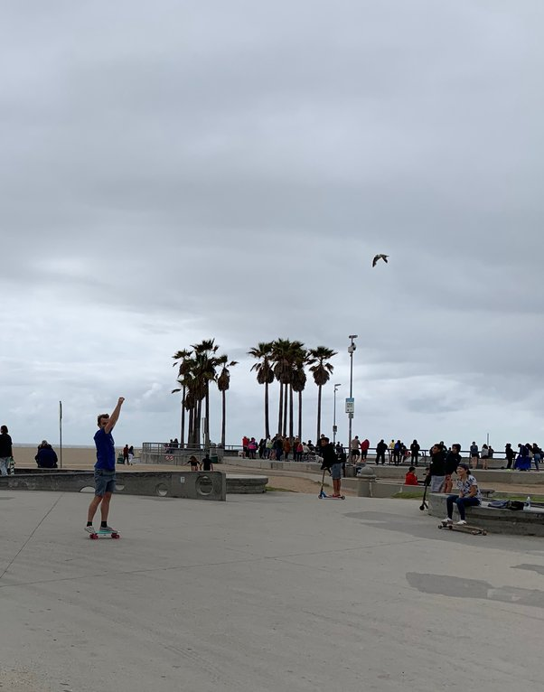

prank featuring (7): [<u>Popping a Boner in Public
Prank!</u>](https://www.youtube.com/watch?v=j9MT3pMMgjw)

\(8\) beach volleyball

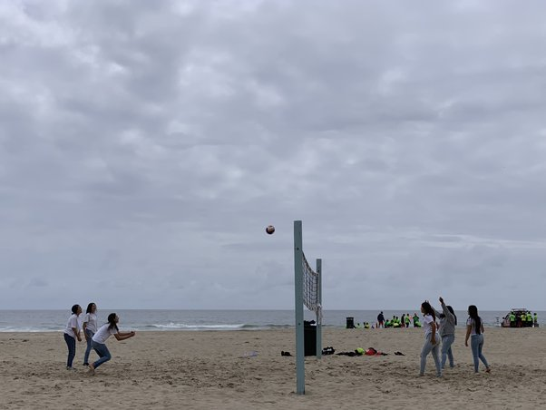

prank featuring (8): [<u>Spider Man Gets Knocked Out At The
Beach!</u>](https://www.youtube.com/watch?v=hz0LAraeY-I)

The stars didn’t seem to be on duty today, but otherwise what a lively
beach on yet a gloomy day. Two Jamaican accented dudes tried to collect
donations from pedestrians with their reggae CDs. I took a CD and said
“bredren, for free? respect”. They were like “stingy Koreans!”

There are other cool stuff to see too, some with a Memorial Day theme:

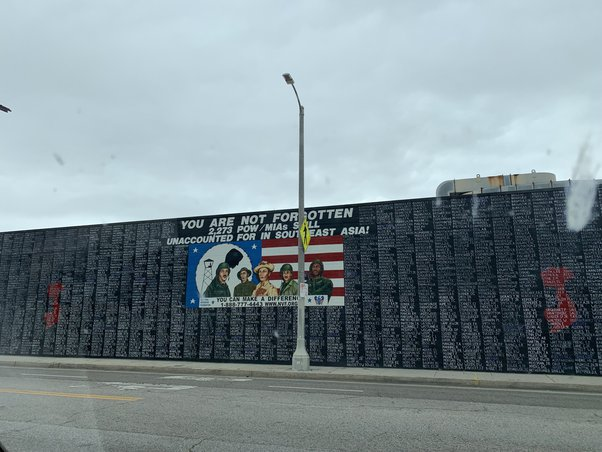

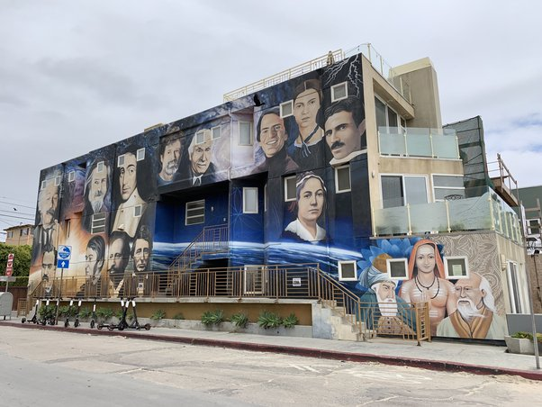

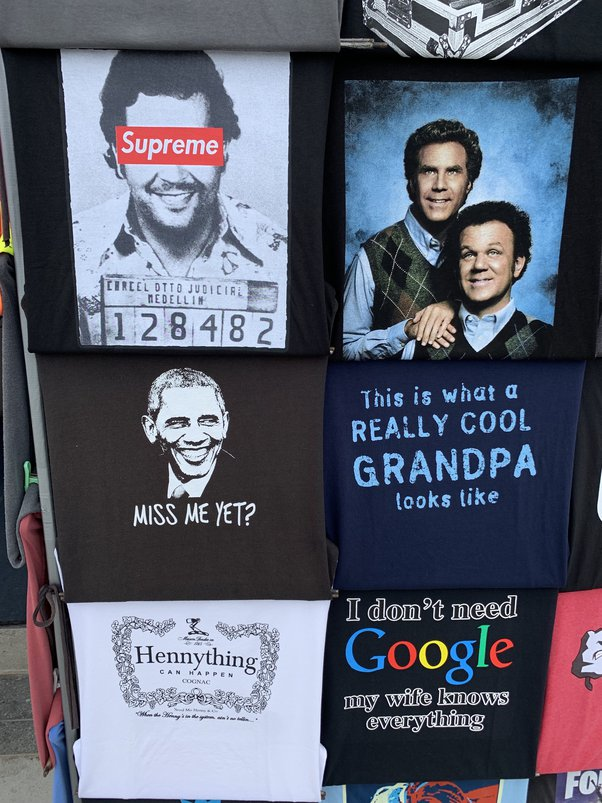

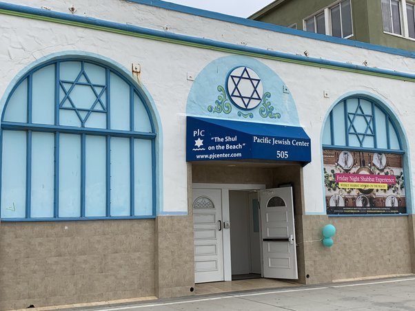

Mission complete.

It was 4pm, time to say Goodbye. Old fellows added: “drive safe!” So I
hit the road.

Detoured for facebook LA before a grand adventure. The MPK badge
surprisingly didn’t work. There was a security guard there, but he
wasn’t able to swipe me in with his badge either. Was able to connect to
the company WiFi nonetheless.

The guy was not only a security there. He also just started running ads
on fb repairing and selling phones. He eagerly asked me to help promote
his ads upon knowing my job. So I took the link to the ads he ran, and
took this picture:

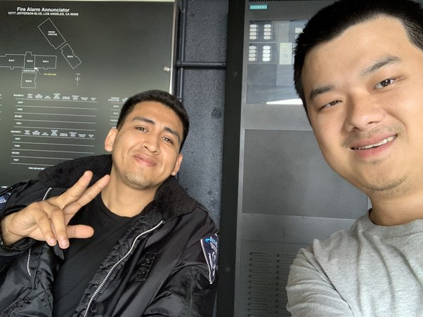

Now let the grand adventure begin: back home via State Route 1!

The towns along the road reminded me of some beautiful songs:

\(1\) LA: [<u>Rap Song in 6 Different
Languages</u>](https://www.youtube.com/watch?v=HRLMDeF7x9Y)

\(2\) Malibu: [<u>林子祥 without the two of
us</u>](https://www.youtube.com/watch?v=JVn8IT-nJCA)

\(3\) Santa Barbara: [<u>U2 - California (There Is No End To Love) Lyric
Video</u>](https://www.youtube.com/watch?v=QVRw_m9cDFw)

It was actually stormy in Malibu. Then at the turn of Point Mugu, the
sky magically cleared up. Channel Islands entered the sight, like two
mythical creatures lying on the marine surface. By Santa Barbara, the
sun was fully out. I couldn’t resist getting off Route 1 for a bit and
visiting UCSB for the first time.

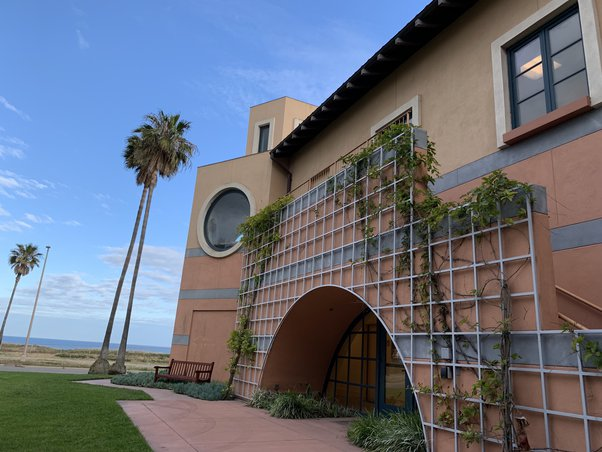

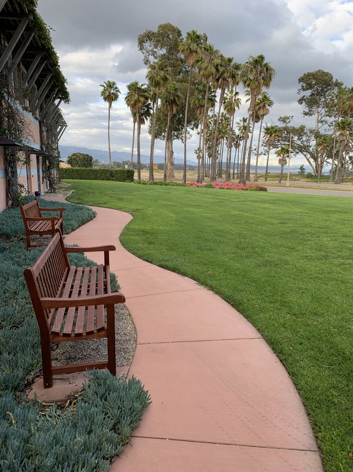

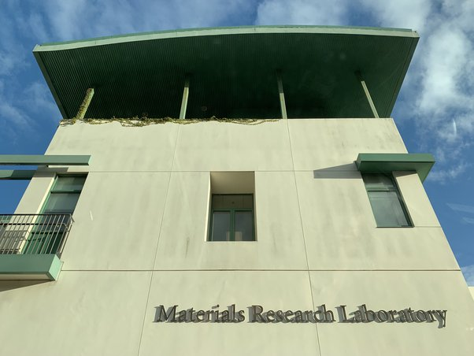

The beautiful sunset escorted me all the way to Gaviota, where Santa
Ynez Mountains finally took control of the landscape, extending into the
pacific, fencing the sandy south off from the rugged central coast.

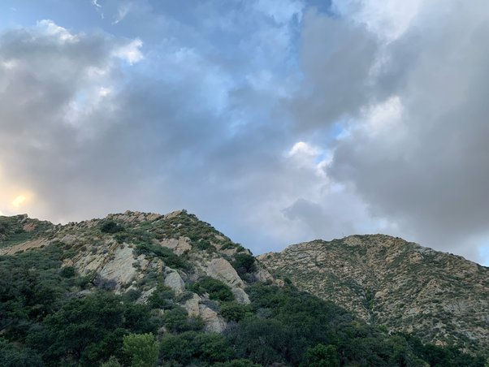

Take care now, SoCal, land of jacarandas, palm trees and dear friends!

# **The most expensive Somali meal**

I enjoyed a Somali meal for \$193 today. The price and the diner were
both eye opening. Here’s what happened.

My rental car got towed for parking at a bus stop. So I had to uber to
the impound lot and pay \$138 for the towing (a fine of \$45 was
supposed to be paid separately to the city government). It was the first
time for me to have a car towed. An associate working at the impound lot
joked that it would definitely not be the last :)

At the exit of the impound lot, there was a guy checking receipts. As I
showed mine to him, I noticed that he has East African complexions. I
read from somewhere that there are a fair amount of Somali immigrants
here in Minneapolis, and since had been on an eager lookout for a Somali
experience. Not quite sure if he was one, I asked for his recommendation
for Somali restaurants and food anyway. Luckily, my guess was on target.

“Karmel Mall!” Ali responded after some pondering. Ali was his name, and
he seemed just as curious as I was: “why are you looking for Somali
food?!?” I explained how I heard about the Somali community here. Ali
bursted out laughing, thought for a bit, and then came up with two more
recommendations: “ask for chicken rice at Quruxlow; if they don’t have
chicken rice, ask for a menu, and you can just order anything on the
menu! Also go to Deg Deg”. He wrote down the two places:

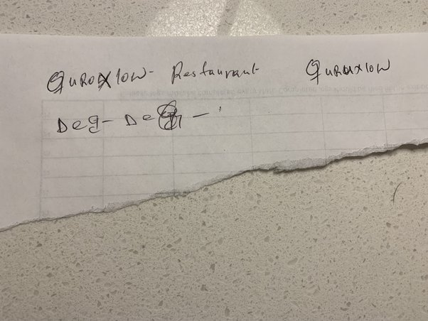

After thanking him, I headed straight to Karmel Mall. Near the
destination, the demographics suddenly shifted, from Scandinavian
looking white, to East African looking black, men wearing white caps and
white robes, and women wearing *guntiino* with hair covered.

Somali written in Latin alphabet could be seen everywhere in this
neighborhood (also officially in Somalia and Somaliland). The mall’s
name written in Somali alphabet appeared to be Suuqa Karmel. The
exterior of the mall was all painted azure, and there was a date tree
along with a traveler with two camels portraits on the wall.

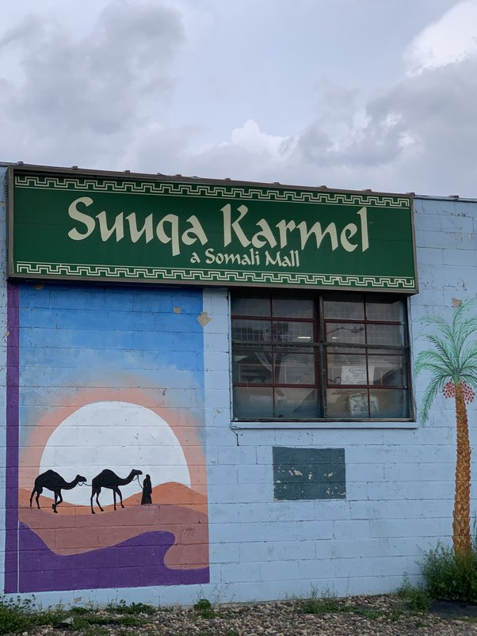

Outside of the mall, there were still Walgreen’s and Popeyes’ that
remind people this is not Horn of Africa. It was a drastically different
world inside. I was likely the only non-Somali there. Everyone was
looking at the new comer.

I got kind of scared, so I walked directly to the counter of the closest
stall from the entrance. With my mind fixated on just trying to get some
authentic food, everything should go fine, shouldn’t it?!?

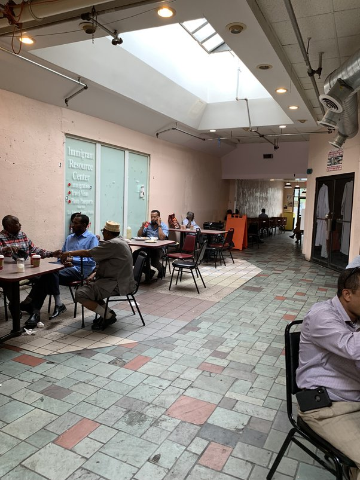

Luckily, the owner of the stall was quite friendly. I asked for chicken
and rice. He said cheerfully that they only had chicken and pasta, and
pointed me to the nearby tables. Everyone had two plates on the table, a
plate of fried chicken thighs, and a plate of pasta.

That’s it! Couldn’t go wrong with chicken and pasta. So I ordered it up.
The owner also offered me a bottle of water. “Enjoy.” He served the two
plates in no time, and gave me a small cup of green chili sauce. The
total price was \$10, and this included three, giant, drumsticks.

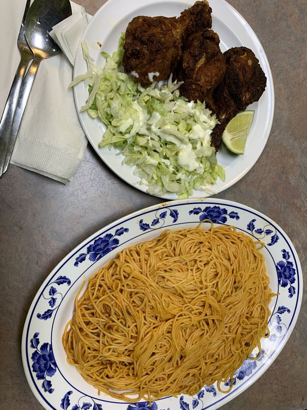

Below are some more photos taken inside the restaurant:

\(1\) the menu

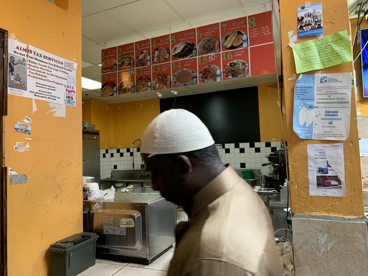

\(2\) the guests (did I just see Draymond Green and Tracy McGrady?)

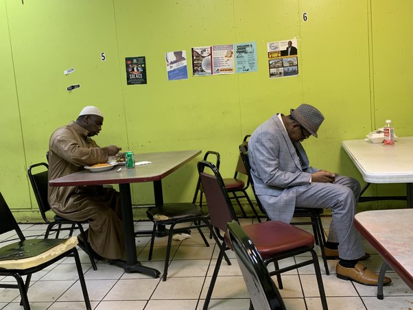

\(3\) the chinese broadcasted CGTN

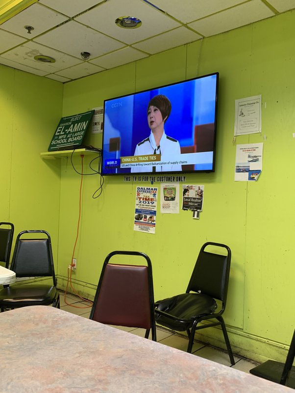

I was curious as to why a Chinese program was played here. Does China
have a huge presence in their native countries, just like China does in
some other African countries for construction and commerce? I don’t know
how much the balkanization of global supply chains would affect lives in
Somaliland and Somalia, but I think these war torn places wouldn’t want
a balkanization of the land after the Italian and British colonialism.

It was a decent meal. The pasta was warm and tomato-y. The chickens were
fried to a right degree. The sauce was on point. It was really stomach
stretching, and it was worth \$138+\$45+\$10=\$193 (not including uber)!

After the meal, it was thunderstorm o’clock. This thunderstorm was
forecasted even 4 days prior to its imminent materialization. Almighty
Midwest clouds all rolled in to smother the town like I had never seen
before. The edges of the clouds were sooo elaborate.

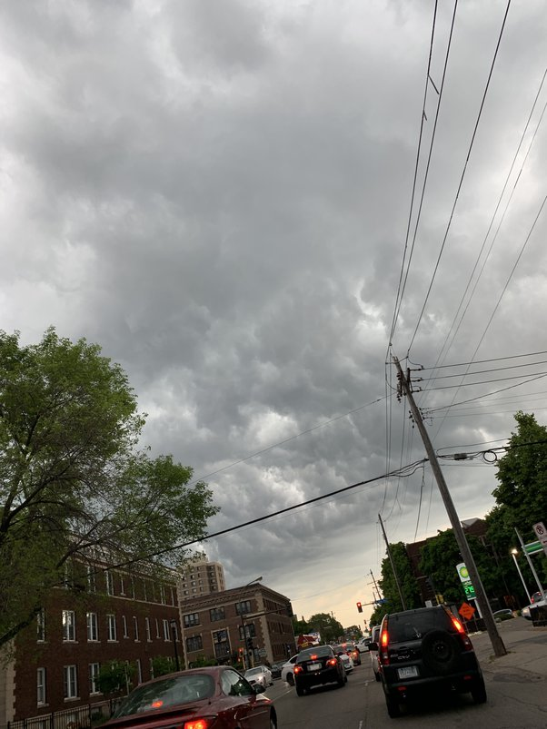

Time to rush back before the first drop!

# **NAACL week trip to Minneapolis**

The highway system is complex just like the freeways in LA, whereas
Seattle and Bay Area — situated on an isthmus/a peninsula — only admit
of one or two major freeways. It’s easy to get lost without a gps device
here. Highway traffic here is too polite. People are too disciplined to
overtake, speed or illegally occupy the carpool lane. Talk about the
madness on 101 in Bay!

Speaking of the people in twin cities. In my experience, the locals are
nice and crude, very much unlike the shrewd techies in Bay or Seattle.
Restaurant services here are direct, homey and unsophisticated. People
acknowledge the existence of one another in elevators. There is a
community feel to the few neighborhoods I explored by the u of m campus.
Old folks gather to listen to live country music as the sun sets. People
bond over lake fishing. Small lakes abound everywhere I go. Elementary
school kids are very active and seem to enjoy hanging out even under the
burning sun or simply throwing a football around. I didn’t find people
passive aggressive like in Seattle, or stressed out like in Palo Alto.
The city embraces the giant Bob Dylan mural in the heart of Minneapolis.
And people seem to go to churches. At least, majestic and grandiose
churches, cathedrals and basilicas are everywhere.

And then there’s Mississippi River. Ever since I read Tom Sawyer when I
was a kid, I have been fascinated by this river. Finally seeing it,
although much farther north from where the story took place, although in
the 2010’s, I was still feeling transcending the modernity, back to the
mid 1800’s.

I had interesting encounters with a few unique communities in the Twin
Cities. On the first day there, I went to HmongTown Marketplace. It was
pretty much like a small town back in rural Hainan. The attires, snacks,
decors and everything else were basically the same. Then there was
Karmel Mall in a Somali neighborhood, where [<u>The most expensive
Somali
meal</u>](https://anglil.quora.com/The-most-expensive-Somali-meal) got
consumed. One midnight, troubled by the yearning stomach, I dashed to an
Ethiopian restaurant only to find it was packed with Ethiopians relaxing
in there. The crepe they served was sour and fluffy, and the beef was
oily and spicy. Quite a unique experience. Then there was this
Scandinavian ambiance everywhere. Although these northern European
immigrants have long integrated into the general American culture, there
are still traits of these communities that I found unmistakably
Swedish/Norwegian, notably the windows framed in dark brown and the
light blondness of the locals. Finally, the local signature dish — Jucy
Lucy — was a dime. I ended up going to each of the top three places
recommended by a youtube channel .

It was summertime. Hot air with high humidity was the theme. I’m quite
accustomed to this as I grew up on an east coast. Being back in this
weather gave me a sense of reunion with an old friend. Where there are
now flies, grasshoppers, mosquitos and the lush greenness, it was all
bleakness and snow just 2 months ago — the existence of 4 seasons can’t
be more brash. It was with this summer-ness that I loitered about on the
u of m campus. I stood by those old fashioned academic buildings, and
chilled on the unseasoned green meadow by Mississippi.

Below are some pictures I took, with some commentary.

\(1\) Hmong town market place

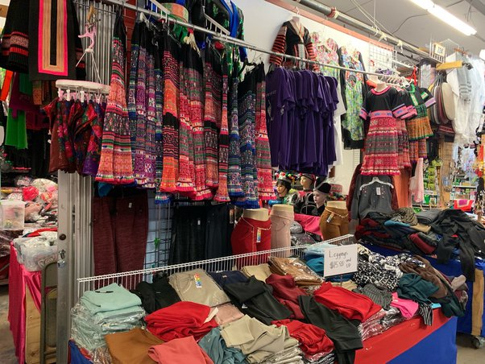

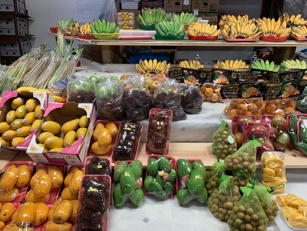

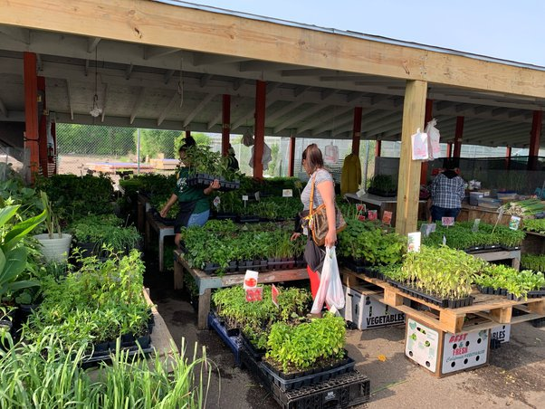

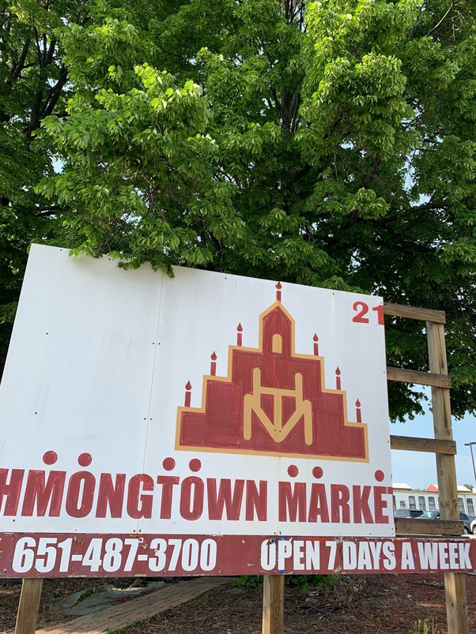

Very curious to see how the Hmong community down in Fresno compares.

\(2\) Chinese Cambodian food near the Hmong town

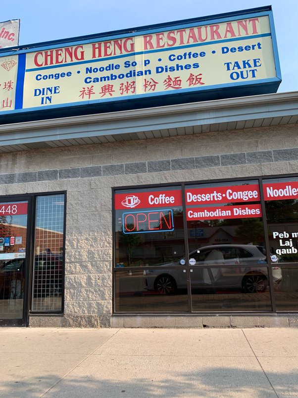


Not unlike Thai food, with a Chinese kick.

\(3\) Cathedral of Saint Paul. The catholic feel of St. Paul came across
very differently from the primarily Protestant Minneapolis.


“Life starts when the church ends”.

\(4\) A dose of jucy Lucy at matt’s Bar and grill, the birthplace of the
cheese-in-a-beef-patty burger.


It is a classic. Everyone orders it, with a “pop” (carbonated drink). A
working clock on the wall was going through one second at a time in
1998, precisely 21 years from now, as a reminder that “it’s not miller
time until you’re 21” :-)

\(5\) Holy Rosary church, in solidarity with the Ramadan observing
brothers.


It’s a church where the Dominicans hang.

\(6\) umn’s nice campus on the north shore of Mississippi


The student body is quite homogenous. The honor of scholarly excellence
glows everywhere. I liked the scholars walk a lot, a half mile long walk
celebrating the awards and discoveries of the faculty and students.

\(7\) late night Ethiopian staple


As said earlier, exotic, savory, oily and sour.

\(8\) the downtown core, reminding me of back bay Boston — stadiums,
churches, businesses and parks.


I did try not to use a gps for navigation, only because of this omni
present Hennepin Avenue united Methodist church.

\(9\) the nook, another classic place to devour a juicy Lucy


Simply delightful.

\(10\) lake phalen — visiting Minnesota without going to a lake is
impossible.


This lake is almost exactly a mirror of green lake of Seattle. The
shape, the view and the surrounding area can’t be told apart with casual
eyes. It was here where live country music attracted a huge crowd until
dark.

\(11\) the Finnish bistro, just an outlet of the otherwise hidden
Scandinavian substrate.


The meal was kind of dry, but the service was A+. A band made up of
neighbors and friends was playing inside, harmoniously. Came for the
cultural experience, and was definitely not disappointed.

\(12\) Minneapolis institute of arts. This is another highlight of the
trip. Naacl Tuesday night party was held right here. So many Chinese
gems that only appeared in middle school arts textbooks were on display
here. I was pretty excited to see and was amused by the story telling
ceramic figure from eastern Han (“figure of a squatting drummer”).


These Middle Eastern, African and western arts are certified beauties
too. Being lost every once in a while in arts was refreshing.

\(13\) so long, Minneapolis!


\[1\] [<u>9 Juicy Lucy Cheeseburgers in 9 Hours. Which is the Best? \|
Bon Appétit</u>](https://www.youtube.com/watch?v=UYmjwE5D1h4)

# **Thanksgiving trip to LA and SD**

Thanks to Quora for bringing back its blogs (rebranded as spaces).

Ever since the [<u>Memorial weekend trip to
LA</u>](https://anglil.quora.com/Memorial-weekend-trip-to-LA), the
jacaranda blossoms, the towering Mexican fan palms, and the all around
awesomeness of LA have been seeded in my head, hollering for a revisit.
So, when’s the next trip to SoCal?? — the Thanksgiving weekend! With my
cousin Sue, and our friend Janet.

It’s no jacaranda season this time around in late November / early
December, but what’s perpetually true is the rain — rainy, weather, in,
LA! Back in late May, I was extremely *fortunate* to catch the very last
rain of the season in LA (it was down-pouring in Malibu!). On Wednesday
night, November 27th, after a prolooooooonged dry season, I, was
formally inducted into the rain sucker hall-of-fame by being baptized
with the first rain of the season on the entire road trip from Bay via
I-5 to LA. God of rain never ceases to amaze me with her timely
blessings.

Well, l’m sorry, fellow travelers, that you had to go through this
sprinkling-to-stormy surprise. The fun, however, was not slightly
dampened on the road. Janet and I took turns to steer southerly, so none
of us got worn out like I was last time on the road. Sue took charge of
heading our music department — Her inexhaustible music list rocked up
the car non-stop. Spotify and the gradual showdown of our varying
degrees of singing talents obliterated the sense for the passage of
time.

Starting the trip at 6pm in Bay, we arrived at our airbnb in Encino at
around midnight, just north of Hollywood. Not long after we arrived, I-5
was closed as snow started to
[<u>pound</u>](https://www.latimes.com/california/story/2019-11-28/interstate-5-through-the-grapevine-closed-by-snow-as-new-storm-pounds-southern-california)
the Grapevine area. At least Tyche/Fortuna didn’t completely ditch us.

Next morning, first thing we knew, the vast San Fernando Valley was
spontaneously cast over the balcony, into our first impression of the
southland, generously with the entirety of its landscape. Gloomy it
still was, the fresh air accompanied by southern charm glowing from the
palms near and far started us off.


On Thanksgiving morning, not a single soul in town seemed to be in a
hurry. We put the exhausted car to work, driving down the hilly roads on
the foothills of Santa Monica Mountains, due Blu Jam Cafe.

At around 9am, the restaurant was already packed! On the inside, a line
that never seemed to shorten was full of holiday morning chit-chatting.
Seeing no chance of getting a table soon, we decided to move on.

Shortly, we found ourselves in this old-fashioned delicatessen named
Jerry’s. It was a place with a full-on menu and an army of loyal senior
patrons. From sandwiches to tacos to omelets, everything looked worth a
try. While the girls got themselves omelets, and sausage and cheese
scramble, I ordered up a corn beef sandwich. The tender meat and the
whole wheat bread reminded me of Katz on the Lower East in Manhattan.
Not bad!

After the breakfast, we headed for the Beverly Hills Sign. An upscale
neighborhood full of celebrity residents, Beverly Hills centers around
Beverly Gardens Park, where the Beverly Hills Sign stands. We took
pictures of this nice place, did some touristy stuff, and then found a
hip cafe nearby called Alfred Coffee, where we took a coffee break, and
continued the touristy activities, joining other tourists in the room
(e.g. posing with a coffee mug that has the name of the place on it).

The Grove, a huge shopping mall, was not far. As the touristy spirit
wore down, the thanksgiving shopping spirit buoyed up. When we got to
the mall, most of the shops were still closed due to the holiday,
quietly waiting for a large influx of customers on Black Friday.
Fortunately, we did find and end up buying nice things in a few of the
shops that were open.

Heading west til the end of the historic U.S. Route 66, we reached the
Santa Monica beach. The stratified coast dotted by the palm trees of
varying heights in the background struck me with its wild beauty.


We strolled along the beach, excited by the turn of weather, from the
pacific gloom that drifted from near Hawaii, to one that has blue cracks
between the clouds, and a rainbow vivified by the fresh sunshine.


There are exercise equipments for calisthenics installed on the beach
since the 1930’s, making the beach also known as [<u>Original Muscle
Beach</u>](https://www.santamonica.com/original-muscle-beach-santa-monica/).
We enjoyed the enjoyment that other “sportive e sportivi” had with the
equipments and the surrounding nature.


And who am I to step back from the challenges? We flexed some muscles
too.


Well done! Keep on building your body and mind!

Later we visited the Venice Beach again, revisiting all the fun spots
where those classic pranks took places (documented
[<u>here</u>](https://www.quora.com/q/lxsbbufyxgfyypve/Memorial-weekend-trip-to-LA?ch=10&share=71194b97)).

As for the Thanksgiving dinner, we ended up returning to Beverly Hills
for a classic turkey meal, which included delicious roasted turkey
slices with a pumpkin sauce and caesar salads. As local friends informed
us that we’d find turkeys only in people’s homes on this special night,
who would know that there was still this restaurant that was open,
serving turkeys to a huge festive clientele? Luck was again on our side.

Next morning, we were greeted with the return of SoCal’s beautiful sun —
No words should describe the rejoice — I couldn’t help but took a
picture at the same spot on the balcony. With yesterday’s depression out
of the way, we were off to a colorful start with a full schedule ahead.


For breakfast, we met up with my friend Steven at Lunasia Dim Sum House
in Alhambra. Steven treated us to a dim sum feast! — The fried rice with
chicken and salted fish was one of the best I had ever had, and there
was a lot of other food we were unable to finish and had to take away.

Steven’s boba tea shop was the next stop. Me and Steven picked up where
we left off in May, this time walking Sue and Janet down the memory lane
of a 15-year friendship. There, we were also happy to learn that
Steven’s franchise was adding another branch in SoCal, with plans to add
shops to cover Bay Area in the future. Bravo!


For lunch, we met up with my friend Wen at Ho Kee Cafe in San Gabriel.
Wen was an intern on our team over the summer. Both of us share a
passion for machine learning, physics, soccer and basketball. Towards
the end of his internship, we went on an excursion to Half Moon Bay to
capture the magnificence of the milky way in the evening sky.

Lunch was a one-man devouring of Wen since the rest of us were full. As
he finished the delicious-looking roasted duck, we went on a tour on the
campus of Caltech, where Wen studies. Touring Caltech was a bit
emotional last time, as the revered Caltech physicist Gell-Mann just
passed away. This time, the tour was super chill and educational, as Wen
showed us around his department building, Moore Laboratory, which I
wasn’t able to access last time. I loved how much history of human
engineering endeavors this building carries, including these aged
strings that demonstrate the never-aging Viterbi decoding algorithm:


We also saw

- a steel cannon that symbolizes the rivalry between Caltech and MIT,

- a pond full of turtles by the library,

- the numerous laboratories in the EE building that host sophisticated
  experimental devices and equipments that I may use to know how to use
  once upon a time,

- the place where press conferences for the newly minted Caltech Nobel
  laureates were held, and

- the nice grad student dormitories that look out on the lofty Mount
  Wilson Observatory.

We waved goodbye to Wen as we embarked on our next journey to somewhere
utterly stylish and glamorous. Will see him soon upon his return to the
workplace, and will see Caltech soon, a place I always feel a strong
connection to, for her sheer elegance on the outside and the hard
engineering core on the inside.


Next, for the utter styles and glamour, we showed up on the neon chaos
of Hollywood Walk of Fame, right before the sunset. I believe “LA LA
Land” couldn’t be experienced better elsewhere than Walk of Fame. Here,
one can find all the familiar names on the sidewalks. For example, Sue
found her idol Britney Spears.


And we found the “best cousin” trophy in one of the souvenir stores
(“Galaxy Mall”), and righteously entitled ourselves to it.


The starry ambiance of the place coupled with floods of tourists from
all over the world gave this place an otherworldly feel, where the sense
of reality gradually faded away behind the neon signs, and every
stranger’s personal life stories relating to the certain works of this
giant entertainment empire flashed back, as name upon name of the stars
passed through…

Later that night, we circled back to the Grove, finally enjoyed the full
capacity of it on this Black Friday, by elbowing through layer upon
layer of people, and by truthfully and solidly exchanging dollars for
goods. We were especially happy to have purchased some comfy shoes from
Athletic Propulsion Labs’s first retail store.

Earlier, we went to another shopping district called Melrose, featuring
loads of independent designers’ stores, in contrast to the Grove’s large
department stores. However, it looked like every artist closed down her
store by 7pm, by which time we didn’t even finish the Walk of Fame. So
be it. We’d be back tomorrow.

The dim sum brunch and the tidbits of roasted duck were all digested
particles, by the time we finished the Grove business. We decided to
have a late night dinner at a legendary hot dog joint - Pink’s,
coincidentally, back in Melrose. What a place - it has a wall full of
photos of the owner with different celebrities. And I was drooling over
literally every item on the long menu. The Chicago Polish dog finally
won my heart. We ordered up 2 Polish dogs. One bite and one will
transcend over to a meat heaven.


The third morning arrived, with an exciting tour to the Warner Bros.
Studio Tour awaiting. Clear weather; right on time; everything ready
(even contextually, as we watched Annabelle the night before — over
light wine, at Janet’s persistence — to get sufficiently hyped up for
the tour next day); off we go!

Warner Bros. studios are next to Universal Studios, across from the Los
Angeles River. The studio tour features the tour of, well, the studios
of all those beloved movies and shows produced by Warner Bros. As huge
fans of a lot of Warner Bros’ movies as we are, we were here especially
for the studios of f.r.i.e.n.d.s. (Sue’s favorite), the big bang theory
(accompanying my college years), The Ellen Show, and, well, Annabelle.
And this tour wasn’t at all disappointing, with a decent coverage over
all these shows:

\(1\) Outside the studios


\(2\) Inside the studios


\(3\) Ellen Show, The Big Bang Theory, Annabelle


And to my huge surprise (and great ignorance), National Treasure and
Harry Potter were also filmed by Warner Bros. I like the National
Treasure series for the plots and historical contexts, and I like the
Harry Potter series, just like hundreds of millions of other people. I
don’t think the Harry Potter series is particularly for “young adults”,
as what bookstores and libraries categorize the series to these days; I
think the story can be equally adored by people of all ages; and I hold
that J.K. Rowling deserves a Nobel Prize for writing Harry Potter.
Anyway, here are sample pictures we took at the respective studios:

“Resolute Desk”


A smiley “Avada Kedavra”


For lunch, we went for roast fish, which Sue had been long craving for,
in the east burbs of LA, with a high concentration of Chinese
immigrants.

Before Janet had to leave for Vegas that night, we went back to Melrose
again despite yesterday’s defeat, and we were happy to find out that the
stores were all open. A serious shopping spree ensued.

According to our plan, the next day was supposed to be when we would
drive to San Diego in the morning as soon as we checked out at the
airbnb in Encino. However, a trip to LA would be incomplete had Griffith
Observatory been missed. We didn’t waste this opportunity, as both of us
decided to trek up to the celebrated observatory, from the Greek
Theatre. The signature Hollywood Sign was clearly visible from the hill
top in one direction, and the cluster of skyscrapers in downtown LA was
also within sight in another direction.

Inside the observatory, there was a lot of educational stuff, with
explanations using the underpinning basic physics. I found the myriads
of meteorite samples on display most interesting. Not gonna lie: it was
so awe inspiring to see stuff that came from outer space, stuff that we
wouldn’t be able to see perhaps even in one’s lifetime. There was also a
section that describes how to recognize a meteorite on earth:


We were no expert in any of the related subjects, so all these nuggets
of information regarding meteorite recognition were new and fun.

By the end of the observatory tour, we came across this gift store right
next to a cafe named “cafe at the end of the universe”. I thought it was
a great name for a cafe. Also, in the gift store, there were actual
meteorites on sale, tens of dollars for a nail-sized piece. I imaged
that meteorites could be a fantastic present for a romantic partner.


It was in little dispute that in SoCal, if you were to eat sushi, go to
LA, and as for tacos, go to SD. Well, we didn’t wait until we arrived in
SD to have conned some tacos. Actually, right before Griffith, we
stopped by this little Mexican spot on Sunset BLVD — Tacos Delta — for
tacos. The al pastor tacos were juicy and flavorful, and the tortillas
were fresh and tender. The seafood soup they served was a bomb — loaded
with large chunks of seafood. One bowl of soup and the energy for the
day was all set, plus some surplus for the contending seagulls by the
table.


With this little expedition in the morning accomplished, we were ready
for San Diego. At around noon, we headed off to I-5.

A few years ago, my first impression of I-5 as an interstate highway was
that it was the vein of Seattle, stitching the city together from North
to South. My life had close ties to I-5. I lived 2 blocks away from it.
My university was a few blocks from it. It was usually what I took to go
to the downtown area, and to Portland for Thanksgiving shopping. And
fast forward a few years, we were driving on the southern most section
of I-5, in the sunny San Diego County, just past the Orange County…

Right before the sun set, passing the delicate La Jolla downtown core,
we reached the La Jolla Cove, a seals’ heaven. We captured on the phone
a seal howling the day goodbye.


But we were not done with the day yet. We wanted to capture the last
moment of the setting sun on Black’s Beach 10 minute’s drive away.

And we did it, on the steep Gliderport Trail. Facing the vast pacific to
the west, overlooking Black’s Beach, we found our way down to the beach.
We were greeted by the last batch of surfers were wrapping up with their
giant boards and climbing back up along the trail.


As we reached elevation 0, the moon was out, and the entire town of La
Jolla lit up (on the lower left in the picture below is La Jolla, and La
Jolla Cove is at the tip of the land).


And that was it for the day… not.

As we were driving to the airbnb place in Clairemont, apparently, rocks
by the beach hit and poked through one of the tires. At the time when we
reached the airbnb house, the tire was completely deflated. Fortunately,
the welcoming host gave us pointers to nearby body shops, as well as
sushi restaurant recommendations, on a slip of paper. At her
recommendation, we Uberred to a place called Sushi Fish Attack.


One of the items in the specialty rolls on the menu was named
“ex-girlfriend“. Voila ^. It was not bad.

The last day of the trip started with a change of tire at a Discount
Tire nearby, a place recommended by the host lady and her husband. We
drove to the nearby gas station, pumped up the flat tire just so that it
would sustain us to the Discount Tire not far away. As the tire was
being examined, we left for brunch at Pho Hut & Grill, and then shopping
at Fashion Valley. By 2pm, the tire situation was clear - the hole was
too big to be patched, so we ordered that a new tire be installed.
Around 3pm, we wrapped up with new jackets purchased, got the car back,
and went on our way back north.

Driving on the Pacific Coast Highway in SoCal, one would constantly see
beaches. With the sun out, the entire coastline would shine with blue
glitter of the sea. But each beach has its own idiosyncrasies. La Jolla
Cove - sealy, Black’s Beach - cliffy, Oceanside - lagoony, Gladiator
Beach - deserted, Dana Point - entertaining, Laguna Beach - arty,
Newport Beach - yachty, and so on. We stopped by Laguna Beach and did
some wave chasing and seagull feeding there, with the tortillas from the
taco place the day before. Never is it too old to indulge in some kids
activities!


Dinner revolved around some nice broasted chicken at The Chicken Coop in
Newport Beach. This restaurant was a gem. The service was top notch,
with the waiter cracking jokes every chance he got. The chicken and the
fish and chips were impeccable. An unassuming place with a very cozy
environment. I enjoyed a Seahawks game against the Vikings on TV.


This got us going for the last stop: The Pike Outlets in Long Beach. Sue
did more shopping for her parents and brother. At 7pm, we wrapped up and
swiftly departed Long Beach. Driving at a crazy speed, we finally
reached Bay a little after midnight.

In the end, I’m truly thankful for the visit of my cousin from Colorado,
and the company of friends. I’m thankful for the memorable trip with
wonderful people, colorful activities and great food. Here’s wishing
everybody a happy, healthy and productive year ahead!

# **New adventures accomplished this holiday season**

1\. Crossed a fairly wide and rapid creek over floating woods near
Mirror Lake in Yosemite, without getting wet, an attestation to the
workout routine I started lately :-)

2\. First Popeyes experience, in Dublin, CA. Had been craving for
Popeyes for a while but didn’t get a chance. The spicy chicken sandwich
was juicy, tender and all around awesome! Later, tried the same things
at a Chick-fil-A for the first time, in SunnyVale. The spicy chicken
sandwich was not bad either, and the chicken nuggets and the service at
Chick-fil-A were even better.

3\. First snowboarding experience at Heavenly, South Lake Tahoe. Learned
the basics of how to balance and control through a sneaked-in private
class taught by Jack (Hopefully he doesn’t see this). Practiced for an
afternoon and got pretty comfortable riding green runs without falling
over. Also, huge thanks for the free suits and the gloves to the good
hearted people :-)

4\. First Texas hold’em experience casino-style at Tahoe. Fairly easy
game, lots of fun with friends. Once a No.2, lost everything in the end
:D

5\. First roller coaster experience at New York New York in Vegas.
Insurmountable fear for this type of game since childhood; no regret at
all after the ride. Succeeding this one is big for me. Even craving for
the next ride - they are 5-minute-long nerve workout sessions after all,
good for your resilience :-)

6\. The Mob Museum in Vegas was awesome. Learned about the Prohibition
in the 1920’s and the repeal thereof in the 30’s. And learned about how
Sicilian and Jewish mobs in the America got started, first in the
alcohol business and then onto casinos after the repeal. As a result,
got hooked on how some of the larger immigrant groups in the US settled
down, stereotyped, blended in and in turn left a mark on the American
culture. E.g., Irish - famine - policemen and babysitters, German -
1848′ers - discontinuation of the use of the German language due to the
world wars - disappearance as a distinct ethic group despite the largest
ethic makeup (except for burgers, hot dogs, Christmas trees and
kindergartens), Chinese - Taiping rebellion - Gold Rush - Chinese
Exclusion Act, Russian - pogroms (Jewish) - October revolution - fall of
USSR (Jewish?).

7\. Ate at some of the most delicate and/or famed restaurants in Vegas.
These included The Buffet at Wynn (meh), Momofuku (meh), Hell’s Kitchen
(mmhmm), Mott 32 (meh), Red 8 (mmhmm), Rivea (meh). Overall I’m not a
big fan of fine dining - to get full you have to deplete your wallet
with no guarantee of either the flavor or the nutrition … Instead, a
good chick-fil-a meal will make me happy at any given hungry time.

8\. Summited the Lick Observatory, right next to Copernicus Peak, Bay
Area’s tallest peak, at an elevation of over 1300m. The observatory is
just 20 miles from San Jose, so yes it was that easy to be on the
“mountain top” of the entire silicon valley :-)

# **A review of spicy chicken sandwiches and chicken nuggets**

Prologue:

As good as the nuggets or sandwiches in some of the following photos
might look, just don’t overdose on fast food chicken all at once😑

**No. 1: Chick-fil-A, 9/10**

Juicy, tender, flavors soaked in, not overcooked, perfectly seasoned.


**No. 2: Popeyes, 8.5/10**

Juicy, as greasy as Chick-fil-A but not as flavorful, crispy on the
outside, pure chicken overdose.


**No. 3: Carl’s Jr., 6.5/10**

Now we enter the fast food regime. Carl’s Jr. spicy chicken burger and
nuggets were savory and wholesome. For fast food, this has been the
best.


**No. 3: KFC, 6.5/10**

Kudos to KFC’s nuggets, they swamped them with hot oil. The patty in the
burger was spicy and fresh.


**No. 5: Wendy’s, 6/10**

Flavorful chicken, well spiced, nutty mayo, crunchy lettuce, a little
dry despite the mayo. pretty similar to Carl’s Jr. except that the sauce
is not as good.


**No. 5: McDonald’s, 6/10**

Simple sandwich, the chicken flavor is surprisingly pronounced and
pleasant, warm and hearty. As Wendy’s, the nuggets taste like fast food
as they are. Unfortunately, they don’t serve spicy chicken sandwiches
(“Hot 'n Spicy McChicken”) anymore.


**No. 5: Arby’s, 6/10**

The largest burger amongst all. Juicy, tender patty with crunch
vegetables. A little too thick and oily, but still pass as a nice
chicken meal.


**No. 8: Jolibee, 5/10**

Fulfilling chunk of chicken, somewhat good of an aftertaste. A bit too
sweet due to the sauce used. The chicken was dry and didn’t have a fresh
taste.


**No. 9: Burger King, 4.5/10**

Nice and soft bums, nice and warm mayo, nice and spicy seasoning.
However, their chicken tastes a little undercooked, having a tiny hint
of raw chicken odor.


**No. 9: Shake Shack, 4.5/10**

A bit overrated brand tbh, the chicken burger is a weird blend of chilly
and chicken. As fresh and high quality it appeared to be, the flavor
just wasn’t the best, in contrast to its cheese burgers.


**No. 11: Denny’s, 2.5/10**

The good thing about it is its large portion, but the chicken is really
flavorless and dry. The caramel and ranch didn’t help much.


**No. 12: Jack in the Box, 2/10**

Despite the appearance, it didn’t taste like chicken. It wasn’t spicy,
and was even a little bitter.


**Honorable (not) mention:** Safeway chicken tenders, 0.5/10

Not chicken, not tender


There you have it! This has been me trying chicken sandwiches and
chicken nuggets at every major fast food chain that has such an option
and offering my personal opinions. Hope it’s helpful for your decision,
and I’m curious to know what you think about these fast food restaurants
as well :)

# **Memorial weekend trip to SoCal**

It has somehow become habitual to come down to SoCal during a memorial
weekend.

thanksgiving: [<u>Angli Liu's post in
marathoner</u>](https://www.quora.com/q/lxsbbufyxgfyypve/Thanksgiving-trip-to-LA-and-SD?ch=10&share=61f05328)

memorial day: [<u>Angli Liu's post in
marathoner</u>](https://www.quora.com/q/lxsbbufyxgfyypve/Memorial-weekend-trip-to-LA?ch=10&share=71194b97)

This time, we have a group of 3. With a Romanian and a Turk, we can
either call this group The Silk Road gang, or Covid exodusters. We set
out at around noon on Saturday. Having had the rental car stocked with
food from a Santa Clara Safeway, we cut through Santa Cruz mountains and
started driving down hwy 1.

The first stop was Santa Cruz. This was not only the first time for all
of us to go to LA via hwy 1, but this was also the first time for all of
us to visit Santa Cruz. Apparently, the climate down here is already a
bit milder than the Bay Area. There are tall and dense Washingtonian
palms along the beach, reminiscent of those in SoCal. I always can’t get
enough of these slim yet mighty tall palms.


While the beach was officially closed due to Covid, tourists and locals
alike didn’t hesitate to get themselves as close to the ocean as
possible. Some were happy with the exotic fish they captured, and some
were enjoying themselves with sea lions at the stack. Sailers were out
in the ocean too on their stylish ships.


Past Carmel by the sea, we had officially left civilization behind,
progressing along the rugged central California cliffs. The sun was
shining and the sky was clear. There was no sign of may grey or June
gloom. Outside of the few population centers, the rest of the California
was stunning and rustic. There was a mystical charm to the vastness and
emptiness of the landscape.


Such views quickly became monotonous. Luckily, before I knew it,
mountains suddenly gave way to a strip of flat land, sandwiched by much
more gentle hills. That was where the ocean view temporarily ended, and
San Luis Obispo - Santa Maria metropolitan area started.


Before the nightfall, we made it through the Gaviota cross, and
officially entered the SoCal land. It’s always pleasing to be welcomed
by densely spaced palm trees significant of SoCal. The Santa Ynez
mountains in the background were a huge plus to the otherwise already
picturesque view.


We spent the night in Santa Barbara, at the best western hotel across
101 from the UCSB campus. The ocean side college town was pretty chill,
in sharp contrast to the locked down Bay Area. Some restaurants even
welcomed dine-in guests. Parties could be heard and seen everywhere in
isla vista. Young people could be found lining up by dispensaries. Just
be here, and stress would be gone. The sea breeze and the ocean smell
gradually calmed people down to a good night of sleep.


The next morning, I woke up early to catch the first glimpse of glory on
the UCSB campus. Running a few miles in the ocean direction, passing an
alleyway by the Santa Barbara airport, I was presented with a gorgeous
beach and campus buildings like those in fairytales. Yes, the kitp
building is always a stunner.


As I came back to the hotel, the 2 weedheads waking up from last night’s
indulgence were found blissfully back to senses and ready to set off.

We were greeted by the signature late May blooming jacarandas, and
again, towering Washingtonian palms as soon as we headed to the road.


By noon, we were near Calabasas. There I recorded Kobe’s crash site as
we drove past. A tragic location, it looks paradoxically so mundane and
boring under the bright sun and clear blue sky…

In LA, we visited Feynman’s grave at my earnest recommendation,
Hollywood walk of fame, and Beverly Hills, in order.

Since Cris is particularly digging Elon Musk, we all invited ourselves
to Elon’s house in bel air, on the Santa Monica mountains. It had a
futuristic look. But he sold this house not long after we visited. Then
we made our way to the headquarters of spaceX, in Hawthorne. There we
saw a giant model rocket, and a neurolink prototype. A week after the
trip, SpaceX would send humans to space and recycle the rockets, the
first time in history. For now, we were just admiring the engineering
geniuses of Elon and co.


We then headed to Santa Monica beach, and spent a good part of the
afternoon enjoying the rare open beach in the middle of the pandemic
(although the beach was closed again as a result of the resurgence of
Covid in LA shortly after our visit). May grey and June gloom would
later come covering the entire SoCal in late June in a typical fashion,
but for now we got quite a bit of sun and warmth.


At night, we reached Long Beach, where our second day residence was.
Orange County took the pandemic with more caution than LA county, as it
had ordered Long Beach to be closed. Cops would patrol the parking lot
and ask any car that tried to park there to withdraw. Our hotel was
close by, so we, along with a few other frivolous local residents, still
allowed ourselves to spend some time on the beach.


unfortunately, I sprained my left ankle in a skateboarding accident at
this point at the hotel. My mobility was instantaneously negated, so we
had to visit but a place right by the hotel for dinner.


The next morning, my plan to charter some SoCal lands on Strava was also
naturally aborted. This also spelled a terminating point for the running
streak I had had, in the face of the severely swollen ankle…

Fortunately, we had gone to all the planned places the day before.
Waving goodbye to the beautiful Orange County, and cruising through I5,
we made our way back to bay in the early afternoon…


# **Trip to Boulder and Denver**

One week after the [<u>trip to
LA</u>](https://www.quora.com/q/lxsbbufyxgfyypve/Memorial-weekend-trip-to-SoCal?ch=10&share=a95a3602),
I traveled again east to Denver, Colorado. One of the things I wanted to
do on this trip was to visit my cousin, who was going to CU Boulder.
Another reason for the trip was just because of the restless souls. Me
and Cris booked 2 round trip tickets, each \$136, 2 weeks ahead of the
trip.

On Friday evening right after work, I jumped on an Uber, which Cris was
already on, heading from his place via my place to SFO, through an empty
101. The airport, which I had been to for quite a few times, running at
its full capacity each time, was almost totally empty, besides a few
workers. It was a bit strange to see SFO without passengers.

The plane took off, and the dimming twilight was soon submerged by
artificial lights over Bay Area. Burlingame - San Mateo Hayward bridge -
Fremont - the brown and dry foothills by the green-ish Central Valley…
in the beginning I could still tell the whereabout, with the help of the
smaller and smaller lit up Bay Area in the background as a reference.
Soon, darkness prevailed, consolidating the unfamiliarity underneath.

A few uneventful hours went by. Suddenly, appeared a large web of lights
on the horizon. Smaller satellite webs scattered over the outskirts of
the main web in the center, clearly carving out the shape of a major
city, and a prohibitive mountain range on one side. Denver here we are.

Traveling in the middle of the covid pandemic, my first impression of
Denver was that there were a line of restaurants that were still
offering dine-in services, with no masks required! Despite the shock, we
took advantage of the liberty and enjoyed unusually large portions of
food at an Applebee’s premises for a late dinner.


One thing I was particularly looking forward to on the trip was the
Airbnb location. It was on a farm 15min from downtown Boulder, for \$60
a night. I had never lived on a farm! After dinner, we headed west to
this mysterious farm. The sky was super clear, offering a rare chance to
observe the stars, and the vast prairies/steppes/savannas they shined
upon. The traffic was minimum. We soon arrived at a farm, supposedly the
destination. There were a few branches at the end of the paved road,
each leading to bottomless darkness. The signs lit up by the headlights
were mighty confusing. Where are we supposed to go? Right at this time,
an elderly lady emerged from one of the houses. It was way past 12pm -
we must have woken her up. I felt bad, ready to extend my apology. “Can
I help you?” She walked up and asked sincerely, in a distinct American
accent. The “e” was almost like an “i”. We explained our confusion and
asked her how to get to the Airbnb address. “Alright” - she seemed to
know what was happening, and pointed to a guy who just emerged with a
bicycle. - “follow him”. So we followed the guy, much younger, who must
be a family member of hers. He seemed very happy about taking on the job
assigned to him seconds ago of leading us to the destination. After half
a minute, as we retreated from one branch and entered another, he
signaled that we had arrived. We shut down the car as he hopped off his
bike. “Hi, I’m Alberto, and you must be Angli.” He greeted. Needless to
say, we were happy to meet the Airbnb owner in an amusingly surprising
way, and were appreciative that he came to pick us up from a neighboring
address late at night.

The Airbnb building was a family business. Alberto’s grandmother started
a lodging business and an associated church, as indicated by the many
portraits of her in the common room and hallways in the building. The
surroundings were dead quiet deep into the night, which gave a strange
feel to these portraits. Nevertheless, my exploration of the building
was successful, where I found many helpful booklets and brochures.


The one extra hour from the time zone shift was balanced by the
exhaustion from the travel and the initial excitement. Soon sleepiness
got the better of me.

Next morning, we started off the exploration by visiting a restaurant my
cousin highly recommended in downtown boulder - the buff. Buffalo is the
mascot of CU Boulder, and so the buff is a fitting name for the
restaurant. Not surprisingly, the buff was packed with people dining in.
The food was of hearty American brunch style. What was amusing was that
the owner, upon hearing our accents, invited us on a photo to appear on
the restaurant’s official Instagram Account.


One of the most important missions on this Colorado trip for me was to
get a pair of shoes from my cousin. Well, this was truly a pair of
storied shoes. Back in November, my cousin and I got both of us a pair
of APL shoes during the [<u>thanksgiving trip to
LA</u>](https://www.quora.com/q/lxsbbufyxgfyypve/Thanksgiving-trip-to-LA-and-SD?ch=10&share=61f05328).
The store shipped my shoes to Boulder, a wrong destination, along with
my cousin’s shoes. Since then I had been waiting to retrieve the best
sneakers I would (n)ever have\*.

\* story twist alert

Anyway, finishing the brunch, we met up with my cousin. It’s always good
to reunite with family. My cousin, specifically, is smart, cheering, and
always shares a lot of topics with me to chat about. I was also happy to
have her come out of the building to get some fresh air for the first
time in months.


Me and Cris went on to explore the Rocky Mountain. My cousin was much
more thoughtful about the Covid, as you can probably also tell from the
picture, so she stayed.

On the way to my cousin’s place, we saw some protesters gathering on a
small scale on the Main Street of Boulder. This was in the wake of the
murder of George Floyd by cops in Minneapolis a week earlier during our
[<u>trip to
LA</u>](https://www.quora.com/q/lxsbbufyxgfyypve/Memorial-weekend-trip-to-SoCal?ch=10&share=a95a3602).
We would see much more fierce protests in Denver the next day, but let’s
put that on hold for a second.

Rocky Mountain was a beast. We set out to scale the bear peak trail
right outside of Boulder, which is still a far cry from the real
heartland of Rocky Mountain, and we were already stalled. The
mountainous roads were long and windy. We had to settle with option B at
the second flatiron, as the only 2 roads leading up to the bear peak
trail head were both blocked.

As we zigzagged our way to the flatiron trailhead, it also came time
when SpaceX’ reusable rocket was about to send 2 astronauts to space,
the first time in human history. We stopped at a location in the middle
of the mountain overlooking the whole town of Boulder and beyond, to
stream the event live. As was described in the [<u>previous
post</u>](https://www.quora.com/q/lxsbbufyxgfyypve/Memorial-weekend-trip-to-SoCal?ch=10&share=a95a3602),
Cris is a huge fan of Elon Musk. I too very much admire Elon’s vision
and work ethic. So when the launch succeeded, our rental car exploded
with cheers.


The hike was successful too. We were able to capture deer from an
intimate distance on film without scaring them. We discussed about lots
of ideas about machine learning, such as backprop from middle layers
instead of from the final loss, multi-task training with much more tasks
than what had been achieved now, and enabling more sensory input to make
agents more aware and so more intelligent. We exchanged teachings of
words in the respective native languages. We attempted rock climbing to
the top tip of the second flatiron but decided to call it off because of
the steepness of the rocks near the top and the imminent rain. The
thunderstorm eventually broke out, after we safely descended to the
parking lot. Before that, I managed to capture some majestic views of
and on the mountain on photos.


As a connoisseur of food, my cousin recommended Rocky Mountain oysters
for dinner. But due to Covid, the major restaurant that usually served
what are actually fried bison testicles was not serving this dish. We
made the best of it and had bison burgers instead. At dinner time, it
started to down pour. The power of summer weather systems east of the
west coast reminded me of how mild west coast always is in comparison.
The powerful rain also reminded me of [<u>a similar encounter I had in
Minneapolis</u>](https://www.quora.com/q/lxsbbufyxgfyypve/NAACL-week-trip-to-Minneapolis?ch=10&share=38cee6e4)
exactly a year ago. The diversity of weather dynamics and the patterns
extracted from them fascinate me as always.

Due to the ankle injury I suffered from a week ago in Orange County, I
couldn’t charter lands in the mile high city as I would have wanted. So
next morning, I drove to meet with my cousin again instead of running.
We explored the city of Boulder a bit more, and chatted about some of
the happy and unhappy family matters.


Back in the Airbnb, 2 nights ago, when we first managed to follow the
owner down the right branch, we saw headlight reflection upon a rather
haunting sign reading “the dead Tibetan”, right next to the entrance of
the Airbnb farm. Ever since then, we wanted to see about it. With the
midday sunlight bright as ever, the opportunity came.


It turned out that the dead Tibetan sign was indeed a rather special
pointer, to a horse farm, which was completely obscured by darkness the
first time we ran into it. A worker there explained that Alberto also
owned the farm. Quite a wealthy person with a peculiar palate for arts!

Back in the Airbnb building, the Sunday church service just finished.
People from near and far gathered to socialize. Curious as i was, i
mingled into a small group trying to get the ethos of it. A middle aged
lady happily described her apparently fantastic trip to Japan in length.
An old timer gave us a hearty welcome to the US upon knowing our
nationalities. He had the ability to chat non stop, with topics ranging
from the geography of Ohio, where he was born and raised, to Seattle,
where his relatives live, to SoCal, where some of his other relatives
live, to Colorado, where he lives, to Afghanistan and Tajikistan, where
he once had traveled and puffed on weed, to Trump’s policies, which he
avoided to the maximum extent to show his subtle, invisible embrace of.
No matter what, the group’s friendliness was so soothing and contagious,
something almost unheard of in Bay Area.

Upon checking out at the Airbnb, which simply consisted of leaving the
keys in a dropbox, we departed for Denver, which was but half an hour of
drive on a land whose flatness extends from here by the rocky mountains
all the way to the Appalachian mountains.

Denver has a Minneapolis vibe to it, as far as I’m concerned. The
architecture, the (slightly more semi arid) vegetation, the local
mannerism, the flatness and vastness, the downtown layout, and the
afternoon thunderstorms, all are reminiscent of the twin cities. We had
a Brazilian barbecue buffet for lunch, the only restaurant in downtown
that offered a dine-in service. I had more meat than any other days in a
few months. Meat done right was pure satisfaction.

To further the exploration, we also visited an office building in
downtown that was said to host fb’s Denver office, albeit closed. We
then went to the Denver zoo, only to find out that it was closed. All
the shops in downtown - closed. The only area that had lots of openings
was a few blocks outside of the downtown core, where open tents lined up
on the sidewalks, one of the largest homeless slums I’ve ever seen.
Eventually, we found a bison refuge on a plain east of Denver that was
not closed. These bisons are huge grass eating animals.


We checked out the state team’s soccer arena nearby. Its location in the
suburbs far from the city center perhaps suggested soccer’s secondary
importance in American sports.


Well, it was still too early for the evening flight back, but there
wasn’t too much to see either, especially given the Covid situation. We
decided to head back to downtown to potentially find protesters and join
the BLM protest.

Protests are one of the most sensitive and taboo topic, if not THE most,
in where I came from. I had naturally been wanting to learn more about
protests by observing one close up. Yesterday, we did see one with the
same appeal, although quite small, in Boulder. Guided by the helicopter
noise from high up, and following the gradient of the graffiti density,
we found the mass in the state Capitol area.


A massive protest was underway at the state Capitol. There were black
and white protesters, rarely Asian. Folks took turns to speak on a
voluntary basis to the crowd using a loudspeaker. The topics included
personal stories of being discriminated against, persecuted, personal
appeals for racial equality, social justice and against police
brutality. Between these stories, an organizer would charge up the group
by shouting slogans. Usually the organizer started the first half of the
slogan, and the protesters would follow to chant the second half. These
slogans included “no justice, no peace”, “hands up, don’t shoot”, “if we
don’t get it, shut it down”, referring to the drones the police deployed
over the crowd. I was truly deeply touched by the way people stood up
against injustice, and the way freedom of expression was practiced right
in front of my eyes. I had watched the footage where George Floyd was
choked to death by the police, and felt every bit of the sentiment the
slogans and signs were conveying. So I joined the protest. This marked
the first time of me doing so in my life. I was feeling angry, touched
and noble all at the same time.


Cris and I discussed about potential solutions to the racial injustice
problem. To me, a major part of the problem is education, or lack
thereof. And the root cause of that is the lack of influences from more
successful people. Singaporean mixing has been a success, where people
of different races live in the same community in a quota system, so good
collective habits from one group have a high chance of impacting another
group. Also, understanding of the differences between different groups
can be deepened.

However, such a system would be impossible to be implemented in a
democratic and historically racially and economically segregated country
like the US.

With many questions, and many memorable events, the Colorado trip came
to a closure. We headed to the airport before protester would disperse
to the street at 8pm, against an active curfew.


Back in SFO, I forgot to take with me the APL shoes in a bathroom at the
arrival floor in the international terminal (designated for the frontier
airline). In the next few days, I contacted the lost and found office of
SFO, the lost and found office of the frontier airline, and the Uber
driver that took us back from SFO, to no avail. As a result, these shoes
that traveled from LA, to Boulder, to San Francisco, over the course of
half a year, became the best sneakers I would never have. The picture
where they were last seen is attached, taken on a tram traveling between
terminals in the Denver airport.


# **Trip to Alaska, the formidable north**

Alaska had been on my bucket list since I was living in Seattle, when it
was just one British Columbia away! My idea of Alaska then pretty much
only involved whale watching and dogsleds in the snow, attributable to
Jack London’s *The Call of the Wild*. In other words, almost everything
up there was up to discovery.

It was however only after the move to California that this great
opportunity to visit Alaska finally presented itself. Just like Buck the
dog in *The Call of the Wild*, the trip also started in the Bay area
this time, via Seattle, then landing in interior Alaska. Unlike Buck
though, who went on the adventure pretty much by itself, I had the
privilege to have fantastic company. Yidi, Shelly and I kicked off this
week-long journey together on a Saturday morning.

The flight from SFO to Seattle saw the gradual transition from
mediterranean terrains to the good ol’ Pacific Northwest. The latter was
covered with a thick layer of clouds as per usual at this time of the
year. I was joking as the flight from Seattle to Fairbanks took off and
got above the clouds that there wasn’t a better duo than Seattle and
rain. As the plane moved further north over the coastal region of
southeast Alaska, the first sight of Alaska broke through, as the sun
returned. Layer upon layer of snow-capped mountains, formidable as they
looked, stood shoulder by shoulder with the Pacific Ocean. The sun
characteristically shone much dimmer than seen in California. That’s how
you tell how far north we’ve reached. Alaska here we come!


(Mt Adams, Mt St. Helens and Mt Hood standing above the clouds)


(Flying over southeast Alaska)

Getting out of the Fairbanks airport was straightforward. There was only
one baggage carousel. And there was one mandatory line for passengers to
present covid test result — as soon as the officer vetted our PCR test
results done within 72 hours prior to the arrival, we were good to go.

Our lodging was situated about an hour outside of Fairbanks, at a place
called Chena hot springs resort. There is an interesting history behind
how gold miners discovered this natural source of hot mineral water over
100 years ago. Today, accommodation facilities like pools, clean thermal
energy transferring, an ice museum, sledding dog and motor trips have
been established around the hot spring.

It didn’t take long before we learned that the week while we were there
actually lay in the shoulder season of Alaska tourism. Apparently, bears
had just gone into hibernation, and the snow was not thick enough to
support dog sledding yet. The season also had a silver lining. We
quickly realized that because of the timing, we got nature all to
ourselves pretty much wherever we went. More on this later.

It had been a long day, and so we settled to watch videos inside our
warm wooden lodge. But it was destined to be a long day, as we found
that the Wi-Fi was crappy and nominally not free, and that there was no
cellular signal. Later, it turned out that the front desk would still
give Wi-Fi accesses if asked.

(Chena hot springs resort Wi-Fi with an un YouTube friendly bandwidth)

We embarked on the next day’s journey with a packed schedule. In the
morning, we made our way back to Fairbanks to visit the Museum of the
North, on the campus of University of Alaska, Fairbanks. The campus
overlooks the quiet town of Fairbanks, entirely covered by snow. The
museum has 2 floors. The main level featured the natural history of
Alaska, including gold (in large chunks!), large animals typical of
Arctic and subarctic climates (one of the bears has facial features
resembling Jay Chou), extinct animals (such as dinosaurs), the Native
American tribes, and the European explorers. The upper level featured
Native American arts. The Native American arts were beautiful and unique
and all. Interested in ethnolinguistics stuff more than arts as I am,
what actually struck me the most was how frequently one could run into a
Native American looking person here in Alaska. Visually, this frequency
is much lower in California. To put this into perspective, native people
constitute 15% of the Alaskan population, whereas the number is less
than 1% in California. Indeed, the receptionist of the museum, many
restaurant workers, the hotel front desk, and a large fraction of the
grocery store cashiers were all Native American represented. So actually
seeing this difference gave me an exciting prospect for people we were
about to meet on this trip.


(Dinosaur fossils in the museum of the north)

Next we visited a Santa clause themed gift shop. Here, one can buy
postcards and have the store send them so that the cards are promptly
received on Christmas. It was also quite a festive place. The shop
featured 2 chairs hugged by Santa and his reindeer squad, which made for
cheerful pictures.

Right next door to the themed shop was Antler Academy. Due to Covid,
tours were canceled. But Santa’s entire reindeer crew could still be
seen chilling on this patch of land. They were getting ready for their
next trip in just 2 months :-) The reindeer looked quite relaxed. Some
were gently rubbing their heads against a blue brush. Don’t know what it
was that they were doing, but it sure looked very satisfying to them :-)


(Reindeer chilling in Antler academy)

The subarctic nightfall came pretty early in late October. By 6pm, we
returned to the resort for the hot spring, upon an expensive KFC
experience. Meat produce was noticeably pricier in Fairbanks than Bay
Area, and Anchorage as we later discovered. Anyway, back at the hot
spring, the locker room was freezing cold, so we quickly submerged
ourselves in the water, joining a sizable crowd that was already in the
pool. The sheer contrast of the cold air and hot water made for a very
unique experience. The closer you moved to the source of the spring,
where the extremely hot spring was pumped up and crashed into the pool,
the greater the contrast. There was a couple settled right next to the
fountain’s crashing point, embracing each other as if time had
suspended. This really left me wondering if their skin was built
different, as I was trying to survive the temperature disparity, and the
violent evaporation going against my lungs.


(“Vaping” in Chena hot spring)

After this outdoor sauna session, we moved on to a tour in the nearby
ice museum as scheduled. The ice museum was essentially a huge freezer.
Hosted inside were an array of delicate pieces of ice sculpture work,
ranging from animals, castles, chessboards, music instruments, to even
roses. The guide proudly reported that the extent to which the details
of each piece were carried out attracts people from all over the world
to hold ceremonies such as weddings in this museum. Indeed, in the
middle of the museum were an ice podium and ice seats. For now, they
were used as a bar. One could pay to get the guide to serve you apple
martini in ice glasses. If you get fancy, there were igloos in this
freezer you can also book and spend a night inside. Since we had YouTube
videos to watch back in the warm cabin, we spared ourselves the
opportunity, but we did get some nice photos inside :)


(An ice flower and an ice patio in the background)

Later that night, we did a bit more outdoor sauna, and finished the
latest episode of *Everybody Stand By* that was left over from the
previous night :-)

The plan for the third day was to march farther north to reach the
Arctic circle. Since rental cars were prohibited from going on the only
paved road in that direction, we had booked a tour in advance. The
guide, Michael, picked us up in Fairbanks. Before we knew it, we had
left Fairbanks behind, the last substantial human settlement before the
Arctic Ocean, and were driving on Dalton highway. Only accompanied by
nothing but a trans-Alaska oil pipeline on the side, which goes all the
way from Deadhorse (by Arctic Ocean) to Valdez (by Pacific Ocean),
supporting a significant fraction of the Alaskan economy, Dalton highway
was truly lone and rough.

There was rarely any traffic in either direction. In fact, as Michael
explained, if there was a truck going Deadhorse bound, it must be
sending food and other supplies to the oil field. On the other hand, if
a truck came in the opposite direction, it must be carrying equipments
from the oil field back for repair.

Although covered by snow, the road could be seen alternating between
dirt and paved segments. Whenever a truck came, both vehicles would slow
down a bit, so neither would be hit hard by the otherwise deadly small
rocks stirred up from the road by the tires. The meeting drivers would
also greet one another using hand gestures. In this extreme isolation
with extremely rough conditions, obviously any human contact with
acknowledgement is a display of hope and warmth.


(The start of Dalton highway right outside of Fairbanks, and the oil
pipeline that parallels it all along)

As bare as the place was, there were a few notable places by Dalton hwy
between Fairbanks and the Arctic circle. These include a rime ice
viewing site called “stone”, the Yukon river camp, which is one of the
very few roadside shops that do basic fuel and food supplies, and a
small hill that overlooks a valley which is apparently the habitat of
various arctic animals…


(Rime ice at “stone”)


(A social distancing sign inside the yukon river camp)


(Bushes up on the hill supposedly inhabited by some fantastic beasts)

The Yukon river camp is a family business. According to the owners, they
had served the area for many generations. What had kept them staying?
One owner recounted that she would go up to Deadhorse in the summer by
the oil field, and visit friends in communities along the sparsely
populated Yukon river from time to time. Satellite communication, albeit
intermittent, was their way of staying connected. Despite being at the
crossroad of Dalton hwy and Yukon river, at this moment, this small
store was very, very quiet. Indeed, with the off-season and the pandemic
going on, there was no business aside from us - the time seemed rough.

After about 4.5 hours of driving, shivering and tired, we celebrated the
accomplishment of reaching the Arctic circle. The location featured an
Arctic circle sign. Next to it there were boards demonstrating the
science of the Arctic circle (ie midnight sun / polar nights).
Technically, it’s unclear whether the Arctic circle still exactly
crosses this sign as the circle moves a bit northwards every year. But
seeing the sign was absolutely humbling nonetheless — this was the
northernmost location on planet earth we had ever been to. Farther north
than Iceland!


(at the Arctic circle)

What was quite amusing was that quite a few birds flew over from nowhere
as Michael started putting out cookie crumbs. So we each put cookie
crumbs on our hands, and observed the birds happily indulging in the
afternoon snacks as they came over for a peck, took a brief break back
on a tree, and took a stint on their federal food reserve again,
repeating the process.

Aside from feeding birds by the Arctic sign, there was not much to do
around there really. The nearby camp ground was apparently closed; no
one else was around. We hopped back on Michael’s van as the last bit of
the cookies was devoured by these cookie loving, cold proof birds.

As a guide, Michael is also a great story teller. He shared with us his
many hunting adventures in Alaska on the way back, and time passed
quickly. It was already pitch dark when we reached the Yukon river camp.
Underrating the importance of this camp in the beginning because of the
somewhat inattentiveness in the service, now I couldn’t stress how
critical this store was enough, as grabbing some food and taking a
restroom break after driving in the dark near the arctic circle for
hours were of such fundamental importance, no matter if the store put up
a big welcome sign or not.

Approaching the outskirts of Fairbanks, we made another stop to try our
luck with auroras for the first time. As a proud Alaskan resident,
Michael really wanted us to see auroras and so proposed this stop.
Although the “realistic kp index” for auroras was not high at the
moment, suggested Michael, auroras might still be seen on a clear arctic
day. Surely, the sky that had been misty all day long cleared out a bit.
Unfortunately, no hint of auroras was in sight, but the North Star came
out. With no light pollution in this colossal wilderness, even seeing a
partially starry sky was really inspiring. This wrapped up our
expedition in interior Alaska.

The fourth day marked the start of our trip to warmer parts of Alaska.
No one was looking forward to it more than us, having just survived the
extremes of the Arctic circle :-) Early in the morning, we entered hwy
3, leaving a quiet Fairbanks behind.


(Morning in Fairbanks)

We reached Denali Visitor Center before noon. It turned out that the
center, and the entire park was closed due to covid. So we couldn’t do
the planned 30 mile trip into the mountain, where we were hoping to see
bears that possibly had yet to fall into dormancy. Fortunately, we came
across a ranger, who happily pointed us to the nearby horseshoe lake
trail (Additionally, he couldn’t seem to resist brining up the city of
Palmer, which he praised has “nice restaurants and nice people”). This
was a trail about a mile long around horseshoe lake. The trail started
on a railroad, and soon branched out into the woods. After a short
scenic hike with trees all covered by new snow, the trail descends
quickly to the level of the lake. The lake was almost frozen. Small dams
possibly built by beavers could be seen dividing the lake into several
parts. But it was dead quiet down in this little valley; no trace of
animals could be seen. Near the end of the lake trail, another short
trail led out to the bank of Nenana River. The river was full of rapidly
floating ice. A tiny resort town sits on a hill right across the river,
offering a trace of humanity enclosed by this pure and white nature.
(Did I say we had nature all to ourselves :-))


(Nenana River seen at the end of the horseshoe lake trail)


(Horseshoe lake almost frozen)

Everyone was starving and frozen after this snowy hike. We had a quick
bite in the much needed warmth in our car before resuming the road trip.
The sky took a pleasantly sharp turn into clarity as soon as we climbed
over to the south side of Denali. Cheers broke out in the car, because a
clear sky meant a chance of seeing auroras, which were forecasted to be
at the brink of a larger breakout. By the time we reached Denali
Viewpoint South, the sky completely cleared up.

While hopes were solidified with the better weather, what changed was
not only the weather. As the south side of Denali directly faces the
moisture constantly blowing from the pacific, the air was palpably more
humid, and vegetation became recognizably more oceanic, a dramatic
contrast to the interior Alaska’s subarctic feel.

In this newly acquired optimism, we made a stop at the Denali Viewpoint
South, and spent time admiring this rare, clear, view of the Denali
summit.


(vista of Denali with Chulitna River in the front)

A small hike called Denali Viewpoint hike led up to a higher spot, where
we had a nice overlook of the Chulitna river under the majestic Denali
peak. As the sun gradually set behind the conifers, the top of Denali
became engulfed in a pink hue, calmly and marvelously. The view
attracted a small crowd of photographers. Everyone looked like they were
trying to absorb the whole picture in full concentration in the last few
moments before sundown, either with eyes or with professional gadgets.

By nightfall, we arrived in the town of Talkeetna. On the south end of
this resort town, we found our airbnb, Susitna River Lodging. As the
name suggests, this set of wooden houses sits right on the bank of
Susitna River, of which the earlier Chulitna River is a tributary. In
fact, the town of Talkeetna is just a bit downstream from the confluence
of Chulitna and Talkeetna rivers.

With the geographical setup out of the way, we started to look for a
practical spot for aurora viewing. The lodging area was nice and dark,
but the airpot nearby was emitting periodic white lights that could be
misleading. Some websites recommended Talkeetna Alaskan Lodge as a
viewing spot, but the entranced was closed. After trying a few
locations, we picked Talkeetna Riverfront Park on Michael’s
recommendation (delivered from Fairbanks). The park sits on the river
bank right at the confluence of the few tributaries of Susitna River.
Despite the Talkeetna Airport-induced beacon lights and other possibly
interfering lights emitted from the main street of Talkeetna in the east
direction, the park provided an unobstructed view of the north, where
the aurora was forecasted to appear.

“Is it going to be the same as last night? how long would the wait be if
we have to wait? It’s freezing cold outside!” Low hopes intermixed with
doubts filled the car as we found a parking spot by the park.
Understandably so…

Bam!

Hmm what’s that!? — BAM! — the exact moment when the headlamps of our
car were switched off, **abruptly**, **bluntly** and **rudely**
projected right across the entire northern dome of the sky, was the
aurora — the long-awaited aurora — unmistakably, unhindered, aurora — No
wait was needed this time!

The setup ended up being perfect — the city lights in the east happened
to be conveniently blocked by the park bushes; even the sound of the
world was turned off, leaving only the frictions between the ice sheets
flowing down Susitna River soothingly heard. We were only faintly lit by
the crisp milky way, and yes, by the aurora, and we were left utterly
speechless.


(northern lights in action)

The aurora was truly like nothing I had ever seen. It was not static. It
was folding itself at one point, and was spreading at another point. It
came in different shapes. Sometimes it was a green-red-ish mist, and
sometimes, it was a bright green band. As the “realistic kp index”
plateaued, the intensity of the aurora further heightened. Each move
became faster. The coverage became enthrallingly overwhelming. The
shapes became more elaborate. The colors became much brighter. Half of
the sky became alive! It was as if a higher being sent a multifaceted
performer teasing us earthlings with its humorously whimsical surprises.
And I really couldn’t keep my eyes off of it for a moment. Not only was
the aurora cast as the sole performer, but it was everything -
everything jumped on this stage and joined force. Denali peak and the
nearby mountain peaks struck from the shadows. Ice in Susitna came to a
climax in its symphony. Shooting stars turned into the loud cannons in
the sky’s 1812 overture. The big dipper stars kept winking on the side,
as a mischievous reminder that there’s more to this myth… This
otherworldly performance completely obscured our sense of the flow of
time. It was only the cold in the depth of the night that reminded us of
our own existence. This aurora party would undoubtedly go down as one of
the most memorable nights in my life.

The next morning, we returned to the riverside to pay tribute to the
theatre where magic happened last night, before heading to today’s
destination: Seward.


(Denali and Susitna in the morning glory)

En route to Seward, we passed through Palmer (mentioned by the Denali
park ranger) and Anchorage. As the largest city in Alaska, Anchorage had
that Seattle vibe, in terms of the maritime influences on the
vegetation, the status as the economic hub of the state (the city has a
proper downtown with bustling businesses), as well as the snow capped
mountains in the distance. The difference was that the late October day
in Anchorage was already freezing cold, when Seattle was just entering
the height of its fall season.


(downtown Anchorage with Chugach mountains in the distance)

After a lunch at Popeyes, we launched our final push to Seward, the
southernmost destination of this trip. This led us to Alaska route 1,
Anchorage to Portage section. This section provided an ocean view much
famed among Alaska travel guidebooks. Very fortunately, despite the fact
that Anchorage averages 15–20 days a month with precipitation at this
time of the year, a clear blue sky was upon us. This offered us a rare
opportunity to see the Denali mountain range again from a distance.


(a gorgeous outlook from Alaska route 1, Anchorage to Portage section)

As we headed south, the scenery became more autumn-like. Oft-seen was
the stratification of vegetation from red foliage at the foot of a
mountain to the tundra top capped with snow. Throughout the trip,
formidable had been the first word that came to my mind that described
Alaska, with its ruthlessly cold and bleak landscape. But at this point,
the ambience really started to dispatch a touch of liveliness.


(a turn of season on Alaska Route 1, Anchorage to Portage section)

Going back to the previous evening for a moment, we met a local at
Susitna River Lodging, who recommended a place called Alaska Wildlife
Conservation Center, which is located at the end of the Anchorage to
Portage section of Alaska 1. Yidi wanted to see black bears bad, so we
decided to give the conservation center a go. Luckily, at the center /
refuge, not only did black bears turn out to have not been dormant yet,
but we also found shy foxes and lively wolfs (to Yidi’s liking;
apparently she has a thing for white fluffy animals :-))


(animals in AWCC; the full list can be found on AWCC’s website)

Here are some observations at the conservation center: the black bears
were digging a hole on their own for hibernation, while the brown bears
in a separate area were to use a cave the refuge staff made for them.
The black bears were not reactive to people on the other side of the
fence, creating the illusion of them having an impaired sensory system
(these were all rescued animals after all) or being close to dormancy.
When the staff came with food even from a far distance, however, the
black bears all congregated by the fence eager to be fed. The food that
was tossed over the fence by the staff consisted of raw meat, nuts and
whole fruits. Ravens and eagles would come in mass to fight with the
bears for food. Some food was tossed into a shallow pond so only the
bears were able to reach, not sure if this was done deliberately.

After touring the refuge, the ride to Seward continued. As we entered
route 9, we ended up in the valleys and fjords that open up straight to
the pacific to the south. The vegetation became even more oceanic. Trees
on average were taller than those seen along Talkeetna - Anchorage. The
air was even more moisturized. Kenai lake was pristine. Fjords slowly
gave way to an open seascape. It was again fortunate that the sky was
clear instead of pouring rain characteristic of the season. After all,
Seward sits on the same latitude as the quintessential oceanic city of
Bergen, Norway, only a bit more encircled by land.

Anyway, we finally arrived in Seward a little after the sunset. Driven
by curiosity, we invaded a local Safeway and indulged in a pack of
reindeer sausages.


(Reindeer sausages seized from a Safeway in Seward)

Seward has a harbor in the south-facing fjord, where seafood restaurants
cluster, serving fresh catches of the day. Ray's Waterfront was one of
them, particularly recommended by Michael. Unfortunately, it turned out
it was temporarily closed. So instead we picked a nearby restaurant
called Chinooks for dinner. The slogan of the restaurant is “work like a
captain, play like a pirate”.

On top of the harbor area, the picturesque waterfront park was another
highlight. From the park, one can see the Resurrection Bay, sandwiched
by lofty mountains on the 2 sides, extends into the vast Pacific.

Our plan for the rest of the night was to chase the auroras once again -
who would get tired of them? The aurora forecast and the crystal clear
sky were both in our favor. We drove to a recommended spot 15 min north
of Seward. This was a trailhead at a relatively high altitude, not far
from Bear Lake. Near midnight, there was a serious group of cars waiting
there already. It was a polite group; the lights were all off. This
scene reinforced our belief. As per experience, Shelly took her camera,
and took a scan across the possible angles in the sky, checking if there
was any hint of green after a 30s exposure. Surprisingly, it turned out
there wasn’t any. To further seek evidence, I walked up to a car close
by. In the car were sitting a couple. They were Seward residents, having
recently moved from the state of Georgia for jobs. They kindly
recommended a couple of eateries and activities in Seward. But it turned
out that they didn’t have further information or judgement regarding the
aurora either. We waited in the dark for another half an hour or so.
Under such uncertainty, excitement quickly turned into impatience and
fatigue, and so we decided to call it a day…

…only prematurely. Later, we found out that people reported auroras over
Seward not long after we left — Life is such a tramedy!


(report of auroras over Seward on Twitter)

We had our luck restored pretty quickly the next morning. Our plan was
to tour Exit Glacier right outside of Seward. Not known to us
beforehand, the park was scheduled to be closed for the entire winter
season starting 9am that day. We arrived at the park at about 8:40am
only to find out about this. And we found ourselves becoming the last
visitors of the park in 2020; the rangers closed up the entrance after
we entered.

We took a 0.6 mile trail (“overlook trail”) that led us to the terminus
of the glacier. Once again we had nature all to ourselves. There were
curious Alaskan hares occasionally sticking their heads out of the
bushes. As a protective scheme, these hares would turn white in winter
and grey in summer. As for the glacier, the signs in the park
demonstrating how the seemingly static glacier is on the move and carves
bedrock were pretty informative. The glacier itself was not the most
impressive in hindsight, compared to Matanuska Glacier and Worthington
Glacier, which we later saw. But this stroke of luck made us happy. At
the park exit, we expressed our gratitude to the rangers for not locking
us out.


(Exit Glacier)

After Exit Glacier, it was time to say goodbye to Seward. With its
petite size, Seward had an uplifting feel to it. The town was well
planned and maintained. The surroundings exude nature and a sense of
exploration. The waterfront was clean and delightful. Even with a missed
date with the aurora, and a rushed tour of the Exit Glacier, we loved
Seward. Next up, off to Valdez we go!


(The inside of our lodging in Seward — Anderson House Lodging)

Following the scenic route through which we came to Seward, we cruised
back to Anchorage. We had crab rolls for lunch at Humpy’s. Took a stroll
on the chilly Coastal Trail near Elderberry Park. Saw the Denali
mountain range one more time over the waterway of Knik Arm. Visited a
Wild Scoops location for a taste of Alaskan ice creams. Fully charged,
we were ready for the longest drive in this trip: Anchorage to Valdez.


(View from Coastal Trail in Anchorage)

The road to Valdez consists of 2 major sections. The first is between
Anchorage and Glennallen, following an eastward course. The second
section between Glennallen and Valdez is southernly. Going deep into the
1st section, we entered a region right to the north of Chugach
mountains, falling again into an interior Alaska-like territory. The
imposing mountains block the moisture coming from the Pacific to the
south. Lush vegetation gradually transitioned into desolate, formidable
terrains.

Halfway through the 1st section, we made a stop at Glacier View. Glacier
View offers a vista point to the 27 mile long Matanuska Glacier in the
Chugach mountains. In order to get a closer look, a guided tour turned
out to be a must. Off Alaska 1 (Glenn hwy), over the Matanuska River,
down to the terminus of the glacier, the guide Gin guided us in a pickup
truck during this little excursion, as the road to the terminus was
rough and without any sign.

Gin explained that over the last 60 years, the Matanuska Glacier had
receded for hundreds of meters; 60 years ago, the edge of the ice
touched on the parking lot, whereas today the parking lot and the
closest ice were separated by grey, loose, permafrost. Interestingly,
she also seemed to suggest that the ice was building up on the top, and
that it would take 600 years for the accumulation to move to the bottom.


(Matanuska Glacier)

The rest of the section 1 was characterized by Mount Drum — a prominent
volcano that the road would constantly point to, while everywhere else
was perfectly flat. The view was reminiscent of that of Mt. Rainer seen
from Rainier Vista on the UW campus.


(Mt. Drum seen from Glenn hwy)

Section 2 began as we hit Glennallen and took a right turn onto Alaska 4
(Richardson hwy). This was where we were joined again by the oil
pipeline that stretches the entire Alaska from Deadhorse in the north
and Valdez in the South.

The night had fallen at this point. We arduously pushed forward, uphill
to Thompson Pass, the highest point in the section. The road saw a
scarily sharp sheer along the contour to cross the pass. Finally, after
7 hours of driving and a final downhill stretch, we reached our airbnb
on the outskirts of Valdez. Having never had to be so focused on a long
drive on a narrow icy mountain road in the dark before, I was hopelessly
gassed at that point.

Nevertheless, after settling down, the restless spirits and the good kp
index lured us into another aurora hunt. Who are we to back down? First
we tried Robe Lake, where a glimpse of the aurora could be recognized at
the back of the mountains. It was dim and partially blocked. In order to
get a less obstructed panorama, we drove up to Thompson Pass again. The
temperature dropped; the spirits were up! Unfortunately, when we
arrived, the aurora was already gone. As we were left alone on this wet
and windy pass, a line from Harry Potter suddenly crossed my mind: “*The
night wet and windy, two children dressed as pumpkins waddling across
the square and the shop windows covered in paper spiders, all the tawdry
Muggle trappings of a world in which they did not believe...*”.

It was most likely the weather and the condition at the moment that
prompted the memory of that line in *Bathilda’s Secret.* However,
Halloween was indeed around the corner, and so was an important
election. There was much uncertainty around it, as well as life ahead.
The anxiety and vigilance in that line suddenly became numbingly
sobering. It was a bone-chilling night on Thompson Pass.


(Auroras seen by Robe Lake)

The last day of the journey was here.

Our mission was to get back to Anchorage to catch an overnight flight
back to SFO. With yesterday’s experience, we took it real easy with
driving. We made our first stop at Kesley Dock in downtown Valdez. This
was where ferries went out for whale watching in summer time. For now,
the dock quietly stood by the green-blue Port Valdez.


(Kelsey Dock)

Our next stop was The Solomon Gulch Hatchery. This is a salmon hatchery.
In early falls, salmon would enter in the hatchery using a fish ladder
swimming upstream following their natural instinct, and their eggs would
be harvested by the hatchery. What’s interesting is that black bears
would also come to the narrow inlet built at the estuary of the creek,
and effortlessly feast on these salmon. It was off season at the time.
There wasn’t any salmon or bear around, but there were an abundance of
seagulls and sea lions. They were playing and munching something. Such a
curious ecosystem :-)


(the creek where salmon would work their up to the hatchery)

Next, we found our way to Worthington Glacier, a little after Thompson
Pass. The snowiest place in Alaska, and the place where the heaviest
snow was recorded in all of the US, Thompson Pass-Worthington Glacier
area also has a mediterranean precipitation pattern. Due to the dense
vegetation, we didn’t find any easy access to the terminus of the
glacier; we drove down to the end of a rough road, to get as a close
look as possible.


(Worthington Glacier)

The rest was a 5-hour drive back to Anchorage. Near Glacier View, there
was a mountain which Gin said looked like a lion head (and was named as
such), if you look in the same direction in which we were driving.
Unfortunately, too dull as I am, I failed to notice any resemblance
despite knowing which mountain that Gin referred to.

In the evening, we finally made it to Anchorage. A Korean food fest was
in order to warm up 3 depleted Asian stomachs. With hours left before
boarding, we decided to try making an appointment with the aurora one
final time. This was not a random decision, as the realistic kp index at
the time was off the charts, the highest of the highest of the few days
when we were in Alaska. Seeing as there were promising cracks in the
cloud cover, we soldiered on to a trailhead in the foothills of the
Chugach mountains, with high hopes. The location reinforced our
confidence too — as it turned out, there were again cars waiting there
like they knew *IT* would happen (remember Seward)! We waited, scanned
the sky with the high-tech camera as we would normally do, and waited.
The promising cracks in the clouds were still there, but all we saw was
city lights in the long-exposure pictures of that clear patch of the
sky. It looked like the higher being that used to send out beautiful
auroras missed another appointment. For lack of better things to do, we
comforted ourselves by playing party games in the car. It turned out
that these guessing games were super, super fun, easily helping us
forget about the bail.

All good things must come to an end. We returned the rental car in the
airport when the time was due, and then hopped on the flight. Anchorage
→ Portland → SFO.

It looked like that was it with Alaska.

I was tired, planning on sleeping through the overnight flight anyway.
Right as I was about to fall asleep, in an unexpected turn of events,
Yidi came up from the back seat, urging me to look out. I’d never forget
what I saw. I saw two bands of shining, dancing auroras spanning the
entire northern horizon. It was a shame that we didn’t take a picture,
as those northern lights were the brightest of the 3 that we saw. The
aurora was so perfect that it looked like a joke. We’ve done it again!

So, that was Alaska giving us a final surprise, and I was really happy
it closed out the way it did.

Time to wrap up this long journey. I was so amazed by how beautiful and
pristine Alaska was. I enjoyed every part of the trip as much as anyone
could — the auroras, the wild and the sheltered animals, the nature that
we really felt we owned, the big and the small glaciers, the Alaskan
cities and the unmanned structures in the absolute wild, everyone we met
on the road, those who told stories, those who gave us pointers, and
those who simply shared some time with us, the mountains that I couldn’t
get tired of and the snow that I was kind of tired of, and the energy
bars that kept us going on the solitary highways and the more refined
food found in the Alaskan restaurants — all these intrigued and
tremendously enriched my mind for good. But most importantly, I was so
happy and grateful that I got to do this with 2 great people, great,
great friends. We looked out for each other in the formidable north. We
shared all the absolute thrills and weathered all the absolutely
difficult rides together. We had many a stimulating conversation and
silly game, and these memories still made me smile all the time. We made
sure tomorrow would be just as fun as today for each other with proper
plans — the logistics couldn’t be simpler with their thoughtfulness.
Together we conquered some of the northernmost locations on earth,
managed to have watched the latest episodes of some of the most popular
variety shows without WiFi or cellular signals, and even succeeded in
getting some work done in the most challenging environment humanly
imaginable. Couldn’t be happier. Couldn’t be more thankful.

Here’s to great adventures in the future!

# **Trip to US southwest, the grand staircase**

Enjoying a 9-day holiday thanks to our company’s policy, we went on an
expedition to the US southwest during the thanksgiving week. US
southwest was picked because (1) Michael the tour guide from
[<u>https://www.quora.com/q/lxsbbufyxgfyypve/Trip-to-Alaska-the-formidable-north</u>](https://anglil.quora.com/Trip-to-Alaska-the-formidable-north),
who is seasoned with road trips, spoke highly of it, (2) none of us had
been there, (3) it’s somewhere between bay area and New York City,
relatively easy for people from 2 coasts to meet, and (4) I looked
forward to picking up camping skills from my teammates, and the
landscapes in US southwest are great for camping.

# **Nov. 22**

Inna, Cris and I arrived at the McCarran airport in Vegas from the west
coast, Guillaume from the east coast. Both flights arrived almost at the
same time around 11am. Upon getting the car, we drove to the nearby
Thomas & Mack Center for a covid test. Like many great structures during
covid times, this arena, which has hosted legendary NBA games, like 2007
NBA all-star for example, has been converted to a test center.


(Thomas & Mack Center in Vegas)

Frontier airlines charge for carry-ons, so we packed very lightly.
Sleeping bags and pads were not packed, and for those we went to an REI
(Boca park, Las Vegas). Canisters and pots and some other disposable
stuff were later cleared to make room for these camping gears on the
flight back.

At night, we arrived in our motel in Hurricane, Utah. Hurricane is a
suburb of St. George, and is half an hour from Zion National Park, which
we were going to the next day. I have long been interested in the
northern limit of Mexican fan palms, which is supposed to cut through
the St. George area. Truthfully enough, in St. George, palm trees were
still seen lining streets, but as soon as we drove past St. George in
the northeast direction to Hurricane, I was not able to spot a single
Mexican fan palm any more.


(Mexican fan palm distribution in the US)

# **Nov. 23**

We woke up to an overcast sky in the morning, which was rare for
southwest Utah in November, because it was past the monsoon season, and
the northeasterly atmospheric river had yet to pick up steam here.
However, a packed schedule ahead dismissed the abyss.

We came to the northwest edge of Zion to explore the Kolob Canyon area,
specifically the Taylor Creek Trail. The trail goes in parallel with
Middle Fork Taylor Creek. It’s a tributary of Ash Creek, which
eventually joins Virgin River near Hurricane, which in turn joins
Colorado River in Nevada. As the trail goes deep into the canyon, the
mountains on the two sides grow in height, and the gap between the
mountains narrows. Finally, the canyon ends where the mountains
converge, and the trail concludes at the source of the creek.


(the source of Taylor Creek)

This was a relatively easy hike. There was barely any elevation gain,
and the entire out and back hike took 3 hours.

Next, we picked up Inna from the motel in Hurricane, who was doing some
studying in the morning and so couldn’t join. Following the Virgin River
river line, we entered Zion again from its south side. Near the visitor
center, we entered the Watchman trail. Watchman trail goes up to a
foothill in the Virgin River / Zion canyon. While still sandwiched by
taller mountains even on the summit, the trail end offered us a first
glimpse of the valley, which is entirely carved out by Virgin river.
With autumn colors glowing everywhere in the valley and red-white rocks
decorating the higher elevations, the view was spectacular.


(views on Watchman Trail)

At night, we camped at a Bureau of Land Management (BLM) campground near
the junction of Meadow Creek and Route 9. This camp site is outside of
the east entrance of Zion, on the same level as the mountains in Zion.
Hence, it was colder than the bottom of the canyon, where we visited
during the daytime. Also, at this moment, the storm was gone; the
overcast sky was replaced with an exceptionally bright moon,
overshadowing all the stars. Crisper it was than the daytime.


(the grand staircase; our campground is between the white cliffs and the
gray cliffs)

I camped before in Washington State, for Mount Adams, and in Deception
Pass State Park. During those trips, I learned how to set up a tent. But
building a campfire and cooking over it were out of the scope, because
there were energy bars and snacks. This time, I learned everything all
over again, and was really happy with the result. We collected dry tree
branches first, lit up small branches to help the fire grow to kindle
the larger ones. We then set up 2 tents following their respective
instructions, and in parallel, boiled water to cook pasta. The most
interesting part was collecting woods. Since it was really cold outside
the 2 meter radius of the campfire, spotting feasible branches, brining
them back, and bringing them to the pit to help the fire grow and myself
warm up were a satisfying process. In the end, we had a delicious pasta
meal in the warmth of the campfire, chased with vino navegado (wine,
orange skin, cinnamon sticks, etc.), all behind the mastermind of Inna,
who is from Chile.


(Navegado is a drink that is particularly consumed during the winter. It
was very popular in the 1960s. This drink remains associated with the
counter-culture and the protests in the collective imagination. Chilean
youth used to meet to debate, discuss and lead protests. During these
evenings, empanadas and navegado were widely consumed.)

Camping in the wilderness in southwest Utah was quite an experience. It
was a few celsius degrees below 0 at the lowest at night, which is a bit
below the comfortable temperature my tent is designed for. With all the
clothes on in the sleeping bag, the weather was bearable. It was the
coyote howling that was enthralling and frightening. Without any prior
encounter, I thought the sounds were made by a wolf pack at first, and
got quite scared — could the tents protect us from a wolf attack, and do
we stand a chance fighting wolfs with bare hands? These were the
thoughts that crossed my mind when that strange, primitive sound broke
the silence of the night. Guillaume, who has rich experiences, put us at
ease by confirming these were coyotes, which were much less dangerous
and normally wouldn’t attack humans. Two coyote packs had a good
10-minute chat, one from a far distance, one 200m from our tents,
judging from the magnitude of the sound.

Finally, the silence resumed. I had an okay night’s sleep, ready for
more strenuous hikes tomorrow.

# **Nov. 24**

To access the core of Zion, i.e., the headwaters of Virgin River, one
would need to either drive or take a shuttle. In July, Zion shut down
the shuttle service and had a limit of 80 cars everyday in the park,
because of Covid. Right now, cars weren’t allowed inside, but instead
shuttles were operating again. The shuttle tickets were released a day
prior at 9am on recreation.gov. First come first serve. So four of us
each grabbed a time on the recreation.gov app to maximize our chance,
promptly at 9am the day before. A few moments later, we were notified
that we got the tickets.


(of course we need to be one Turkey Vulture apart to social distance at
shuttle stops)

The core of Zion features 2 iconic hikes, Angel’s Landing, and The
Narrows. Our first stop is at the trailhead of Angel’s Landing. Unlike
the Watchman trail, Angels’s Landing goes all the way up to the next
level of the grand staircase. We started at the ground level. That is
the level of Virgin River. The morning sunlight brightened up the
mountains peaks with golden glows. Down in the canyon, the cacti were
not exposed to the sun yet.


(trailhead of Angel’s Landing)

A view of the canyon emerged as we went further up. However, the
imposing mountains on the opposite side of the canyon reminded us that
this was just the beginning.


(outlook of the canyon and the lofty mountains on the back)

After a big switchback followed by a zigzag segment was the beginning of
the true wonder. Only on from here did the game begin. The danger was
that from here on the trail sits on a sharp rocky ridge, with very risky
chain protection. The reward was that the view was truly breathtaking.
If the bottom was the Yosemite Valley, Angel’s Landing was the half
dome, *joyas de la corona* of Zion.


(the beginning of the chain protected section — scout lookout)

Unfortunately, I couldn’t take as many pictures as I would have liked on
this final section, because my heart was racing for the high stakes.
Falls could easily be fatal. But at a few spots where safety was
(almost) guaranteed, I managed to snap a few.


(the task was to reach the top via the ridge)

But I was made for such challenges. Gone were the days when I couldn’t
finish Mt Stuart in Washington due to exhaustion, or when I’d struggle a
lot doing half marathons due to lack of training. Soon I found myself
acclimated to the steepness of the slope, the height, and kept a
reliable balance even without the chain. True happiness emerged from
this trust in and reliance on myself. And towards other passengers this
abundance radiated, as I began to make way on the narrow trail for
hikers coming from the opposite direction, and to comfortably use room
others made for me to proceed. In the end, as we reached the actual
Angel’s Landing, the reward was sweet.


(views from Angel’s Landing)

The descent turned out to be much easier than the ascent, because of the
acquired experience, and because gravity was in our favor. During the
ascent, I didn’t pay much attention to the chipmunks, but apparently
there were plenty of chipmunks during the whole hike, trying to get a
bite from hikers. A ranger would tell us the next day that chipmunks
shouldn’t be fed because (1) they’d be subject to hunger in the
off-season, (2) they carry diseases and you might get bitten, (3) human
food is not healthy for wildlife, and (4) feeding attracts a large
concentration of chipmunks, which in turn attracts snakes, imposing
danger on tourists.

Our next mission was to explore Virgin River further upstream. A shuttle
took us to the end of Scenic Drive, where Riverside Walk Trail begins.
Like Taylor Creek Trail in Kolob Canyon, the gap between the mountains
becomes narrower and narrower at this point. This gave rise to a scenic
riverside trail, and the paved road shall not proceed.

Water streams emerge from cracks on the rocks. Sunlight couldn’t reach
the narrow valley. All these bring about a cool, subterranean world.
Further upstream is where the Riverside Walk ends and The Narrows
begins. The difference is on Riverside Walk you still walk on land,
where on The Narrows you get your feet wet, because the gorge is so
narrow that the trail constantly crosses the water. Not wearing anything
waterproof, and since the water was cold, we left The Narrows for a
future adventure.


(There is a crack in everything; that’s how the water gets out)


(The narrows begins where riverside walk ends)

20 minutes before the sunset, we embarked on our final hike of the day -
Canyon Overlook Trail. This is a trail on the east side of the main
canyon. It features a smaller canyon, carved out by Pine Creek, a
tributary of Virgin River. The trail begins at the east end of the
Zion-Mount Carmel Tunnel, by Pine Creek. After a mile, it ascends to The
Great Arch, overlooking the junction of the smaller canyon and the main
canyon.


(view at The Great Arch)

At night, we camped at a Dispersed USFS campsite near route 12 right
past the Red Canyon area. This is a campground close to Bryce Canyon,
which we wanted to go tomorrow. This campsite was different from
yesterday’s in that a thin layer of snow covered the ground, and the
source of firewood — pine trees were sparser. There was snow because
this campsite is on a higher level on the grand staircase than
yesterday’s, hence higher elevation, and because its location is farther
northeast. It is drier because of the rain shadow caused by the mountain
range on the west. This created a situation where we had to endure much
colder temperatures at night, and where creating a campfire was more
difficult. In fact, this night turned out to be the most difficult for
us. None of us got a minute of good sleep. First, there was the -11
celsius degree temperature. Also, the campfire was out in the middle of
the night as the firewood was burned out. Those who slept in the tents
close to the fire suffered from this incident. Because my sleep bag
wouldn’t work with that temperature, I opted to sleep the car.
Nonetheless, when I woke up from *awakeness* the next morning, I found
that even the bottled water in the car frozen up.


(a hot dog meal to weather a cold night)

The stunning view we woke up to the next morning instilled much hope.


(“When the dawn comes / Tonight will be a memory too / And a new day
will begin”)

# **Nov. 25**

With no shuttle ticket to fight for, no shuttle to catch, the drive to
Bryce Canyon visitor center was pretty chill. At 9, we arrived at Sunset
Point in Bryce Canyon. Immediately upon seeing this amphitheater setup
at the rim, my breath was taken away.


(Bryce Canyon at first sight)


(The amphitheater overlook at Inspiration Point)

The rim lies at the highest level of the grand staircase. The idea is to
descend from the rim at Sunset Point and do 2 contiguous loop trails
down in the canyon — Navajo Loop Trail, and Peekaboo Loop Trail. This
would lead us through the pink cliffs to the same level as the top of
the gray cliffs, which are still one layer higher than Angel’s Landing
in Zion.

As we descended, we entered a world of Hindu temples. Guillaume, who’s
been to Cambodia, commented that the structure reminded him of Angkor
Wat. Indeed, these columns looked too organized to originate from
nature. The pointy peaks, the symmetric outlines, the uniformly
stratified composition, and the fact that these structures always come
in an array easily give people the illusion that they were religious
institutions built by adherents to communicate with God. Hoodoos are a
technical term they gave to these thin rocks.

Occasionally, we were not passing **by** these structures, we were
passing **through** them. It was at these moments that I was even more
amazed at how elaborate they were — there were doors and windows **on**
these structures and bridges **over** them! As a matter of fact, there
was an entire wall of rocks with holes through them, which they dubbed
Wall of Windows. There was a shorter trail named Wall Street too.


(citadel)


(two bridges)


(fortress)


(castles)


(wall of windows)


(hindu temples)


(a human shaped tree)


(horizon through the window)


(the various shapes of the sedimentary rocks)

Back at the rim at 1pm, we had a guided tour with a ranger from Sunset
Point to Sunrise Point. The tour lasted for about an hour, during which
the ranger, who studied geology in college, expertly explained about (1)
the formation of the rocks, which have to do with Farallon Plate, (2)
the types of vegetations here that can survive the extreme heat in the
summer, and the dry weather throughout the year, and (3) the animals in
this region. The presentation was super clear, informative, and
engaging. For this, my admiration for people who study geology and the
related studies of nature grew substantially after the presentation. And
yet, this tour was totally free. This made me realize and appreciate the
fact that rich countries can afford to pay rangers with such expertise.
I also appreciated that Guillaume recommended a book named Watership
Down when the topic was prairie dogs inhabiting Bryce Canyon. Apparently
he learned quite a bit about leadership from the book.


(The Bryce Canyon ranger was the one who warned us of the danger of
feeding wild chipmunks)

After the guided tour, we drove to Inspiration point, which is a little
down south from Sunset Point at the rim. Inspiration point offers a
comprehensive overview of the amphitheater from a different angle. The
hoodoo rocks are primarily circumscribed by the semicircle rim, and
Sunset Point and Inspiration Point are the 2 tips of the semicircle.


(a panorama at Inspiration point)

Wrapping up Bryce Canyon, we concluded our exploration in Utah. Our next
stop was in Nevada. Following route 15, we passed through Cedar City and
St. George, and entered Nevada at night through Mesquite. Mesquite felt
like a liberation from the Mormon and gun culture in Utah. As soon as we
entered Mesquite, Nevada, casinos and a ton of liquor stores were on
display.


(a random grocery store in Orderville, Utah, featuring gun-shaped
lighters, and a random liquor store in Mesquite, Nevada, featuring a
booze-themed social distancing sign)

With the lessons from last night, we picked a much warmer campsite, in
Mojave Desert. The exact location was near the intersection of
Northshore Road and Sand Mine Road near Valley of Fire State Park, which
we were visiting the next day. Due to its southwestern location and it
being on the lowest level of the grand staircase, the exact lowest
temperature at night was above 0 celsius. Different from the previous 2
campsites, this site was in a true desert; Only bushes grew. The
firewood to build a campfire with in turn came from branches of these
bushes. It took them less time to burn out. But in a warmer weather, we
didn’t need a big long-lasting fire either. With 2 days of experiences
pitching tents and building campfires like an apprentice, I decided to
take charge of these this time. The end result was that everyone wined
and dined well :-)


(me taking care of the usual business :-) “In fra le tende, bandir la
cena. In una sera così serena”)

During the fireside chat, Inna told about her hitchhiking and camping
trip from Puerto Montt to Coyhaique in Chile with a female friend when
she was in college. I admired that 2 girls decided to do a trip that’s
at least 660km long. On the other hand, I was shocked when Inna told me
that it was common for Chileans to hitchhike like that in Chilean
Patagonia. She added that in fact, it was especially easier for girls to
go on such trips because guys would have a harder time stopping a car.
Reflecting on that general lifestyle, Inna lamented that the Latin
culture embedded too much hedonism, which kept people from pursuing
bigger achievements. For instance, during college years, young people
would party all day long whenever there’s a school break. After college,
they would find themselves either unemployed or working a random job. I
found her perspective very interesting because growing up immersed in
that culture, she could actually see another side of it. That was
perhaps why she chose to come to America for a different life.

# **Nov. 26**

After a good night of sleep, awaiting was an amazing desert landscape.
Under the clear blue sky, nothing blocked the view. Utility poles
extended to miles away. Recreational vehicles (RVs) scattered around.
Short bushes dotted the landscape. Hills made up of red rocks could be
seen from afar.


(woke up to a desert scenery in Nevada)

Our plan for Valley of Fire State Park included (1) Elephant Rock Loop
(2) White Domes Loop (3) Fire Wave Trail (4) Atlatl Rock. Each features
a different rock formation, surface firmness and surface stability .

Elephant Rock is a mile-long loop trail that offers a classic wild west
scene. A long straight road, curious rock formations, a fire-like zeal,
and tenacious desert vegetation, are all here. It was interesting to see
a phenomenon where deep straight lines cut across multiple giant rocks
too.


(views on Elephant rock loop trail)

White Domes are a different world from Elephant Rock. It was as if you
came to a beach in Southern California, as delicate white sands are all
over the place, and the rocks are white for the most part. Intermingled
were some red rocks, apparently eroding at a different speed.


(views on White Domes loop trail)

Fire Wave, reminded me of Turpan Depression in Xinjiang, China. This was
my favorite trail in the park because the rocks were the most
structured, like those in Bryce Canyon but with smoother curves, like
lava flows or rolling fires.


(views on Fire Wave Trail)

Last but not least, Atlatl Rock. On the rock there are petroglyphs
written by ancient Native American tribes. These petroglyphs are not yet
interpretable, but I believe machine translation technology will be
advanced enough some day so that these ancient scripts are understood
again.


(petroglyphs on Atlatl Rock)

Overall, Valley of Fire was a quite nice place. More rock formations can
be seen here than in Zion or Bryce Canyon. If a park’s status as a
national park is based on the variety of rocks, Valley of Fire would
quality. Also, I could imagine some of these must be very similar to
Antelope Canyon, which we thought of going but didn’t, in the interest
of time. But we were very happy about the variety of experiences we had
in three different parks across Utah and Nevada.

We headed for our hotel in Vegas after finishing the exploration at the
park. The idea was to enjoy an evening in a good hotel because we
deserve a very good night of sleep and shower after camping for 3 days
straight, and because it was Thanksgiving day. Treasure Island was what
we picked, right across from Trump International Hotel. The sunset was
beautiful viewed from the 30’s floor; there was no cloud obstruction but
a giant ad on the exterior of the building.


(Sunset at Treasure Island in Vegas)

Guillaume booked a nice restaurant called Mon Ami Gabi under Eiffel
Tower for Thanksgiving dinner. Being French, Guillaume explained the
concept of French fine dining and typical French urban cafes to us, as
well as the table etiquette and characteristics of the French cuisine.
We ended up ordering the thanksgiving meal, where each of us had

- smoked salmon (pumpkin spice brioche, black peppercorn crème fraîche,
  chives) as the first course,

- fairytale pumpkin soup (amaretto cream puff) as the second course,

- herb-roasted turkey (served with caramelized yams, garlic and sage
  cornbread stuffing, haricots verts, potato purée, bourbon gravy,
  vanilla-cranberry relish) as the main course, and

- pecan chocolate tart (caramel sauce, vanilla whipped cream) as the
  desert.

Cris was the only one who ended up devouring his portion, citing living
in Romania before 1998 leading to lots of hunger and his determination
to not waste food thereafter as the reason. For me and Guillaume, the
cold leftovers were consumed the next day, in the spirit of thanksgiving
traditions.


(French Thanksgiving dinner at Mon Ami Gabi during the main course)

# **Nov. 27**

In the morning, we had some time before Guillaume left for NYC. We
decided to do Taiwanese food in Chinatown. Unlike French fine dining,
the setting was casual. We had numerous dishes ranging from oyster
omelettes, scallion pancakes, fried Singaporean noodles, minced pork
rice, radish cakes, potstickers, pork buns, intestines noodle soup,
braised beef burritos to soy milk. Based on the exit poll of my friends,
oily and savory Chinese food like potstickers and scallion pancakes were
favored over sweet food like oyster omelettes and over non-savory
non-sweet food like soy milk and beef burritos. Intestines got none of
our vote either. I mistook it for rice noodle rolls based only on the
menu. Overall, it was funny to see their reactions to authentic
Taiwanese/Chinese breakfast food, because these restaurants tended to
focus on getting Chinese-speaking customers only and non Asians dining
here was a rarity.


(Chinese Black Friday breakfast at Yi Mei Champion Taiwan Deli)

For the rest of the day, me, Cris and Inna toured the Strip. During the
pandemic, the street was not as half crowded as usual. We went for
burgers in Hell’s Kitchen but it didn’t serve burgers due somehow to
Covid. Instead we visited Gordon Ramsey Burger but it didn’t allow
dine-in without a reservation. Even the statue of liberty was wearing a
mask. One highlight though was the finding of a döner kebab shop on the
Strip, which gave Berlin vibes.


(Strip views in Vegas)

We managed to catch the evening flight after rushing through the rental
car return and everything. Back in SFO, tech startup ads were seen
literally on every wall. This was very different from the gambling
machines seen everywhere in the McCarran airport, which created an
entertaining atmosphere. On the contrary, this was a reminder that it
was business time once again.

Generally, this had been a fantastic expedition. We worked together to
make sure the plan was good. I learned a great deal about camping. I
learned that with great power comes great responsibility in such
teamwork. The most memorable was surviving the extremely cold night. We
were all happy about being rewarded afterwards with the majestic
amphitheater view in Bryce Canyon.

On to the next adventure!

\[1\]
[<u>http://parks.nv.gov/forms/Valley_of_Fire_Map_1_SE_HWY_162_NET_otln_reduced_2014-02-10.pdf</u>](http://parks.nv.gov/forms/Valley_of_Fire_Map_1_SE_HWY_162_NET_otln_reduced_2014-02-10.pdf)

\[2\] [<u>Unsupervised MT: fast and accurate for more languages -
Facebook
Engineering</u>](https://engineering.fb.com/2018/08/31/ai-research/unsupervised-machine-translation-a-novel-approach-to-provide-fast-accurate-translations-for-more-languages/)

\[3\]
[<u>https://www.aclweb.org/anthology/P19-1303.pdf</u>](https://www.aclweb.org/anthology/P19-1303.pdf)

# **Trip to US southwest continued, Sonoran Desert**

In the [<u>last
episode</u>](https://anglil.quora.com/Trip-to-US-southwest-the-grand-staircase),
we explored 3 of the most distinct ecoregions of southwestern US — the
grand staircase on Colorado Plateau, bordering Great Basin, and came
down to Mojave Desert following the altitude gradient. Although the
memories of camping on the cold plateau, and then coming back to our
senses in the mild desert, are still fresh, came Christmas, me and my
cousin made a last minute decision to explore 2 other major ecoregions
of southwestern US — California coastal sage and chaparral (or, SoCal :)
), and Sonoran Desert.


(terrestrial ecoregions of the US southwest )

**Dec. 23**

Hours before the trip, my cousin was informed she got her dream job
offer. As part of the celebration, the decision to go on this trip to
Santa Barbara was made 5 hours before midnight. After quick packing, a
long drive ensued.

After midnight, following 101 and 154, we overcame San Ynez Mountains
and approached Santa Barbara. As soon as we reached the southern slopes
of the mountain range, greeting us were the warm socal palms en masse.
Despite late in the night, the sudden change of vegetation was very much
felt. The mostly ever-green nature of the vegetation, and the diversity
of the palm leaves and other plants dotting the night sky, were easily
noticeable. Glowing was a more active vibe than the California interior
chaparral and woodlands landscape typical of bay area.

A warm Greek couple welcomed us into their house. Being very careful in
the face of the pandemic, they took our temperatures upon our entry to
the house. One of the rooms was turned into a 2-bed guest room for
airbnb. The room was nicely decorated with art works featuring ancient
Greece and China.


(art works in the guest room)

In the morning, we visited Hendrys Beach and Campus Point Beach. Whereas
Hendrys Beach saw many locals hanging out, Campus Point Beach on UCSB
campus was very quiet in comparison. The only competition to pick up the
abundance of the beautiful seashells was against the seagulls :) In
addition to the tranquility, the weather was gorgeous. While it was
pouring in bay area, down here in socal, the sky was delightfully clear.
Always preferring sun over rain, I couldn’t help but appreciate this
last-minute decision to go on such a trip :)


(Campus Point Beach)

We spent the afternoon driving to the next airbnb in Desert Hot Springs,
which is located in the west part of Sonoran Desert. On the way, we
stopped by at [<u>Kobe’s chopper crash
site</u>](https://anglil.quora.com/Kobe-is-no-more) in Calabasas. This
afternoon, despite the overcast, the hill was not covered by fog. As a
result, the whole landscape could be seen in full. The closeness of the
crash spot to the hill top, which the chopper almost overcame back in
January, when seen in person, hit different. Growing up watching Kobe’s
games, I couldn’t resist paying tribute to that part of my memory by
doing this little hike to the actual site.


(hiking up to the site)

Laughters and barking could be heard on the trail in this empty
mountain, down from the dog park by the trailhead. Life goes on.

By dinnertime, we reached this legendary restaurant called Mini Kabob in
Glendale. The restaurant has been run by an Armenian family for 25
years. The famed food vlogger Mark Wiens visited this place in his LA
series and spoke highly of it. With this prior knowledge, my first
impression was that the setting of this family business was extremely
simple — simple menu, one table (for dining-in pre-covid). This made me
wonder whether there was a strong correlation between the degree of
greatness of a restaurant and its simplicity. In any case, the
combination plate and the lamb chop plate we ordered were exceptionally
good. (update:
[<u>Hanshu</u>](https://www.quora.com/profile/Hanshu-Zhou) commented
that the tenderness of the lamb chops could have been better :D) The
meat was tender, juicy and flavorful. The rice was aromatic and oily.
The garlic sauce was creamy, fragrant, exotic tasting and yet not
pungent at all. This hearty meal trumped all the middle-eastern /
mediterranean / caucasian food I’ve had so far.


(Mini Kabob in Glendale)

We arrived at our airbnb in Desert Hot Springs in the upper Coachella
Valley at night, passing through many huge wind farms along the way.
Coachella Valley is part of Colorado Desert, which makes up the west
part of Sonoran Desert. Sonoran Desert sits to the south of Mojave
Desert. Close to Gulf of California’s warm water, at a relatively low
elevation, and susceptible to summer monsoons, Sonoran Desert features
different flora and fauna from Mojave Desert. For example, desert fan
palms (Washingtonia filifera) are native only to the oases of Sonoran
Desert, while Joshua trees are native only to Mojave Desert. In
colloquial terms, Coachella Valley / Colorado Desert part of Sonoran
Desert is called “low desert”, and the high elevation, California, part
of Mojave Desert is called “high desert”. It was fascinating to see
these differences in person and understand what lead to these
differences after visiting both deserts.

**Dec. 24**

Leaving Coachella Valley, we drove via route 62 (“29 palms highway”) up
to Mojave Desert again to visit Joshua Tree National Park from its
northwestern entrance.


(a mall in Desert Hot Springs with Little San Bernardino Mountains in
the background)

The road up to Mojave Desert goes through Morongo Valley, which
separates San Bernardino Mountains and Little San Bernardino Mountains.
Little San Bernardino Mountains in turn separates low desert in the
south from high desert in the north. Very interestingly, as soon as we
entered Mojave through the valley, Joshua trees started to be spotted on
the mountain slopes; they tended to be short and bushy at first. As we
kept on going and reached a town called Yucca Valley, Joshua trees were
seen thriving with greater density and height, some of the specimens so
tall that they were planted like street trees. It was as if we entered a
totally different world with these Joshua trees.

Joshua Tree National Park northwest entrance was right after Yucca
Valley. We started the national park tour by hiking the Boy Scout Trail.
On the trail, regardless of the desert stereotype, many types of
vegetation could be identified. The most prominent were the massive
hordes of Joshua trees. It was a Joshua tree wonderland.


(Lush Joshua trees dotting the landscape)

Under these Joshua trees and various cacti, there were usually kangaroo
rat and rabbit burrows. Sometimes these burrows were so close to one
another that when they were stepped on, a part of the network collapses.
So to protect these animals’ habitats, it’s recommended to stay on the
trail.

Next, we checked out a place called Hidden Valley. This is a 1-mile loop
trail featuring rocks of curious formations. It is a climber’s paradise.
These rocks are often not too tall, yet pose interesting challenges with
their various formations. On these rocks one often saw climbing robes
and carabiners.


(Hidden Valley)

One may ask, how did these rocks come into existence in the middle of a
desert, and how did they take up such shapes? The answer is plate
tectonics and volcanic activity. As explained in the [<u>grand staircase
episode</u>](https://anglil.quora.com/Trip-to-US-southwest-the-grand-staircase),
hundreds of millions of years ago, the collision between the North
American Place and the Farallon Plate produced magma chambers, which
eventually cooled underground into granitic rocks. These rocks cracked
due to pressure, plate movement and groundwater. And groundwater further
shaped these rocks into various formations. As the top soil eroded away,
some of the rocks made their way to the surface.

Aside from the rocks in Hidden Valley, perhaps the most famous rock in
the park — Skull Rock, which looks like a human skull — was formed this
way, the result of groundwater and acidic soil from decaying plants.

Next, we drove to Keys View on the southwest edge of the park, which is
a vista point at a relatively high elevation on Little San Bernardino
Mountains. From here one gets to overlook the entire Coachella Valley,
from the northwest end at Desert Hot Springs, to the east southeast end
at Salton Sea, and all the desert resort towns in between. San Andreas
Fault cuts right through the valley. It was a fascinating revelation
that it was tectonic activities that formed such a huge valley.


(enchanted at Keys View)

At Keys View, it was also very interesting to notice that the Joshua
tree forest end right here, signaling that this is the end of high
desert / Mojave Desert. Apparently, down in Coachella Valley in low
desert / Colorado desert / Sonoran Desert, no Joshua tree could be found
in sight.

Next, we followed Wilson Canyon, and entered the Sonoran Desert part of
the park in its southeast. We came to see Cholla Cactus Garden. This
part of the park differed greatly from the Mojave Desert part of the
park in its vegetation. Instead of miles upon miles of Joshua trees, in
this area one could see endless Cholla cacti. Cholla cacti feature
brighter and lighter-colored thorns/leaves than Joshua trees. And while
they really look fluffy with their furry like thorns, the thorns are
actually hard. Rodents could be seen hanging on these cacti dead with
thorns piercing through the body. It was truly a world of dangerous
beauty!


(Profiling Cholla cactus thorns)

Finally, before the nightfall, we went along to see another wonder in
the park. We left the Sonoran Desert part of the park for the northeast
entrance of the park. Here one can find Oasis of Mara. This is a small
patch of oasis in the heart of Mojave Desert. Together with 49 Palm
Oasis and Lost Palm Oasis, Oasis of Mara features a water source in the
desert that cultivates California fan palms native to the area.


(California fan palms in Oasis of Mara)

When groundwater hits a fault plane, it rises to the surface and creates
conditions for an oasis. Seeing a small cluster of towering palms amid a
vast dry land of short desert shrubs was truly spectacular.

Right after we wrapped up Joshua Tree National Park, we encountered a
rare desert rain session. The outbreak of the downpour stirred a strong
mud smell. The rain would continue until we entered San Diego county via
route 79 and then 15. Down in San Diego, the sky was clear, and the moon
was bright. It was Christmas Eve, and San Diego was full of holiday
vibes.


(Holiday spirits in San Diego)

**Dec. 25**

After a Christmas Eve of hiking in Joshua Tree National Park, we spent a
super chill Christmas in San Diego.

In the morning, we checked out from the gorgeous RV airbnb in the Ocean
Beach neighborhood, and explored Ocean Beach. The sun was burning, but
the sea breeze kept the air cool. The Mexican fan palms and all kinds of
tropical looking plants could be seen everywhere in the neighborhood.
People were surfing, strolling, biking, and playing volleyball. Everyone
looked active and laid back at the same time. The ambience was super
charming and delightful :)


(Our RV airbnb with a yard, beach volleyball, and beach houses at Ocean
Beach)

Almost all restaurants were closed on this Christmas morning, but we
found a Chinese restaurant that remained open. Jewish (presumably) and
Chinese folks alike lined up at the business for take-out food. The
fried beef pancakes and pork buns were delicious.


(a restaurant serving authentic northern Chinese food on Christmas)

Then we toured the old town district. This was the birthplace of
California, and still preserves numerous historic buildings dating from
the colonial time. Today this district is packed with themed shops and
museums, occupying these historic buildings. We had a blast in the old
town, enjoying the hospitality of the shop owners, the bright colors of
the buildings, souvenirs, and plants, and the beautiful weather.


(Old Town San Diego State Historic Park)

The exuberant Mexican culture in the park was memorable. Because of
this, we decided to check out the US-Mexico border, specifically the San
Ysidro border crossing.


(US-Mexico border near San Ysidro)

At the border crossing, being able to see the skyline of Tijuana close
up was exciting. Next time when we have proper paperwork, we’d
definitely like to visit Tijuana in person!

Also, after this trip, one still remaining major ecoregion I have yet to
explore in southwestern US is Chihuahuan desert. Would love to go on an
adventure for it in the future!

\[1\] [<u>WWF terrestrial ecoregions
v1</u>](http://worldmap.harvard.edu/maps/6046)

# **Giant sequoias or coconut palms?**

Visited sequoia - kings canyon national park, and Miami - Everglades on
the last 2 weekends. The big draws for me are the giant sequoia trees,
the largest trees in the world, in sequoia, and coconut trees, the trees
I’ve long missed since Hainan, in Miami, respectively. Here we go.

**March 27**

Sequoias grow at a certain elevation in the Sierra Nevada mountains.
Below that elevation, central California bushes and farmlands abound.
Above that elevation, vegetation tends towards the alpine kind and gives
way to bare rocks. So, very peculiar of these giant trees. Have to grow
with the right moisture and precipitation level and temperature.

Me and Gaurav stuffed ourselves with Indian food in Apna bazaar for
dinner. We arrived in the town of Visalia on a Friday night before
midnight. Visalia is situated in the Central Valley agricultural
heartland, half an hour away from the mighty Sierra Nevada mountains,
especially the kings canyon and sequoia section. We were ready for some
hikes.


(Dinner at Apna bazaar in mtv the night before)

The first destination was a nice trail in mineral king area in sequoia
national park. As stupidly adventurous as we were, we didn’t check the
warnings on the website or along the road. This area turned out to be
closed, as we drove half an hour on a dirt road into the mountain only
to see a road blocker.


(Road blocker at the mineral king entrance of sequoia national park)

But that’s ok. There was a couple camping at the entrance too. They came
here the night before only to find out about the closure. We turned
around and headed for the other entrance towards general Sherman tree.
On the way we passed by a pretty river named squirrel creek.


(Riverbed of Squirrel creek, which looks like it was hit by a meteorite)

As mentioned earlier, before the giant sequoia trees, we passed through
low elevation bushes and a bevy of spring flowers. The flowers were of
yellow/orange and purple kinds. It was so pretty that we felt this by
itself is good enough for a national park.


(Flowers at lower elevations)

Suddenly, as we drove up to a certain elevation, we found ourselves in a
different world. Both snow and giant trees showed up. These trees were
largely pine trees, with giant sequoia trees sporadically dotting the
landscape.


(Pine trees in snow at higher elevations)

Then we arrived at the general Sherman tree. This is the largest tree in
the world by volume. While it is not the tallest, widest or longest
lived, it’s crazy huge. Below is a picture of tree vs man.


(Largest tree in the world)

The tree itself is mighty worthy of a visit. Not to mention there are
many equally shockingly giant sequoia trees around the general Sherman
tree to complement the experience. Indeed, the giant trees make it so
that this whole place feels like the mysterious entranced forest in
Frozen 2. However, time just ticked through the middle of the day, and
we wanted an actual hike. So, we soldiered on upward to Wolverton
parking lot. There we had the trailhead to Heather lake.

Heather lake is this alpine lake that sits right at the tree line. So,
to see this lake, we gotta trek through all these trees, and conquer the
elevation span that gives rise to these trees.

The trail itself was ok. Not too strenuous. But the snow was killing me.
I didn’t check the snow situation before coming here. As a result, I
slipped every 5 steps on my running shoes. When we finally hiked up to
the lake, I was exhausted. Fortunately the view was rewarding. The lake
was frozen, and the surface was covered by an additional layer of snow.
While Bay Area was sprouting spring, it was a winter wonderland up here.


(Heather lake winter wonderland)

And we were among the last that day to arrive at heather lake. The good
thing about this is that we were also the last to descend; the mountain
was left all to ourselves. If we don’t talk, there was no sound at all
in the empty mountains to be captured by our delicate auditory system,
but blood pumping and heart beats.

It was another gearless 4 miles of torture. Before the last bit of sun
was down, we made it to the trailhead. The exhaustion was eased by a
nice pizza meal back in Visalia later that night.


(Dinner at pieology in Visalia)

**March 28**

As unexpected as it was, we actually visited most of Sequoia national
park the first day, given the gears we were equipped with. Seeing as
Visalia is also close to another national park, Kings canyon, we had no
better choice than heading towards our second national park on this
trip.

On our way to Kings canyon, we came across parcels upon parcels of
orange farms. The prosperity of these oranges was too pronounced for us
to not give it a visit. So we stopped by one of them real quick. The
fear of being shot in the head by the owner limited this visit to a mere
span of 5 minutes, culminating in a small loot of Safeway-tasting but
much fresher oranges.


(Orange farm)

I promised I’d never step on a molecule of snow given yesterday’s
disaster. So as we entered kings canyon, we picked the sneaker friendly
locations. These included the big stump grove, which features the stump
of a dead sequoia tree, which we actually didn’t find, and general grant
tree. general grant tree is the second largest tree in the world, again
in terms of the volume. What’s nice about the general grant tree is that
it was once conferred the title of the national Christmas tree. What was
also nice was that the trail was almost snow free, and that there was a
higher concentration of giant sequoias around general grant than around
general sherman. Nevertheless, at both locations, there were not many of
these trees. Due to its rarity, I tried to capture all of them in the
area on camera.


(Profiling the sequoia trees around the general grant tree)

Like the closure of the mineral king area in sequoia national park, a
highlight of kings canyon national park — grizzly falls area — was also
closed. That is where kings canyon really is but that’s ok. We ended up
going to Hume lake, which was also spectacular. It is a tranquille and
warm lake at a relatively low elevation. We did a picnic by the lake
admiring snow capped mountains in the distance.


(Kings canyon vista and Hume lake)

That wrapped up the little conquest of the southern Sierra Nevada range,
an overall dry region blessed with a narrow band of giant sequoia
habitat. We cut through the entire central valley to reach home by
sunset, sometimes accompanied by road side palms.


(Palm trees in Central Valley)

**April 2**

Speaking of palms, I had long been missing the “real” palms. I grew up
in a tropical climate with lots of coconut trees, but haven’t had a
chance to visit back for ages. Since I came to California, I had been a
bit of a palm fanatic, because I could see some actual Mexican and
California fan palms, which resemble coconut palms to some extent. But
not really. The fruits of these palms are very different. Even the
leaves are miles apart. For a while, I did some research into the
northern limit of coconut trees in Northern America in related fb groups
and on forums on tropical gardening. My finding was that there used to
be one coconut palm which miraculously lived for years in Southern
California, and a handful in Palm Springs under watchful human
attention. There were some that are sparsely distributed across the rio
grande valley in southern Texas. However, these are outliers and so are
hard to find, hard to enjoy en masse. After all, coconut palms couldn’t
survive the cold winters even in the southern most coastal regions of
California. The rio grande region winters are warmer on average, but
cold fronts frequently assault the region, bringing the temperature
briefly to lows that coconut palms can barely survive.

Me Jessy Anelli Cris Inna and Bo going to Miami for Bo’s birthday
presented a great opportunity to see the “real” palms. Of course, the
parties are the focal points of the trip. In fact, Bo’s sole mission was
to celebrate a birthday with a happy amount of alcohol. For me, I was
happy to help Bo achieve this hedonistic goal, but my additional mission
was to observe coconut trees again after a long hiatus.

Me Inna and Cris arrived at Fort Lauderdale in the early evening. Bo
Anelli and Jessy had arrived earlier that day. As the latter group had
decided to spare the opportunity to pick us up from the airport after
drowning themselves in some magic liquid in the pre-parties, we Ubered
to Miami to unite with the group. The temperature and humidity of the
air was familiar. It was that tropical monsoon vibe and it felt like
meeting the childhood best friend.


(Our Airbnb)

That night we went back to Fort Lauderdale, for the club district near
downtown. The clubs were crazy — they open until 4am. The music was
crazy and the place was about to explode. I didn’t remember much what
went down. Jessy showed me some nice dance moves. Conquering salsa
definitely became a thing on my bucket list. I took the club hopping
intervals to get footages of coconut trees up close. Here they are.


(Coconut trees at Fort Lauderdale riverfront)

The coconut trees have a slimmer trunk than the ones I saw in Hainan.
Probably they are a different kind. Or perhaps Fort Lauderdale is too
northernly for the trees to develop a thick trunk. Also, the leaves are
not as spread out. Later in the trip in Miami, I did find specimens that
are exactly like those I saw in hainan.

**April 3**

The night didn’t end until early morning. Given that I didn’t drink much
as the driver, I had a relatively early start of the day and explored
the downtown coconut grove area by the waterfront myself. Again the
environments were quite similar to Hainan, despite the fact that it’s a
little north of the Tropic of Cancer.


(Coconut grove waterfront)

In the afternoon we went to the south beach. The place was full of
legends, from the infamous YouTube pranksters to what went down in 2010
with the NBA super stars. The reality was just as cool as the legends.
The water was warm with the Gulf Stream and the tropical atmosphere was
in full swing. Apparently in mainland US aside from the Florida keys,
south beach is the only place that has never seen a sub 0 Celsius
temperature. Looking beyond Miami, Gulf Stream probably contributed a
lot to west Europe having led the way in human civilization in recent
centuries: it gives a mild climate to Europe despite its high latitude,
while the continuation of it — the canary current — provides a
convenient pathway for the voyagers to discover the new world across the
Atlantic.


(south beach)

We made it to the Wynwood Walls at the last minute. The wall features
murals, graffitis and paintings by some of the accomplished artists.
Some of the arts had a strong political undertone. I was able to
recognize some of the political movements these murals portrayed.
Nevertheless, the colorfulness and energy at Wynwood Walls were amazing.


(Wynwood walls)

We had the second party night in a row in Fort Lauderdale. The
blissfulness of the place never ceased to amaze me. Music, dances,
hangover food stores, drugs, drinks… the energy was off the charts. Even
though I forgot to bring my id with me unfortunately that night, just
being at the location at that time felt incredible.


(An interesting sculpture in Fort Lauderdale club district)

**April 4**

We had a 1:30pm appointment for a boat and canoeing trip at Chokoloskee
in the Everglades national park. After 2 days of partying in southeast
Florida, we are going southwest. Between the Miami metropolitan area and
the settlements on the west like Naples and fort Myers is the vast
wetlands of Everglades and big cypress. The place is a huge sponge,
storing fresh water and serving as the breeding ground for tropical
birds. Apparently, where we are going — chokoloskee — is also next to
the largest mangrove ecosystem in the Western Hemisphere (ten thousand
islands). I’ve been to the Dongzhaigang mangrove forest, which has a
similar climate. But the mangrove forest here is way larger.


(Canoeing through the mangroves)

We had Daniel as our guide and pilot. He used to work as an investment
advisor. Now he’s enjoying life in the tropical paradise away from human
chaos. He told us lots of interesting facts about how native Americans
used to live here until Spanish invasion, the various invading species
on these mangrove islets, the innocuous species migrating around, the
tropical birds, the dolphins joyfully following the turbulent water flow
stirred by our motor boat jumping up and down, and dogecoins. From the
way he talked about nature, economics, political affairs and so on, you
can tell that he is just very content with his life now.


(The harbor view)

Unlike the water on the Miami side, the water on the side of Gulf of
Mexico is cold. Daniel said the water, when warmed up in the summer,
will reach 30 degree Celsius. Coral reefs grow on the Miami side but
don’t exist on this side. This again speaks to the power of the Gulf
Stream / Florida current on the other the Florida keys.

On the way back we were all super hungry. Daniel recommended a place to
eat nearby, but surprisingly the line was super long, given that there
were few people we encountered at the harbor. But we couldn’t wait and
there weren’t many choices around, so the hunger issue was resolved at a
subway.


(A packed restaurant in Everglades city)

This was supposed to be the last day in Miami, but the birthday was not
officially celebrated yet. So in the evening we surprised Bo with a
cake. We then chased it with parties in Wynwood and again Fort
Lauderdale. In the middle of the night, Anelli’s friends came by and we
had Japanese food. I don’t remember what happened as I was super sleepy
and tired. And was trying to have a power nap to get ready to catch the
morning flight and get back to work the next day.

**April 5**

The coconut trip had an unexpected ending. We missed the flight in the
morning due to lack of sleep. After all, there was essentially one hour
of sleep permitted in the situation but none of us managed to get up.
Seeing as the tropical paradise doesn’t want us to leave that soon, we
enjoyed a chill day in Miami. I explored the coconut grove waterfront in
more depth, and managed to find coconut trees with a large trunk, spread
out leaves, and copious of fruits. They look exactly like those by the
beaches in Hainan. Inna managed to get a covid test, the result of which
came out in an hour. We were relieved for the negative result, because
Miami didn’t seem like it was aware of the existence of the pandemic,
the way people go out to parties, beaches and restaurants. We all had a
super delicious Cuban meal. Cuban sandwiches were a must. The Mamey
juice was sweet and refreshing. Before nightfall, we hopped on the plane
flying back to the real life on the west coast. Anelli stayed in Miami
for another day with her friends.

This trip made me fall in love with southern Florida, so, definitely
there will another trip to Miami, and another trip to ten thousand
islands for uninhabited island camping and stargazing, in the future.


(Miscellaneous)

So, giant sequoias or coconut trees?

# **LA again in the Jacaranda season**

Every year in the Jacaranda season I visit LA. There has been
serendipitously no exception to that. The reason for the trip to LA
during the Jacaranda season this year is because me and my cousin are
visiting her best friend who just relocated there.

Having visited LA a couple of times, I didn’t have a bucket list of
places to visit. Also it was the middle of the week. So I spent most of
the time staying in the hotel working. The hotel was Courtyard by
Marriott in Monterey Park. The WiFi was okay, but the productivity was
low. May Gray was in full swing so everyday it was gloomy, which more or
less hurt the productivity.

The fact that the hotel was in Monterey Park, bordering Rosemead means
that we were close to tons of Chinese restaurants. It turned out a lot
of these are cantonese. I don’t speak the language / dialect, and was
treated clearly differently from the other people who spoke it. For one
thing, I would have been able to make quick adjustments based on the
unavailability of certain dishes, but since the owner didn’t speak good
Mandarin or English, she didn’t care to explain or present options. The
food quality was nice. And the area is full of seemingly high quality
small restaurants. The Chinese restaurant competition scene seemed to be
much more tense than in the Bay Area.

The first day was good. Three of us visited universal studio. We did a
couple of roller coasters there of different themes. And the Harry
Potter theme park felt nostalgic for an HP fan. The movie set tour was
also quite informative. Lots of the things that look realistic in
especially those well-known action movies turned out to be staged and
heavily fabricated. A couple of movies I like, I was surprised to find
that they are produced by universal studio, including A beautiful mind,
Schindler's list and les misérables. The only complaint was the wait
time for each event. It ranged from 1 hour to 2 hours.

Another highlight was meeting with middle school friends. This time I
managed to meet with all three of them at the same time. We had Korean
BBQ
[<u>again</u>](https://anglil.quora.com/Memorial-weekend-trip-to-LA). It
was so nice to see friends with whom the first meeting was almost 2
decades ago, on the other side of the planet. We also had our dog Bambi
have a sleepover at a friend’s house, because we couldn’t take her on
the universal studio trip.

The drive from bay area to LA and back were surprisingly not tiring this
time around. Me and my cousin talked about stuff the entire road trip.
She got a job offer in Beijing and took it. And LA was her last long
road trip before leaving. It felt as if she just landed in Cali but in
fact it had been a year.

One thing I found interesting was that my cousin’s friend’s boyfriend
Ted met us and told us a lot about the demographics of Orange County.
Apparently there are lots of mistresses of Chinese officials living
there. Ted runs a musical instrument business in OC and he had a lot of
these people visit his shop. According to Ted, these people had a sense
of prestige, and did all they can to display that, including hiring the
best tutors, buying the best instruments, insisting on speaking English,
and driving the best cars. One other thing is that thanks partially to
the money of these exiled politicians, the city of Irving is well
planned and new.

Finally, on Jacaranda trees. It surprised me that after returning to Bay
Area, I paid closer attention than before and also saw jacaranda trees,
just not at the same density. Also, one thing I carefully examined and
noticed was that the average height of Mexican fan palms in LA is
greater than in San Jose, which is greater than SF. It turns out the
[<u>hardiness</u>](https://planthardiness.ars.usda.gov/) of SF is the
same as coastal SoCal at 10b, whereas peninsula and east bay is 9b to
10a, and San Jose is largely 9b. So the lowest temperature is not the
only factor that determines the individual and collective attributes of
palm trees, and jacaranda trees.

The next trip will be going to Iowa to visit the family of a friend /
colleague, to the heartland of America. Highly look forward to it! See
you in August.

# **Trip to America’s heartland — Iowa**

I believe one of the happiest things in one’s life is that your friend
invites you to their hometown, because you get to see the people, the
culture, the history, the economy, the politics and the landscape up
close, with an “insider”. This to me is much better than just reading
online articles and watching YouTube. You will have a good time and you
end up with a better understanding of yourself and the world, which is
always nice.

One fond memory of such is that back in high school, during a school
break, a friend of mine invited me to visit his hometown Wenchang, which
is where the dish Hainanese Chicken originated. I had lots of fun riding
a motorbike in the countryside at night with my friend. We ended up
biking to a beach, where we caught crabs, brought them back and made
congee. Freshest crabs ever. Later in high school my friend and I had
fun competing together in a national physics Olympiad contest, and to
this day our friendship is still going strong, many years after.

Andy and I met when I first joined the company. I was doing a task with
the team he was on. Andy was sitting next to me during those few days,
during which we talked a bit. Later I joined the team, and we got to
befriend each other. We have worked on things together at work and would
often run in the neighborhood on weekends.

Andy’s hometown is in Iowa. For me, Iowa had been about this friend Matt
whom I got to know on a research internship a few years ago. He was also
interested in machine learning theory and ended up doing a PhD at MIT.
Since Matt is from Iowa, I always associated Iowa with someone doing
cool math.

Which is still accurate, as Andy does cool math as well — He is a
physicist, who also enjoys spending time solving math and physics
puzzles outside of work. But obviously Iowa is more than that. About
that, as Andy invited me to visit his family in Iowa, I had an
opportunity to learn more, which I had been super excited about.

One thing about traveling at covid times is that it’s really
discouraged. I’ve flown a couple times since covid broke out, to
[<u>Alaska</u>](https://anglil.quora.com/Trip-to-Alaska-the-formidable-north),
[<u>Florida</u>](https://anglil.quora.com/Giant-sequoias-or-coconut-palms),
[<u>Nevada</u>](https://anglil.quora.com/Trip-to-US-southwest-the-grand-staircase)
and
[<u>Colorado</u>](https://anglil.quora.com/Trip-to-Boulder-and-Denver)
for example. For this, I have been seen as a bit careless among people.
But for the Iowa trip, I really didn’t want to mess up. It would really
be a bad idea for Andy’s and his wife Carole’s parents to have someone
show up at their houses infected. It turned out that when the vaccine
came out, my reason to take it was to go to Iowa.

(August 8th)

My flight left San Jose on Sunday morning. The dawn glow unveiled a
thick marine layer over the peninsula, coexisting with a layer of early
season wildfire smoke.


When the airplane arrived in Denver, the city was going through THE
worst air quality in the world that day, due to the same wildfire and
the westerly wind. The connecting flight got delayed by an hour because
of the smoke, which was rare.


I arrived in Des Moines in the afternoon. Before coming, I watched a
bunch of videos about the city, most of which mention the state capitol,
which looks like a splendid landmark. When I actually saw it from the
sky for the first time, I got so pumped. It was indeed a remarkable
piece of art.


So, upon landing, I got a car and the first destination was the state
capitol. It turned out that it was not open to the public on Sunday.
Nonetheless, I took a walk around the beautiful building, and would
return in a few days to see the inside when it opened.


Aside from the capitol building, Andy gave me the names of a few places
beforehand, which coincide with what the lady at the information desk at
the airport told me about. So I knew where to go next.

I arrived to the modern art museum before its 4pm closure. It was a
quiet day in the museum, not sure if it was because it was late. So the
staff didn’t have much to do, but to tell me about the arts. There was
no admission fee and the staff seemed to be all volunteers. This and the
fact that they were all super friendly and talkative to me told me that
they really love the arts.


Next I went to pappajohn sculpture park in downtown. The park was nice.
It features several happy looking statues. Each sculpture has a phone
number which directs you to a voice tour if you call. The sculpture park
was a contrast to the Fremont Troll in Seattle, which has a weird and
creepy face. Sorry Seattle. The locals greeted me when I was just
walking by on the park trail, which felt really nice.


Next I decided to find a German restaurant, because of the significant
German heritage of Des Moines and Iowa in general. I ended up having a
huge meal at hessian haus which is a Bavarian beer garden near downtown.
The schnitzel and bratwurst were superb and cheap. It was one of the
best schnitzels I’d ever had, up there with its counterpart in Oren’s
hummus. A friend who used to go to school in Munich told me that the
restaurant looked exactly like those in Munich.


Unable to finish the food, I needed a walk so I drove to the waterfront
of Des Moines River. There is a Chinese style pavilion called Robert D.
Ray Asian Gardens. It turns out it was built to commemorate the
humanitarian assistance to the boat people fleeing the atrocities during
the Vietnam war. By the pavilion there is a walkable bridge over the
river. There were a few people shooting a movie on the bridge. And it
made you feel like you were in Prague or Budapest.


After this, I was supposed to meet up with Carole and Andy at Carole’s
parents’ house in Madrid. They arrived 2 days before via a long road
trip, for Carole’s parents’ 40 year anniversary. But being curious, I
made a quick visit to a Casey’s, which is this chain of gas stations /
grocery stores headquartered in Iowa. The breakfast pizza there was said
to be great. Since I didn’t have room for any food, I just asked the guy
working there a bunch of questions. They made these bacon sausage cheese
and scrambled egg pizzas everyday, and also donut holes and cookies. The
store was well run, clean and organized; the donuts that didn’t get sold
that day were being thrown away. The guy was pretty chill; he gave me a
tour of the kitchen. I was thinking they should really expand their
businesses to California.


Finally I made it to Madrid, where Carole’s parents, Steve and Tanya
live. In their comfy and spacious living room, they shared stories about
their family history, from their ancestors who were German and Swedish
immigrants during the mid 19th century, to some of their distant
relatives living in Sweden whom they still are in touch with, to how
Madrid was founded by lost Swedish immigrants. They both are going to a
Lutheran church and have had the anniversary party there earlier that
day.


Andy later gave me a walking tour of Madrid, which is today more or less
of a commuter town to Des Moines. Houses are seriously huge, and life in
town feels relaxed and peaceful. One of the only changes to the town
over the last few years was the conversion from an abandoned railroad to
a bike trail. I found a lot of inner peace too, and had a really good
sleep compensating for the intermittent naps on the airplane the day
prior, in a bedroom that Tanya and Steve neatly prepared.

(August 9th)

Next morning, I woke up to a beautiful porch and delicious muffins Tanya
just baked.


After breakfast, we were off on the road, on interstate 80, via
Davenport to Clinton.

We stopped at a grocery store called kum & go by the highway near
Williamsburg, got pizza. One might assume le pizze made by these
unassuming places are mediocre. In reality they were juicy and
fulfilling, really good quality. In fact, these shops along the highways
in Iowa are all very well built - clean and spacious. Importantly, they
offer a wide range of stuff from food to houseware to farm farm
equipments to freshly cooked goods. Truck drivers and farmers alike
would get things they need here.


Driving through the plains of corn fields and pig farms, we arrived in
Clinton, by the Mississippi River. This is where Andy grew up and where
Andy’s parents still live. We detoured a bit to pass by a house where
Andy grew up in another part of town, before meeting with Andy’s
parents, Ruth and Jim, in a newer neighborhood. They were extremely
friendly. Jim was showing me around the house - one with a backyard
that’s almost as big as a soccer field! And Ruth made us sandwiches.
Engraved words that praise family, friends and God can be seen
everywhere in the house - fridge magnets, banners, words on toy roosters
(Ruth loves roosters). What a loving family.

A friend who’s an expert in card games asked me before the trip if I
could ask Andy’s parents whether they knew a game called Euchre. The
reason is that it is a game that originated in Germany, and when Germans
immigrated to midwest in the 19th century they brought the game with
them. Andy’s parents are of German ancestry. Upon meeting them, I
extended the question. Interestingly, the answer was a yes. In fact,
they said they still have Euchre tournaments in the community, carrying
on the ancestor tradition from Europe to the US.

After lunch we left for Dubuque for American Lady Cruises. Dubuque is a
city north of Clinton on the upstream of Mississippi. Said cruise is a
boat tour on Mississippi River, from Dubuque Yacht Basin to O’Leary Lake
at the border of Iowa and Wisconsin, and back. Different from the corn
plains that is Des Moines - Clinton, from Dubuque on upstream until just
before the twin cities in Minnesota, the ecoregion is called Driftless
area. The region features drainage patterns due to lack of glaciation
back in the days, very different from the adjacent glaciated regions.

It was a hot humid summer afternoon. The passengers were either hanging
out on the deck, or enjoying a cold beverage inside. They also served
meat balls and alcohol on the ship. It was such a nice trip. Family and
friends were chatting, enjoying their time, and taking pictures as it
cruised along. There were lush forested hills on both sides, a broad
river body, and even an American eagle in the distance.


After the cruise trip, we toured downtown Dubuque. What a historic town.
Situated in the tristate area by the river, it’s been a manufacturing
and religious hub for a century. We took the historic fenelon place
elevator, one of the steepest railroad in the world, originally built in
the 19th century for a senator to have a shortcut to work, and there we
saw the splendid skyline of the city.


And we took the train back down the hill. We had dinner at a restaurant
in the city center, surrounded by red brick buildings. The portion was
generous. The service was classy. Life in this town felt like clock was
turned back.

(August 10th)

In the morning we came to Ruth’s and Jim’s church for a short tour.
During the pandemic the church services have been conducted over zoom.
Nonetheless the church was open. Even without people, the interior felt
like a really cozy community center. Modestly built, the church features
family pictures and event photos on the walls of its first and second
floors. There’s also a kitchen area where families would cook and eat
together.


Then Jim drove us crossed Mississippi River. Fulton, Illinois is a town
right on the other side of the river. The town has a strong Dutch
heritage. On the river dike we visited De Immigrant, which is a huge
windmill, fabricated in the Netherlands and assembled in the town
decades ago.


We had lunch at a bakery that is a favorite local eatery of Jim’s and
Ruth’s, called Krumpets. It was a homey restaurant with a big menu.


After lunch we headed to Lock and Dam 13 on the Mississippi River, which
offers a great vista of the much broader river body upstream from the
dam. There the river is so broad that made me wonder what Tom Sawyer /
Mark Twain was working with down in Missouri. Across from the vista is
Eagle Point Park on the Iowa side, where Andy and Carole wedding
ceremony took place, which we also visited later.


In the afternoon, we headed down to quad city / Davenport to watch a
baseball game. Watching baseball games with friends is a big thing for
the locals. It was then that a big summer storm was rolling in. The sky
gradually darkened and a downpour seemed to be imminent. Fortunately the
center of the storm missed the town when the game was on. During the
game, Carole and Andy tried teaching me baseball rules. But I was
hopeless :) Nonetheless a sport enthusiastic, I still enjoyed the
competitiveness of the game and the nice family and friends get-together
ambiance at Modern Woodmen Park.


(August 11th)

We left Clinton for Andy’s brother Tom’s and sister-in-law Sarah’s house
in Ankeny, near Des Moines, the next morning. Ruth made ice cream, pie
and coffee to send us off. The next time Andy would meet his parents
would be Christmas. Ruth shed tears :(


We arrived in Ankeny in the afternoon. Tom and Sarah warmly welcomed us
in. Their house is similarly full of pride, like Tom’s parents’ house.
Funny slogans as well as pictures of the family are everywhere. Tom
started sharing stories as a professional journalist and a brother and
an Iowan with passion, from interviewing president candidates on the
campaign trail in Iowa, to chasing a destructive tornado, to Iowan home
cooking, to Weird West movies, to the local housing market. It was funny
to be part of this sibling reunion.


After a big dinner, as a celebration of Carole’s birthday, we went for a
walk in the nearby Sawgrass Park. It was tranquil, spacious and green
everywhere. The sunset on a summer night in Iowa was really beautiful.


(August 12th)

Next morning, we checked out a nice bagel place called 5 borough bagels,
and devoured them by Grays Lake. Grays lake is in an urban park between
downtown Des Moines and the airport. Carole used to jog around the lake.
At brunch, Tom and Andy were debating on something about Holy Roman
Empire by a tree. This park is a very relaxing place with big trees on
the lake bank.


After the bagel brunch we said goodbye to each other for now. Andy,
Carole and Tom went for a hike with family friends, and then Andy and
Carole would stay in Madrid with Carole’s parents for another night and
drive back to California (It turned out that Carole’s dad was tested
positive for covid that day, but fortunately he would recover in a few
days). I in turn had one more day in Des Moines, before flying back to
California.

I decided to take advantage of a ticket and coupons that Tom gave me,
and head to Iowa State Fairgrounds - the annual Iowa state fair was
taking place there.

State fairs were something new to me. We have something like state fairs
in China as well, where they’d put out things the province produces and
is famous for, not too different from a big farmers’ market. I didn’t
know much about the ones in this country. Andy had actually hyped it up
long before the Iowa trip, so I couldn’t wait to check it out.

Food stands, amusement park, beer garden, concert, business booths,
aquarium, and animal farms — it turned out that these were the things
that characterized the Iowa State Fair. So not just a farmers’ market. I
had a lot of fun in the giant fairgrounds. As for food, of note is the
Dutch letters, one of Iowa’s iconic bakeries.


It was the very first day of the fair, and it was truly a big party. On
display was predominantly agriculture stuff, and you can see that it was
surely something Iowa is very proud of. Actually not just on the
fairgrounds, but also throughout the trip so far, I had been seeing
hardworking Iowans producing corns and pork and many more, feeding the
country from the heartland of America.

After traversing the big state fair on foot, it was already late.
Nevertheless, I headed to the university area of Des Moines, because I
couldn’t leave Iowa without exploring its university campuses. It’s one
of the interests. On university campuses, you get to learn stuff,
understand the local dynamics, and feel young.

So, I stopped by Drake University, northwest of downtown Des Moines. The
campus is not huge. It took me 40min to see pretty much every building
on campus. It was quiet at night, and supposedly during the entire
pandemic. The buildings were classic and beautiful. There was a mini
prairie in the center of the university that was pretty interesting. It
was set up there to showcase Iowa’s major ecoregion. As for academics,
apparently produced here were quite a few Iowan politicians and lawyers…


…and that would be a nice segue to the Iowa state capitol tour which I’d
embark on tomorrow.

(August 13th)

Finally it was the last day of the trip. I arrived at the capitol
building in the morning, completing the unfinished tour on the very
first day.

It’s a splendid piece of art — the capitol building itself and the
location they chose to put it. I had visited Lincoln memorial in
Washington DC with my mom several years ago. That was a humbling
experience, eventually contributing to my moving to the US primarily
because I loved the messages the words on those walls conveyed. And this
Iowa state capitol is just the same. Especially the rotunda on the
second floor, reminded me of the U.S. capitol rotunda too. We’ll get to
the details of this rotunda.

There are four floors in the capitol building. The tourist entrance is
on the ground floor. There is a gift shop, and the legislative services
agency on this floor.


One floor up is the first floor. On the first floor, the Iowa
constitution is on display in the office of the Secretary of State. A
model of the battleship u.s. Iowa is also on display. A committee room
for the House of Representatives, previously the Supreme Court chamber
can be visited on this floor.


From the first floor, one can get to the second floor via the marbled
stairs in the center of the building. The second floor features the
chambers of the Iowa House of Representatives and the Iowa senate. It is
here where the states 50 senators and 100 representatives meet to create
Iowa laws.

Another spectacle on this floor is the state library of Iowa law
library. It occupies the entire west wing of the second floor.

Additionally, some of the most striking artwork in the capitol is the
rotunda on the second floor. At the base of the dome are 8 half moon
shaped paintings and 12 statues. The paintings tell the story of the
progress of civilization: hunting, herding, agriculture, the forge,
commerce, education, science and art. The statues represent history,
science, law, fame, literature, industry, peace, commerce, agriculture,
victory, truth and progress. The emblem is the grand army of the
republic (g.a.r) is suspended across the dome, symbolizing Iowa’s
efforts to preserve the Union during the civil war.


Ascending to the third floor via the narrow wooden stairs on the flanks,
one would see 6 mosaics in arched panels depicting defense, charity,
executive, legislative, judiciary and education.


Very powerful.

Outside the capitol there are more cool stuff, including an area
commemorating lost American soldiers in the Korean War, more statues,
and an obelisk dedicated to the pioneers (I think). From the capitol, a
nice skyline of the downtown could be seen. As I was short on time,
regretfully I didn’t get to explore a whole lot of these spectacles just
on the outside of the capitol.


And that was it.

This Iowa trip is going to be remembered in years to come. I’ll remember
the loving families, the heartland pride, the powerful capitol, the
tranquil sceneries, and the simple life with large portions of food and
large yards and porches. To capitalize on these memories, later Andy
conferred the title of an honorary Iowan on me at my earnest request.
With this title, I’m now part of Iowa, and can rightfully bring Iowan
tranquility and modesty to my life.

Had a layover in Houston, and at night, decided to take Caltrain back
from San Jose airport. While it was my first time commuting from SJ
airport to home, thankfully the train took me home reliably and
economically.

Back in the hustle and bustle of Bay Area, the Iowan in me shall stay
the course from now on.


# **SF marathon**

Al miglio 18, le mie ginocchia non erano più funzionali. Ho detto a
Santa Muerte: non oggi. Lei mi ha lasciato andare.

Ma soprattutto, il pass è stato concesso dall'ottima medicina offerta
dall'UCSF, dagli applausi e dai frutti dei cittadini, dal servizio dei
volontari, dai vari quartieri di SF che non vorrei perdermi, e dalle
critiche supporto dagli amici.


# **Third time’s a charm — summiting mt whitney**

Did it finally at the third attempt.

The first was early in the season, with loads of snow starting from a
really low elevation — 2800m as I remember. We followed the main trail
and made it to a spot before the last lake and gave up because cris got
sick. The plan was to camp at the base camp but we were not able to make
it there.

The second time was in mid summer in July and the snow condition was
perfect because there was none. A thunderstorm was probable when we were
going up but didn’t end up happening. The plan was to do it as a day
hike. We made it to the crest right after 99 switchbacks but altitude
sickness struck again. Cris was reacting more to it but recovered
significantly after taking an aspirin. There was a chance to continue
on, but it was like 4pm at the crest, and we didn’t want to hike down in
the dark for too long so decided to head back. It was a shame because we
were really close, after having conquered the treacherous 99
switchbacks.

This led to the third time. The plan was still a day hike because we
knew pretty much everything. Especially personally, I knew how my body
might react at which point and how we would likely do with time.
Unfortunately cris couldn’t move past the spot where we stopped the
first time due to the altitude and lack of sleep (which happened all
three times but also was not easy to avoid because each time we had to
come after a 7 hour drive with the previous day at work), at the pace we
were at. We departed at about 12:30pm, since when cris hiked down and
toured trails near lone pine and I tried to push for the summit. I moved
swiftly to the crest but it turned out I was a bit too fast, as my heart
was racing faster than the second time at the crest and my head was
dizzy. I was reacting badly to the altitude. I took an aspirin but
didn’t feel better. I decided to soldier on because it wasn’t like I was
going to die, and also because I really didn’t want to come back again
knowing the details of pretty much the entire trail. Then on that last
segment of the trail on the back of the ridge, I moved really slowly,
supplied myself with calories, and kept my head down. Eventually I made
it to the top, where there is a hut. The view was gorgeous. There was
another guy at the top when I arrived. He was a pro. he helped me
identify the names of the mountains nearby, including telescope peak in
Death Valley, which was really nice, because i always wondered whether
there are landmarks near the highest and lowest point in contiguous US
that are visible to one another, given that the two locations are really
close. I was the second to last to summit that day, and had to suffer
the hike down alone in complete darkness starting from early on on the
99 switchbacks. Oct 9 was considered late in the season as fresh snow
already covered the switchbacks, making them difficult without spikes.
They were not icy yet so it wasn’t too dangerous, as long as I took
decent caution. At 10:29pm I made it back at the trailhead (with a
headlamp of course). Never have I hiked in the dark alone for that long
but it was kind of fun. I eventually caught up with a few other hikers
descending the mountain, and came across a few others who were summiting
for the sunrise. Some of them I met before on the way up, so the second
encounter was fun and memorable.

so, third time’s a charm. Felt bad about not summiting as a group when
the whole group planned on summiting, but finally making it individually
at the third try was still really nice. Here are some pictures from all
these three times.


first attempt in may


Second attempt in july


Third time in October, one can spot telescope peak of Death Valley in
the last pic

The whole post has been a bit of rambling. So to whoever makes it here,
thanks for reading and viewing :)

# **God created the Grand Canyon but He lives in Sedona - back-to-back excursions in Arizona**

Two different trips to Arizona, the first to God’s house, and the second
to God’s masterpiece, both in September 2021.

Without further ado, let’s dive into these 2 trips.

On the morning of September 3rd, I hopped on a plane, without much plan,
with so much expectation, to Phoenix. From there, I was going to embark
on a feast. As soon as I landed, I took Phoenix metro to Tempe, where I
took a turo to navigate the city. It was the first time I used turo.
These resource sharing businesses are really meeting the needs of people
the way no previous businesses did. So, I took the car, drove a little
bit, to the legendary ASU campus. It was a clear day in Phoenix as it
typically is. The hot Sonoran desert sun was grilling the place. But it
was full of excitement on the campus. The locals seemed to know no
boundaries della corona. Why do I say that? Look at the shops and
restaurants packed with people. Look at the coffee shops and bookstores,
where A/Cs were making the biggest noise they could to rhyme with the
sun devils. Now, why is ASU legendary? Just go to YouTube, and you’d
find all the legends in the prank circle, lots of them based in this
area, doing pranks on the ASU campus that garner millions of views. Why
do pranksters congregate in this area? Why not for example university of
Washington, or Harvard? One big reason is the weather. In this corner of
the world, Sun reaches its maximum possible coverage. And humans are
known to have a high spirit when there’s plenty of sunshine. Perhaps
unsurprisingly, the students of ASU have made the university one of the
best party schools in the country. Also, it doesn’t take that many
people to make a place a prank hub. Thatwasepic, bigdawstv, and
angrypicnic, three uniquely talented pranksters that grew up in the
area, have been enough. It was because of their copious, hilarious,
YouTube videos that I had already been familiar with the appearances of
various buildings and streets of ASU. After lunch, at a burger shop on
the main commercial street, recommended by a friend who’s an ASU
alumnus, I entered the campus. What a strangely happy feeling. The
streets, the buildings are the same as I thought. I could picture these
guys shooting pranks by Hayden library, in the gym, by the cafeterias,
on palm walk. In the past I visited Venice beach (topnotch idiots,
vitalyzdtv, hoomantv, Jaykindafunny), Vegas (epicfivetv, limitless), and
Miami Beach (Viktor Drago) in hopes to meet the guys and they didn’t
come out. Today, none of these guys came out either to ASU. But that’s
okay. I went for a walk around the campus, toured the Hayden library,
and spent the afternoon trying to fully absorb the passion exuberant off
of the place.


After ASU, I drove around Scottsdale and Paradise Valley. The city is so
spread out that going from one community core to another means 20 min of
drive. I didn’t find interesting nooks and crannies, and came back to
the campus, had a late dinner, and slept in the rental car.

Next morning, I came to this Mexican restaurant on the other side of the
town which Mark Wiens visited. The owner explained the items on the menu
enthusiastically just like how she did it in the video. And the food was
great. Between this and Los carnalitos in Redwood City, I can’t say
which serves the best tacos.


after breakfast, I met with all the friends coming from Bay Area.
Returned the turo car, had brunch in Phoenix. And we are on our way to
Sedona.


As we headed north, the dry hot low desert scene gradually turned into a
warm/cold plateau, with more greenery and the disappearing of the tall
cacti. We stopped at montezuma castle national monument to admire the
living space that ancient Native American tribes built on a cliff. The
reason they built it on a wall was to stay away from floods and heat and
to be at an advantageous position against enemy tribes.


In mid afternoon we arrived in Sedona. People say God live in Sedona. I
can see why. Sedona situated in a basin surrounded by tall green
mountains. But at the heart of the basin are red sandstones. It’s got
its majesty with the jaw dropping color contrasts against the
surrounding forests, while exhibiting great elegance with the delicate
rock formation. YouTuber Harald Baldr visited Sedona a month or so
before, as well as Traveling Robert. They seemed genuinely happy when
they were here. And I was about to find out as we parked at the
trailhead of cathedral rock, one of the most popular hikes in this area.
The parking lot was packed. It took us a while to get a spot but all
this was going to be so worth it…


that’s right. That big rock is cathedral rock. The view was stunning
from the beginning, but got better and better as we hiked up. The trail
itself was easy. As we got close the top, I felt like entering a
fairytale.


Damn this is a weird emotion where the happy days in my childhood were
all brought back, flashing through my head. Dramatic. To echo that
emotion I risked my old adult life a bit and climbed to a hallow on the
cliff. It was exhilarating.


By nightfall we tried to soak up the last beam of the reflection of the
dramatic rocks, and finally hiked down. The problem now is where to
spend the night . Earlier that day we got food from grocery store near
the national monument so we were in the mood of camping. Fortunately
there was a public camping site near flagstaff, not far north from
Sedona. We pitched tents there. There wasn’t enough tents so I and Jessy
slept in the car. It was damn cold that night back on the plateau. The
campfire went out in the middle of the night, exacerbating the
situation. Some motor fleets playing loud music going around all night
long, supposedly locals protesting the tourists’ use of the land as a
camping site, didn’t help with the sleep. The sleep was bad for all of
us, but the food was great, and the spirits were high.


In the morning we packed up left flagstaff for Tuba city, to meet up
with some Navajo people. So Navajo nation is this nation like entity in
this area between Arizona and New Mexico. It has its own political
system and a president, but doesn’t have an army. Some other Native
American people have their nations too, but Navajo nation is the largest
among all. Me and cris learned a few Navajo phrases on Duolingo
beforehand, fully prepared for communication.

the place we stopped at is called Moenave dinosaur tracks. It’s a field
where archeologists found dinosaur fossils. There are Navajo people
setting up a stand selling handmade rock art at the entrance, \$10 each
regardless of the item. They offered to serve as guides as well free of
charge. But we gave \$20 as a tip. It was scorching hot in the desert.
The fossils of dinosaur eggs and skeletons were visible, embedded in the
rocks. But some explanation and imagination were needed to recognize
them.


Then we left for horseshoe bend near Page. Horseshoe bend was made
famous as a tourist spot in recent years with the advent of social media
like instagram. Previously tourists came to Page to see Glen Canyon
nearby. But Horseshoe bend got popular definitely deservedly. Look at
that elevation drop from the rim down to the riverbed. The size of
humans down in the canyon rafting is similar to that of ants. And unlike
Grand Canyon, look how narrow the canyon is. The carved out wall is
almost perpendicular to the floor. It was a hot and crowded midday. It
took a while to find a good spot for pictures.


After Horseshoe Bend, we went for a swim in the lake on the Utah side of
the Colorado River, near Lone Rock Beach. It’s a wide sandy beach
popular with RV campers offering calm water for swimming & views of an
iconic rock. Way to cool down in this desert summer heat.


Next stop, Antelope Canyon. There are a few different Antelope Canyons
in the region, all featuring windy narrow pathways under the ground with
red canyon walls on the sides. And they were all discovered by the local
Navajos. They made touring the canyons into a business where visitors
need to do a guided tour to see the canyon. For this trip we were lucky
to get tickets for lower Antelope Canyon beforehand. The view was
exactly the same as shown in those pictures online. But being able to
speak with a Navajo guide was something different. The guide was very
nice. He didn’t only talk about the geology and history of the canyon,
but also about the culture and history of Navajo nation. Something I
didn’t know was still there was still immense bad blood between the
native Americans and the colonists. There was a guy from Miami in the
same group who spoke very arrogantly to the guide. The guide withstood
it and smiled it off well.


We had a big Mexican meal for dinner, and stayed in an AirBnB in Page
for the night. It was warm and comfortable. No more unprepared overnight
camping freeze…


Next day our goal was to spend a short time in Sedona again on the way
back to Phoenix. One more chance to see where God’s living. This time we
toured this nice row of boutique and souvenir shops.


In Phoenix, Cris and Inna had to take a fight earlier. Anelli Jessy and
I devoured juicy az bbq. Anelli then headed to Tucson to meet up with
her friends while Jessy and i headed to the airport to catch our
flights. Anelli would return to bay the next day.


It was really hard to say goodbye to az as the trip was so memorable and
the views were so captivating. And the next opportunity came very very
soon. As soon as I learned that Yidi wanted to conquer the legendary
Grand Canyon rim2rim trail, we booked tickets for az via Vegas, and came
back on sep 24th, 3 weeks after the first az trip.

It was a well, well planned trip, with details down to the minutes. So,
to do rim2rim in one day, everything had to revolve around the shuttle
schedule — the shuttle that goes from the south rim to north rim, which
operates twice (?) a day. If we miss that afternoon shuttle at the south
rim, we wouldn’t be able to make it to the lodge at the north rim, hence
starting early next morning wouldn’t be possible. Fortunately, with our
excellent planning and execution, we made it to Vegas on time, got the
rental car immediately after, raced through the empty space between
Vegas and South Rim, and there was still about an hour left until the
shuttle took off. The podcast on the road about solving crimes of
homicides and frauds wasn’t too bad. The shuttle arrived at the north
rim right before the nightfall.


We had to start early the next day because it was a 27 mile trip with a
crazy elevation difference between the bottom and the rim for a day
hike. So we had a quick dinner at the north rim lodge and wrapped up the
day.

the next day, on sep 25th, we started at 5am. The trailhead is 2 miles
from the lodge, so we started walking. A good hearted local found us
walking and offered a ride to the trailhead. We were off to a smooth
start.

Dawn broke the darkness soon after, as we were descending from the north
rim. The descend was gradual, but long… much longer than the ascend we
were about to tackle later the day. But the view was so good. Once you
are in the canyon, you don’t realize it’s a giant canyon anymore. It’s a
maze.


after crossing a certain elevation line, the temperature suddenly went
from freezing to hot. It was the magic of microclimates in the
mountains. Soon the vegetation looked like those in Sedona (remember the
basin that Sedona is in).

The trek was out it a pause when we arrived at phantom ranch, the bottom
of the canyon, by the rapid Colorado river streams. It was scorching
hot. There was a small shop. Everyone was sitting there getting snacks
to get energy back.


So we crossed the river and soon found ourselves ascending on a slope.
From here on it was getting harder and harder. The sun light was not
obstructed, and the steepness was higher and higher. Fortunately I was
training for sf marathon and Yidi was no slouch, following a fitness
routine rigorously everyday. We soon found ourselves taking over
everyone. Except for this one guy who seemed fit and wouldn’t give in to
our advance.

finally everyone hit a wall by Indian garden. It’s a water supply spot.
It’s the beginning of a serious sequence of zigzags that would end at
the south rim. If anything, it was harald baldr’s funny video about
burger hunting exactly on this route shot about a month ago that kept me
going. I kept looking for where exactly he did those shots. And I think
I found it as I trudged on.


In the last section of the trail, we were too tired to even take any
picture. But we managed to arrive at the south rim at about 5pm. It was
a heroic moment. The 12 hour conquest of such treacherous lands finally
concluded. We drove back to Page for the night, with the last bit of
strength left in the knees and feet.

The next morning, the energy came back. We toured horseshoe bend. For me
it was the second time in the month. But we went super early and it was
easy to find a picture spot without a crowd, which allowed me to
appreciate this stunning place more, than the first time.


Then we headed to antelope canyon x, which derived its name from the x
shape of the sky when you look up from the bottom of the canyon. This is
a different antelope canyon from the last one I went. But the setup
looked very similar, except that it’s a bit shorter. The guide again was
a member of the Navajo nation. She always patiently waited for everyone
to take pictures before the group headed to the next viewpoint.


At noon we came back to page and I had a Navajo taco for the first time.
This was at a gas station near Page. It was crunchy oily and fresh, was
a nice bite and a cool experience.


afterwards we headed back to Vegas for the flight next morning. It was
an eventful drive. I was stopped by a cop when we were driving through
Utah, because I sped. The cop couldn’t make his printer work after 30
minutes of tinkering so he ended up sparing us a ticket. We arrived in
Vegas in the afternoon, and checked out this mob museum which I went two
years before. But it was cool to see the monsters names and careers anew
after I learned a bit of Italian this year. We ate at a famous clam
chowder place, a minute or so before the business closed. How fortunate!
At night we checked out downtown Vegas where all the old school and less
famous casinos congregate.


Arizona, Arizona. After these 2 trips, I have to say I’m sold — this is
a God’s blessed place. Grand Canyon is his master piece, and Sedona is
where he lives. I’m also convinced that he has his gardens and artworks
in Phoenix, Page, Flagstaff and Navajo Nation too. Next time if I come
to az, I hope I could explore the Sonoran desert more, places like
Tucson, Yuma and lake havasu city, are on my bucket list.

# **Trips to LA at the beginning and end of the winter**

This past winter has been particularly sad for me. My beloved grandma
was already very sick when Winter started in Hengyang, and despite the
relative warmth in the beginning phase of the winter, my grandma didn’t
make it through. A few days after my grandma passed away, Hengyang’s
temperature dropped dramatically. The winter went on and saw an
unprecedented count of 4 snow events.

These events hit me profoundly. Since I have been on the other side of
the ocean, far, far away from my grandma, whenever I saw a streak of
cold days in Hengyang on my weather app, my mood would sink, thinking
that it would be another hard day for my ailing grandma, and that I
couldn’t be there, taking care of her. This pattern didn’t change at all
since she passed away - whenever I saw Hengyang’s temperature dropped to
near 0, the first reaction was distress and guilt.

And then I realized she was not in this world any more.

LA is a warm place, even in the DEAD of winter. LA happened to have
become my refuge for this winter. Winter 2022.

On Nov 12, 2021, we drove to long beach. It was Cris’ 30th birthday, and
we (Cris, Inna, me, Anelli, Jessy, Bo) decided to celebrate it in the LA
area. The Bay Area started to display a cool and grim weather pattern at
the time. But long beach was a sunny furnace still. We rented a big
airbnb, went to bars and Disneyland, and went beach hopping. We stayed
in Long Beach, but also went to Hermosa Beach. The beaches were all
sandy, flat and sunny. Tall palm trees lined up on the beaches. Packed
restaurants abounded by the promenade. Kids and dogs were running and
screaming. It was incredibly not hard to forget things for a while here.

Fast forward to March 13, 2022. Aside from the grief, I also got burned
out at work. Cris wanted to do Whitney again, and he needed to get his
passport renewed in the consulate in LA. So we went on another trip to
LA. Turned out Whitney was no go, because the trailhead was pushed back
by 1.5 hours during the sierra winter season, and the snow depth was
prohibitive. So we went straight through High Desert, via Mojave and
Lancaster, and arrived in LA. Again, when it happened to be drizzling in
the Bay Area, LA was warm, sunny and soothing. We rented an Airbnb in
Glendale, tried a couple of Mexican and Armenian places, and saw an NBA
game, where the Lakers lost to the Raptors in a [<u>dramatic
fashion</u>](https://www.reddit.com/r/lakers/comments/teftj9/the_los_angeles_lakers_score_12_points_in_the_1st/).
We hiked to the nearby Echo Park, where we saw St. Andrew's Ukrainian
Orthodox Church. The church was closed, so we couldn’t get closer. But
the golden domes of the church quietly stood on the hill top as if it
was firmly resisting the [<u>Russian
invasion</u>](https://www.latimes.com/california/story/2022-02-27/ukrainian-americans-pray-for-loved-ones-sunday-service-in-echo-park),
far, far away, in its native Ukraine.

“Far across the distance\
And spaces between us\
You have come to show you go on”

“Near, far, wherever you are\
I believe that the heart does go on”

# **Adventure in Texas**

Went to South Texas to find coconut trees, accidentally crossed the
border, got deported. Here’s what went down on this crazy journey.

**April 9**

Landed in Austin, Texas, a city that embodies the beginning of my
American dream. In winter 2012 Austin was the first place I visited on
my first trip to the US. Generous portions of food, open and welcoming
people, great academics, flowers and bushes and prairies, and freedom.
Since that trip I left my heart in Texas. And since always wanted to
come back. I did come back on a campus visit trip in spring 2013, liked
it a lot, but volatility of life struck and I ended up going to Seattle
for grad school.

My first impression of the city was that it had grown a lot since 2013.
Downtown area features a lot of high rises that I don’t remember seeing.

We didn’t have luck with rental cars at the airport, so we headed north
to the highland area for rental cars. After Enterprise rejected us due
to what they thought were invalid documents, we found our luck with Avis
eventually. The trip officially began with a nice Mexican breakfast.


We headed south directly after the breakfast, leaving Austin for later.
By early afternoon, we arrived in San Marcos, where Texas state
university is situated. I came back to see the university which my mom
and I were visiting in 2012 for a few months. I couldn’t remember where
my mom’s office used to be, but the campus still looked familiar, and as
inspirational as then. This place was simply what made me quit my
studies in Tsinghua and come here.


I had another mission on this trip, which was to find the northern most
coconut trees in Texas, which we’d find out about later on on this trip.
But I had serendipitous findings about the northern limits of
Washingtonia palms. Look at that palm in the photo above. The habitat
border lies exactly along the Austin-San Marcos line.

After San Marcos, we arrived in San Antonio. A historical town in
American history, the touristy area of it was a bit of a letdown. The
river walk area reminded me of foster city, and the Alamo was not very
majestic or mesmerizing. The Spurs are of course a legendary team,
something I’d definitely like to see when in San Antonio. But there
wasn’t a game that day.


(Notice that the palm trees start to thrive in San Antonio, a city that
is a bit farther south and warmer than Austin.)

Then we decided to head to Corpus Christi. Through miles upon miles of
one giant continuous prairie, we finally reached the Atlantic Ocean.


(USS Lexington)


The water was considerably warmer than the pacific. In the distance, one
can see the oil rigs in the Gulf of Mexico. The local gas price was
significantly lower than Bay Area, within the \$3-\$4 range.


On the inland side of the barrier island, there was a wind surfing area,
which also featured an interesting road sign with multiple world
destinations.


We headed back from the barrier island that was north Padre Island, to
meet Svet and Mira in downtown Corpus Christi, who were on a road trip
from Seattle to Texas (and back to Seattle). After dinner, we strolled
around downtown.


It was pretty funny to have different friend circles cross paths like
that due to the completely different spacetime in which the friendship
was formed. Svet and I went to School in Seattle. Cris and Mira went to
school in Munich. And Cris and I met in a redwood forest in Bay area. It
was even funnier that we got to meet each other at a quite random third
place that was Corpus Christi. And it couldn’t be more random that 4 of
us ended up working for the same company. Svet was to start in May. The
world is one big family.

**April 10**

Svet and Mira headed north to Austin, while Cris and I headed south to
lower Rio Grande river valley. We started the day with a Texas classic -
whataburger. My first time. I used to [<u>rate chicken
sandwiches</u>](https://anglil.quora.com/A-review-of-spicy-chicken-sandwiches-and-chicken-nuggets)
from different fast food chains. This time I couldn’t resist the
temptation to try its chicken sandwich too. Unfortunately, despite the
ginormous portion, the quality of it fell only into the ranks of
Denny’s, jack in the box, and Safeway — a terrible territory :\| And
overall, if one does a head to head state symbol comparison, I have to
say whataburger is not in the same league as in-and-out. Not sure why
people were comparing these 2 on youtube!


As we went farther and farther south, it became warmer and warmer, there
was more and more significant Latino presence, and more and more palm
trees emerged. Before long, we were already at starbase, a great rocket
launchpad at the southern border by the Gulf of Mexico, a masterpiece
due to Elon Musk. Seeing the site in person, to think that rockets that
are launched here go to outer space and reach Mars gives me goosebumps.
It was like seeing Da Gama before he first sailed to India! To erect
such a grandiose structure in the middle of nowhere also speaks to the
quirks of Elon Musk. To be fair, the launch site could have been
anywhere south enough to save energy but he chose \*here\*, Boca Chica,
southeasternmost of lower Texas.


1 minute from starbase is Boca chica beach, which is the mouth of Rio
Grande, and not far is the border between the US and Mexico.


So far still no coconut tree spotted, despite that we were already at
the farthest south of Texas, and eastern most in the region as well,
closest to the ocean, which means moderated winter lows. To get some
help, I messaged a south Texas coconut enthusiast group on Facebook for
expert assistance. From earlier on the trip, the replies were all
negative.


A generous guy named John PM’ed me saying that there were 100 to 150
coconut trees in the lower Rio grande valley region, and around 50 in
the corpus Christi region. After the “big freeze” last winter, almost
none survived in the wild in corpus Christi, and only a handful remained
in lower Rio grande valley. He lives in Corpus Christi and has 2 in his
yard he planted after the big freeze. He invited us to his home to check
them out on our way back.


So that was the plan!

Waving goodbye to starbase and Boca Chica Beach, We went on our merry
way. The idea was to visit John in Corpus Christi, via Brownsville.

Near Brownsville I found this cluster of palms that looked very similar
to coconut trees, but it turned out that they were a more hardy kind
named queen palms.


In downtown Brownsville, we came across a border crossing over Rio
Grande. There’s car crossing and pedestrian crossing on the bridge. The
border crossing is called Gateway International Bridge System. Curiosity
got the better of us. We decided to get a close up view of the border.
And there wasn’t any difficulty at all. We put a coin into the
turnstile, thinking it would get us to a touristy area where one could
see Mexico and Rio Grande up close (up until this point we hadn’t really
seen Rio Grande). Little did we know after passing that turnstile we
were already in Matamoros, Mexico. We realized it when we found
ourselves on av. Álvaro Obregón in Matamoros without passing a single
customs or a checkpoint. So be it! Let’s explore Mexico for a bit and
then come back.


The streets were quite empty, probably because it was a Sunday
afternoon. The vibes were similar to Haikou I have to say — laid back,
bordering a tropical climate, less developed than the other side of the
border. I was really excited throughout this short Mexico trip, because
I had never been in a country other than the US or China. Alas, the
first visit to Mexico was on such an accidental occasion!

We walked for a few blocks and decided it was time to head back because
it was getting dark, 30 minutes had already passed, and our phones were
low on battery. This was where the real adventure began.


A hell of an adventure.

From US to Mexico, there was no border check, which led us to Mexico
inadvertently. However, from Mexico to US, it was a whole different
story.

There was a customs buildup on the US side. There I was detained and
interrogated for 4 hours by ICE. The treatment I got there absolutely
warrants a whole different post. In hindsight, I received harsh
treatments because I suspect that they suspected that we were drug
dealers or human traffickers, because this exact border had seen a lot
of those activities, as we were later told by friends who had insights
into that border crossing. In addition to harsh treatments, customs and
border protection officers ended up actually “deporting” me, admitting
me back in the US with the premises that I leave the country within 30
days.

I carried all the documents (in digital forms) with me that could have
established the legitimacy of my re-entry (under the “automatic
revalidation” clause). Nevertheless, CBP used their discretion to land
quite a harsh decision on me. So I got quite upset with the judgement.
Talking about busting my American dream! This led to quite some hustling
over the next few days on my side trying to find a third country to
travel to for visa stamping in order to re-establish myself in America,
under the 30-day time bomb. Thankfully, a few days later this judgement
got corrected, and I was no longer a parolee or had to depart the
country, thanks to CBP’s willingness to approve our record correction
request. My lawyers mentioned that they didn’t actually expect that CBP
would respond, which gave me real chills!

There were 2 interesting footnotes to this story. First, I met a few
Ukrainian refugees on the Mexican side of the border trying to enter the
US. On the Mexican side, there was help organized by local churches to
send the refugees from the airport to the border, giving them food and
accommodation. Humanitarian assistance by the US government in turn
would allow them to stay in the US for one year. The happiness of these
people was so palpable the moment when the officer told them they were
admitted. Witnessing this made me feel close to an actual war and the
distorted humanity that ensued. Second, during the course of researching
for third countries to travel to for visa stamping, I met quite a few
generous strangers, and had the pleasure to befriend them. A Singaporean
couple I met through a mutual friend helped me get a Singapore e-visa
within a day. And a Fijian guy I reached out to on IG helped me book an
embassy appointment in a local post office using Fijian dollars, the
only manner of payment that the US embassy there recognizes. It was
these encounters that kept me going until the record correction took
place. And it was because of these encounters that I felt an urge to
travel to a lot more countries, meeting more people.

Back to the crime scene, we eventually re-entered the US, close to
midnight. We found a hotel in south padre island. I told John we
couldn’t make it to Corpus Christi, and apologized. He welcomed us to
visit his house next time!

The night on the South padre island was quiet (a few kids on their
spring break were heard babbling aloud during the last stretch of the
bar hours) but was not calm. Bothered by the visa situation, I wandered
about on the main street, keeping an eye on coconut trees which, of all
the places in Texas, this place has the best condition to allow to
survive the big freeze. None was spotted.


**April 11**

We headed back to Austin for the flight early next morning after a quick
brunch on South Padre Island. When passing through San Antonio, we
decided to take a detour and visit the famed Texan German town —
Fredericksburg. What a fascinating place deep in the heart of Texas! A
lot of the signs were in German (Cris understood them), and the churches
and businesses looked German as well. There was a museum telling the
history of how German immigrants established this place as their new
home in the 19th century.


What’s more German than having doner kebabs for dinner? We did exactly
that, on our way back to Austin.


We took a quick tour around the 6th street, the Texas capitol, and the
UT Austin campus, and called it a day. It was late night and the flight
would depart in the early morning next day.


My biggest takeaway from this adventure is that there will always be
unknowns on the next journey — be prepared and have the audacity to
tackle them. Resolving these has been and will be a rewarding
experience. Things will be fine, since your heart is in the right place!

And also I wouldn’t mind going on an adventure in Texas again — what
generous people (excluding CBP! no matter how understandable their
behavior was), what diversity of nature and cultures, what generosity of
meal portions! My American dream started from exactly here in Texas and
will continue crossing paths with it.

# **San Diego and Lake Mendocino**

7/5

So Jess, Joshua, Ailen and I decided to escape from work / take
advantage of the school break for a week, to explore a couple of nice
places away from Bay Area.

On the Tuesday of the week of 4th of July, we drove down I-5 to San
Diego. Had dinner at an Uyghur restaurant in LA, which was visited by
Mark Wiens before. Visiting his recommendations rarely disappoints.
Turned out the food was okay. The one in Fremont was better actually.
But it was really nice to stop by LA before the drivers tired out. At
night, we arrived at the Airbnb near little Italy. It was also so close
to the airport that airplanes felt like they might hit the rooftop!

7/6

We tried another one of Mark Wiens-visited restaurants in the morning,
Ocean 97 Seafood. It’s a food truck on a Safeway parking lot. Wow, I had
the best ceviche there. It’s also interesting how they serve coconuts.
They put chili into coconut meat. It was delicious. They do similar
stuff to mangos and guavas in Hainan. I guess tropical / almost tropical
regions prepare fruits in similar ways. The fish tacos were also bombs.
They were juicy, warm and fresh. The food truck didn’t open at the
advertised time until an hour after, but it was well worth the wait.

(In fact, my cousin and I visited this place 1.5 years ago too and it
was not open at the time, more in

[<u>https://qr.ae/pvuhEq</u>](https://qr.ae/pvuhEq)

)

In the afternoon we visited San Diego Zoo. In the US I’ve done Woodland
Park Zoo (Seattle), Bronx Zoo (NYC) and San Francisco Zoo (SF). I think
San Diego Zoo is the best. Depending on the time of the year of course,
but the animals in San Diego Zoo are the most unhinged by humans,
untethered and active. And it’s huge. We walked the west half, and did
the cable cart for the east half, and finished it off with an all around
shuttle tour. The flamingos were a highlight. They way they were
sleeping while maintaining the standup posture was amusing.

In the evening, we were back in Little Italy, and tried one of Sam the
cooking guy’s restaurants — “Samburgers”, and a gelato place next to it.
I had to say the burger was the best I had had. The buns were soft on
the inside, but a little crunchy on the outside. The patty was beefy and
extraordinarily tasty. And the dragon fruit gelato was also a star! It
was not too sweet, and it maintained that dragon fruit fragrance. People
that can visit Little Italy often are really really spoiled I must say.
There are just so many nice restaurants to choose from — Sam the cooking
guy alone has 3 restaurants here. The street musicians, the neon lights
and the gift shops also lifted the ambiance.

After little Italy, we went ocean bound to check out the Tuna Harbor
Park. There’s this famous Public Art of a sculpture "Embracing Peace",
which depicts this spontaneous and monumental kiss of a sailor and a
nurse in Time Square at the advent of the news of the allied victory in
WW2 in 1945. Since San Diego is an important navy harbor with marine
stationed here dating back to that time, this sculpture is an important
symbol here. When we were visiting, quite a few couples were taking
kissing pictures in turn under these two giants :-)

At night, I went for a run around the block. From I-5 to balboa park and
back. San Diego nights are warm and so relaxing. Reminded me of the last
time when my cousin and I visited San Diego to flee the cold weather in
Bay Area, and were gladly welcomed with warm night temperatures as well.

7/7

Both Jess and I had to catch up with work. So we spent the morning in
the airbnb. Jess made breakfast for all of us. The breakfast whose
ingredients I bought from a nearby liquor + grocery store was really
nice. Powered me through the meetings.

In the afternoon we went for karting. I think Joshua liked it a lot.
Ailen didn’t start off going super fast but did well in the end too. I
tried steering the car according to road signs. For example, I’d go slow
and make a turn when I saw a sign of a sharp turn, and would take the
longest straight line by including parts of the turns on the 2 ends, and
accelerate through. But my approach apparently could have been improved,
as I ended up at 5th in my best round. There were around 10 people. This
little boy with an Italian worded t-shirt was cocky before the race, and
I thought I beat him. Turned out he was one spot ahead of me. Couldn’t
let go of that smirk he had after the race!

For dinner, we visited Jess’ friends Anastasia and Vladimir in a
vineyard. Anastasia and Jess became besties when they were students in
the same class. Since then Anastasia and her husband Vladimir moved
around the country. Their meetings with Jess had not been frequent. This
time they booked this nice vineyard beforehand knowing that we were
visiting. With the sunset in the background and some really good wine,
the margherita pizza and the carbonara were extra delicious. Got drunk
thanks to the wine, so after the dinner when we visited Anastasia and
Vladimir’s cool house at a hill top, I don’t remember much what we were
talking about, but I remember thinking to myself owning a house in the
outskirts of San Diego is a cool idea.

7/8

We drove back to Bay area. We stopped by La Jolla Shores Beach and
dipped in the water. The water was warmer than Half moon bay, but still
cool. The sun was extreme! Since we were pretty much swimming in the
water, I thought the water would block the sun. But I ended up getting
sun burned still. Nevertheless, it was pretty fun. We were basically
jumping the waves — when a wave came, we’d jump, so we wouldn’t absorb
all the momentum of the wave that would crash on us. Just watch out for
the surfers! It was apparently a very popular surfing spot. Ailen also
collected a lot of these small crabs on the beach. I thought the amount
of living animals on the beach was surprising given how popular the
beach was.

On the way back, we stopped by this coconut tree in Del Mar. Coconut
trees are extremely rare in California — California is too cold during
winter time and too dry overall to foster coconut palms. But there are
rare exceptions. Palm enthusiasts like me would know that there are a
fewer than 10 in California, and this one in Del Mar is the tallest and
the most mature one. When we arrived at this resort, we found the tree
nicely situated at the south wall of the hotel building by the ocean.
The microclimate of the building protects it from cold snaps. The tree
possibly doesn’t have the warmth or enough water to bear fruits, but its
height is impressive, comparable to those one would see in Haikou. I had
a slither of homesickness.

As we drove by LA, we decided to eat at this taqueria in Compton. Jess
said the way this taqueria was set up reminded her of Mexico. All the
meat were in one huge pot, with the juice boiling away. One could smell
the meatiness from far, far away. It was unmistakably a place that
locals would frequent. Also notable was the fact that it was \$1.75 each
taco, very affordable! Each of us had from 4 to 5 tacos. These tacos
were so delicious and fulfilling. With the LA downtown skyline in the
background, I felt I was on cloud 9.

When we arrived in Bay Area, it was 2pm and cold, and we were all half
asleep! We crammed in my apartment for the night.

7/9

In the morning, we headed north to Lake Mendocino, to meet Anelli and
Gera and their friends and camp for a night. The whole drive was so
pretty. You have the typical foggy sunset district in San Francisco, and
sunny Sausalito on the sea. Farther north, you have the lush green of
Cloverdale, which receives as much as 5 times of precipitation of some
of the areas in the bay area. Then you have Ukiah, which is a small town
by the lake, which would supply us with all the grocery and alcohol we
needed :)

By dusk, we’ve set up the tent. I dipped in the water in lake Mendocino.
The lake water is no west coast pacific - it’s warm and calm. Warmed up
by the sun for the entire day, the water temperature had risen to 20
celsius, easily. Famous for its gold rush era history, Russian river
would inject water to the lake when the dam was open (at the moment it
was closed). The water went deep quickly off shore, and the stones and
grass at the bottom made navigation tricky. So we were swimming strictly
by the shore. The sun was beaming, offering a nice contrast between the
air temperature and the water temperature.

It had been a while since I last swan in a lake or a river. The most
recent was probably when I was 10 swimming in the Xiang River with my
cousin and uncle. So it was really nice coming back and having this
memory refreshed.

According to Lalo, who had been to lake Mendocino many times over the
years, the draught in recent years has destroyed the ecosystem of the
area. He pointed me to the previous water level visible on the bank,
which separates the tree line (above which trees grow in this case) and
the bank, indicating the normal water level. And that line is way above
the current water level, to an astonishing extent. Media has coverage of
this situation, which I had read about. But seeing it in person shocked
me even more.

The temperature dropped quickly at night, so we sat around a fire pit.
We started eating. The hotdogs and hamburger meats were made perfectly.
The smell of the barbecue and the smoke would make anyone near it
hungry. The swim in the lake, the food coma, and then the warmth of the
fire, relaxed every ounce of my being. We started singing and drinking.
Almost everyone here came from Michoacán, a few of us Mexico City. There
were a few Mexican folk songs almost everyone knew how to sing. It was
nice to listen to music sung in harmony, with passion, even though I
didn’t know how to sing them or the language well. Finally, we started
singing the Anthem of Mexico, which I learned recently. I always find
the lyrics of the Mexican anthem full of passion, specially the line
“Piensa, oh, patria querida, que el cielo. Un soldado en cada hijo te
dio” — Emociones muy fuertes.

7/10

The hangover was real from last night. Anelli made me an iv drink for
rehydration. For lunch, we had carne asada. Lalo and co. expertly cooked
the meat on the grill, served with home made spicy salsa. With onions
and cilantro and corn tortilla, the meal was perfection.

It was really nice to befriend my fellow campers. They are some of the
most genuine and passionate people, each with a storied life. Living in
the little bubble that is the bay area, the daily conversations have
been too often centered around compensation, tech, real estate, school
districts and competitions. Somehow I felt such an environment causes us
to lose touch with the humanity that lies deeply in everyone’s heart. My
revelation and advice to others is this: please don’t conflate moving up
the socio-economic ladder with living a fulfilled life. The latter is
the goal, well, at least mine, which, however, does not always follow
the former. Similarly, the former is something that’s nice to have. But
when the two are in conflict, I always think one should prioritize
fulfillment in life, which more or less revolves around love, passion,
entrepreneurship, and dedication to family, which is fully embodied in
the way my new friends approach life. I really appreciate this encounter
by Lake Mendocino. Need many more of these to come!

# **Baltimore, Philly and Washington DC**

So I traveled to east coast to attend ICML 2022, which was held in
Baltimore this year. The company sponsored the trip. That means I’m
obliged to write about research frontiers I learned from the conference,
which were a lot, and were a lot of fun. But that will be in a different
post. This post mostly talks about stuff outside of academia.

I had never been to Baltimore before, neither had I explored Philly or
DC in any depth. Last time was with a tourist group and my mom 10 years
ago. So when i got to decide which place to go to for this year’s
sponsored machine learning conference trip, I was pleased to find out
that Baltimore was an option.

7/16

I arrived in DC on 7/16, at the Reagan airport. DC was such a different
place from the Bay Area, from the ethnic makeup (black and white), to
the way people walk and talk (fast), to the weather (humid and hot)! The
lady who sat next to me on the plane explained to me that in DC one
simply can’t miss the peach, corn, and tomato, and don’t miss out on the
ice cream trucks. The specialties sound a bit strange but ok! Off we go.

First I went to George town. Pretty trendy place full of boutique shops
and trendy people, on a substrate of a bevy of historical buildings,
including some really really old churches. Tried the ice cream there,
also one of the best kebabs. A rapid thunderstorm came and dissipated
fast as I was in the kebab shop.

Then I visited the Washington monument area. Ten years ago it was
exactly the monument and Lincoln memorial that convinced me of coming to
the US. The mottos, the obelisk, the tranquility of the water seen from
Jefferson memorial exuded powerful and exotic vibes. This second time, I
felt the same. While last time I just took a picture far away from the
monument (which was my fb profile picture for a long time), this time I
touched the monument. The building blocks were pretty cool, like a
pyramid.

At night I drove to Baltimore and checked in at the hotel. One hour
drive. First impression of Baltimore was that it was a pretty historical
town with a small and much less grandiose downtown core.

7/17

Started exploring Baltimore. Met with Haiyan and Ke in the morning.
Family friends, who have long inspired me to come to America. They used
to bring me a gift every time they visited us in China. One of the gifts
was a world atlas, knowing that I’m a map fan. The way borders were
drawn in that atlas opened my eyes because before that every map I had
was made in China. One of the scariest things I know is that they
escaped the collapse of the twin towers on 911 coincidentally, calling
in sick.

With them, had breakfast in one of the most popular brunch places in
Inner Harbor area. Didn’t have the popular crab cake, saving for later.
Had a nice conversation with Haiyan about life, America, family, and
workplace politics. Lol. Nowhere can one avoid that, be it in actuary
industry (her) or tech (me).

She drove 2 hours from Philly to see me this morning, and her son,
playing chess competitively, happened to be in town for a tournament
this weekend. After the brunch, I was invited to visit her in Philly the
next weekend. Couldn’t wait!

For the rest of the morning I explored little Italy (“Piccola Italia”)
area da solo. Compared to San Diego’s Little Italy and SF’s Little
Italy, Baltimore’s is much less touristy, full of old buildings, but
looks more Italian, in terms of originality. Nancy Pelosi, an Italian
American, was born here.

Outside of little Italy, the area was even more run down. Abandoned
factories, desolate residential buildings, were seen everywhere.
Apparently the area was dangerous for a naive tourist. People in the
shops told me “don’t go that way!”, pointing to certain directions.

Later in the afternoon I checked in for the conference at the convention
center. And checked out the recruitment area. Every known tech company
had a booth there. For me, I was there to collect nice souvenirs. Stuff
offered by Two Sigma has consistently been the nicest :-)

That night I met with a bunch of German students who came to attend the
conference. We found a biergarten near the convention center, called
Paulaner. For these germans the beer glass size was normal. For me too
much. A German girl took the beer I couldn’t finish and devoured it :-)

It was really fun. These PhD students had great energy. They liked to
talk politics too. For example, they had a lot to say about that gas
pipeline recently reopened between Germany and Russia, and how it
affected the strength of Euro.


After the bar, on the street a guy approached us. He read us some
Christian teachings and then started asking for money. The transition
was very smooth like how coach nick from bballbreakdown transitions from
basketball to commercials. The story he told was cool, about how he was
incarcerated for half of his life and then was reborn and so on. We took
a picture with him. Nothing bad happened.


7/18

Very first day of the conference. We had a bunch of tutorials and
workshops. I was surprised to find out that a lot of the talks were
pre-recorded. Audience was sometimes left clapping to a video after a
talk.

Of the sessions, LatinX in AI workshop was pretty interesting to me,
because I care a lot about AI and tech education in Bay Area especially
for the LatinX communities. I got in touch with a guy who connected me
to a few organizations that carry out such initiatives in the Bay Area.
Very inspirational guy. He did a lot of such work in the Houston area.

Another tutorial is about machine learning and climate change. I found
the issue mostly a policy one rather than one regarding specific machine
learning technicalities. e.g., how to allocate resources and how to
bring awareness so models get trained and evaluated.

In the afternoon I explored some more neighborhoods in the more rundown
areas. The shops had bullet-proof windows. The locals all looked very
discreet. They warned me against displaying my phone when walking on the
streets, and against leaving anything valuable in the car. The street
scene was indeed creepy. A lot of the people on the streets were either
disabled or blind or mentally ill. Everything screamed poverty and gun
violence. Initially avoiding being too close to potential smoke, I was
relieved to find out that people just wanted to say hi and even to bless
you when you came close.


It was a huge contrast between the street scene and Johns Hopkins
hospital, the latter of which I passed by on the way back to the hotel.
Hard to believe the most advanced medical technologies and the most
prestigious medical school were abreast with some of the least educated
/ poorest neighborhoods in American.

What was different in Baltimore from Bay was also that at intersections,
where is no light dedicated to left turns; you have to wait until the
traffic in the opposite direction goes away and then turn left, when
hopefully the forward light is still green. Also, during the wait,
people often come up to you to sell bottled waters, clean windows and
sell other stuff, sometimes aggressively. I got one unsolicited window
cleaning and got away with paying as the traffic started moving.


7/19

In the morning before the conference started, I ventured out again to a
very local joint for chicken and fish. Baltimore apparently boasts a
variety of chicken and fish sandwich spots. And they seem to be all run
by Koreans! One of the most popular is the lake trout sandwich. However,
the fish is not trout, and it’s from the ocean instead of a lake.
Anyway, yesterday I got a chicken and shrimp sandwich, so today I
switched up and got a lake trout meal. Very fresh and tasty 🙌


Can’t remember anything about the conference that day :(

In the afternoon, I visited Mount Vernon area, which is pretty much the
old downtown core. It’s a really historic place, with a lot of churches
and old buildings from the 18th century. Cris commented they resemble
those in Germany, with the coloring schemes and pointy roofs. Baltimore
has the most statues among American cities, and here in Mount Vernon,
statues, big and miniature, are everywhere. There are quite a few Arabic
restaurants in juxtaposition with the churches. The Yemeni restaurant
owner said outside of Michigan and NYC, Baltimore has a high
concentration of Yemenis and other arabs.


7/20

Today there were a few highlights from the conference. Translatotron 2
was a direct speech to speech translation model by Google, which has
made a huge advance over the performance of the first version thanks to
a few architectural inventions and linguistics-informed tricks. The
synthesized, translated speech was amazing. I couldn’t distinguish the
samples from human voices, and the translation was good.

Another work of note was “Symmetric Machine Theory of Mind”, by UW and
CMU. They claimed that most of machine theory of mind prior art is
asymmetric, and so put forth a symmetric version, where gaining reward
efficiently requires theory of mind: reward is given for sharing and
receiving new knowledge. I know the authors from UW times. It was
refreshing to see them expanding their research from pure machine
translation to reinforcement learning and game theory directions.

After the main conference, Aayush and I went to the poster session.
There were hundreds of posters. Was really really nice to engage with
the authors and learn the cool and happening stuff in machine learning.
Although some of them were too theoretical for me, my understanding was
enriched profoundly on a conceptual level, such as some of the gaps
between theoretical reinforcement learning and actual robot learning.

The conference venue offered food and the companies organized
after-parties mainly to attract talents. We went to one organized by G
Research

[<u>https://www.gresearch.co.uk/</u>](https://www.gresearch.co.uk/)

Met a few guys doing interesting research in weather forecasting by
combing physics (in the form of partial differential equations) and
machine learning. Apparently machine learning is not there yet; physics
is still the better forecaster. These guys are based in Stuttgart,
Germany. Apparently they are well funded. They posited that it be just a
matter of a few years when the hybrid approach takes the lead.

After the afterparty, a Stuttgart guy and I went to Mo’s Seafood to
sample some crab cakes. The guy studied in the Netherlands for masters.
His advisor referred him to Germany for geo-machine learning research
for his PhD. Reminded me of Noraly the itchy boots channel on youtube,
although she was more about theoretical field studies than large scale
data analyses,.

The cake was fine. The crab didn’t taste the freshest. I’d take chicken
and fish subs over a crab cake! The bartender was with us throughout the
meal. She was very enthusiastic about everything Germany.


7/21

In the morning I had a run, and ran into something that I would have
never believed exists — alive coconut trees! On the east coast, coconut
trees can’t even survive in Orlando, Florida. Maryland is just too far
north. Nevertheless, it was a pleasant surprise. The owner of the place
must have invested some serious money in keeping the cocos alive.


After the run, on the way walking to the convention center, where the
conference was located, I stumbled upon this huge building. The area is
called inner harbor, easily the safest and least chaotic area in the
whole of Baltimore.


Not gonna lie, the stuff presented at the conference today left me with
the impression that none of them, such as the stochastic Hamiltonian
Monte Carlo or graphical model improvements would gain any traction in
real life. The insights were not profound enough, and yet were overly
complicated. That I think is one of the main reasons. The additional
regularization terms and such just wouldn’t amount to a step function
change, or a phase transition.

At the poster session, I found more work I could understand and
appreciate, mostly around applied machine learning in NLP. There I found
that most of stuff deemed frontier research has already been happening
in industry. Sometimes industry doesn’t have the tendency to publish the
results or do rigorous benchmarking. Whatever makes loose sense, leading
companies in the industry usually have the resource to try them out.
Like this kNN-LM extension thing:


In the evening, a guy from the UK I met earlier, Chris, went to tour the
JHU campus with me and Aayush, who studies as a PhD student in JHU. The
campus was old fashioned, the buildings were like those in those English
unis according to Chris. It felt peaceful on this summer evening; There
were fire flies everywhere. Aayush said he never walked 2 blocks out
from the campus, because the safety situation would be drastically
different from that on campus. We checked out Aayush’s office space too,
in the computer science building. The entire department seemed to be
quite theory-focused, as theory books were seen on every desk. Despite
that, they had an open plan office too like in tech companies.


7/22

Last day of the main conference. The highlight for me was this workshop
called Knowledge retrieval and language models. There, a few prominent
figures in the area showed up and presented pretty interesting stuff.
Jimmy Lin talked about retrieval in the era of LLMs. Ellie Pavlick
talked about recognition that documents have an implicit conversation
and how that can help question answering. AI21 labs (Israel) presented
using huge frozen LLMs as readers for open-domain question answering.
Last but not least, Michihiro Yasunaga, Jure Leskovec and Percy Liang
from Stanford presented LinkBERT, which takes into account links between
documents in language models, such as hyperlinks in wiki, citations in
academic papers, and dependencies in github. I found it a nice blend of
graph learning and LLMs. Can be very useful at my job.

For lunch I tried Popeyes. The same lady in the first chicken and fish
shop who warned me of public safety also recommended Popeyes when I
asked her for fried chicken spot recommendations. Well it is chain, but
it was nice. Just had to burn those calories afterwards.

For dinner, at Haiyan and Ke’s invitation I drove to Philly. The drive
was 2 hours. Pretty scenic, the highway occasionally met the Atlantic
Ocean. We had dinner at a Mexican restaurant. In California, the default
street food are taco trucks, whereas on the east coast, the default are
subs and kebabs. Even the latino communities on the east coast are more
Caribbean and Central American than Mexican. So the dinner felt like a
flashback. Although it turned out that it was more Mexican American than
Mexican Mexican, the food was really tasty and bulky. The beer was not
Modelo or Corona but was nice too. Had a fun time with the future chess
master Andrew / Yangyang :-)


7/23

In the morning Ke and I set off for a tour around the Penn campus,
leaving the nice and affluent Wynnewood neighborhood Haiyan, Ke,
Yangyang and Fiona (who was at Brandeis as a freshman at the time) were
living in. Ke is an architect employed by Penn. He helped build several
buildings on the campus since he joined the university about 12 years
ago, working with renowned architects. Before that he worked as an
architect himself for Princeton. Even before that he graduated from
UPenn, school of Design (now Stuart Weitzman School of Design). With his
professional background, I knew I was guaranteed to have the best campus
visit ever.

We parked our cars by Ke’s office near the engineering building, and
started off with the old Moore School of Electrical Engineering
building, where the first digital computer ENIAC was built. We visited
the various undergrad dorm houses that are Penn’s signature buildings,
dating back from the university’s founding years. Then some new
undergrad houses that Ke helped build. Penn’s hospital and children’s
hospital that operates separately. Old Wharton buildings, new Wharton
buildings (its business school apparently is super well funded). Old Law
school building and new law school building. Its theatre, Penn museum
(one of the most comprehensive collections of middle and near-eastern
art in the world). One of the pioneering Corbusier style buildings
([<u>Modern architecture -
Wikipedia</u>](https://en.wikipedia.org/wiki/Modern_architecture)). New
buildings like neuroscience, Penn Hillel, economics, etc. And of course,
Penn’s law school, business school, medical school, vet hospital,
women’s dormitory building, all of them the nation’s firsts. Some even
argue Penn is the first university in the States. Below are some of
these extraordinary structures.


After the Penn campus visit, we visited Drexel nearby too. My summer
intern goes to Drexel. Salamata was born in the US and grew up in
Guinea. She came back to the US for high school, and then Drexel. While
an intern, she found that her internship would need to have a focus on
front end per the program requirement, so we had to relocate her to a
front end team. Nevertheless, during her stint on my team, her
creativity demonstrated in the capstone project, productivity and
aptitude for an uplifting spirit made a hugely positive impression. The
signature dragon statue of Drexel reminded me of her.

After lunch for a halal chicken cheese steak at a food truck with Ke, I
headed for Philadelphia Museum of Art, which Ke strongly recommended.
It’s a huge and nice museum. Not someone who’s very knowledgeable about
classical arts, I did learn a lot there. My biggest impression of the
galleries displayed there was that since Renaissance, European arts
started to really focus on individuals, with the person being in the
center with detailed personal traits, whereas East Asian arts tend to be
about flowers, birds, insects, and fish — there isn’t a focus on
individuality in contrast. I feel this is a huge reflection of the
differences in the mindsets between east and west. Such a revelation was
also somewhat captured by a description I found in the museum:

“Artistic practices in China have since ancient times been intertwined
with ideas of man’s relationship to the cosmos and achieving harmony
with the natural world. Painting and calligraphy were not just forms of
self-expression, but could aid in cultivating one’s spirituality and
finding the truth. Traditionally, it was the literati — men of learning
and high moral character — who practiced the creative arts to reach
these higher ideals. The literati vulgarity and showiness — qualities
that could carry through into thought and action. Activities such as
drinking tea and wine, burning incense, and collecting antiques to study
the past were all considered ways toward self-realization.”

After the museum I headed to Reading Market in Center City (how downtown
is called in Philly). There one can find all kinds of Amish food. Amish
people emigrated to Pennsylvania from Germany in the 19th century en
masse to flee political disturbance. They have largely kept their
traditions and speak Pennsylvanian Dutch, which is a German dialect.


Mark Wiens came here also. not that I follow his recommendations
everywhere :-) it was a lady in the museum who recommended this place. I
arrived at the market right before their closing time at 5pm.

Afterwards I didn’t waste any time and headed to the birth place of
Philly cheese steaks — Pat’s. It’s in the little Italy area in south
Philly. There were lots of Italian immigrants in this area and they
invented this famous sandwich while they were in the US. To my surprise,
there was a long line there with people having all kinds of accents. I
thought only Chinese people would do such touristy things :-) Right
before the window where you order, they put a sign demonstrating how to
order with jargons to show to the staff that you are versed with the
local lingo. I did an original “cheese wit”, which is a cheese steak
with onions. Was nice. After the sandwich, I did what Will Smith did — I
played basketball, one-on-one, with a guy who just graduated high school
here, who aspired to do computer science. He had a side hustle where he
bought and sold shoes on IG. Youngsters these days are entrepreneurs.
Very cool.


At night, I returned to Baltimore.

7/24

In the morning, I checked out from the hotel, and headed to DC where my
flight would take off. There I met with Pascal to tour those free
museums, which last time I didn’t get a chance to explore.

The first museum was natural history museum. There were a lot of stuff
on display, from geology to animals to vegetation. Earth is a magical
place :-) Pascal was teaching me more reinforcement learning stuff in
addition to his conference talk throughout the visit. I think I learned
more machine learning in the museum than in Baltimore altogether :-)

The second museum was Archives of the United States of America. I was
super excited about this because of National Treasure. I had to admit
Riley’s role in the movie was pretty influential to my career choice so
far as an engineer. Plus, Diane Kruger was pretty and Nicolas Cage’s
performance was not as bad as they say. Unfortunately no pictures were
allowed in the museum. Neither was I able to decipher the hand written
scripts of the founding fathers. Despite the curly squiggles, I more or
less know the messages conveyed on these sacred scripts, and I really
admire the originality of the system they managed to build.

The third museum was the Holocaust memorial museum. This was a hard one
because, well, Pascal is German. I initially felt awkward. But Pascal’s
explanation dissolved the awkwardness as he said Germans had field trips
to holocaust museums as students, in Germany, Poland, etc. He himself
was on a school-organized trip to Auschwitz. In short, he had ample
exposure to this history and took it very seriously. It was a very
educative place, where they demonstrated the scale of the horror and
replicated the death chamber and the interior of those trains that
shipped Jewish victims to concentration camps. It was somehow also funny
because whenever Pascal started talking with a German accent, people
immediately turned their attention to him, which wouldn’t be the case
outside this place.


After the museum crawl, I made it on time to the Reagan airport, where I
came from. I didn’t have the time to put gas but the rental car guy was
generous enough to give me a waiver.

Back in the chilly, culturally desert-y and anxiety filled Bay Area :(

JK. I like both the west and east coasts. They are great in just
different ways.

# **NYC**

Oct 8th after a night of flying I landed in JFK, to start my visit to
NYC. This trip was sponsored by the company, but I try to squeeze in as
much non work time as possible. Being in NYC means you have access to
all the world cultures and languages and food possible. That was exactly
what I was looking for on this trip.

Having a rental car allowed me to do that with more flexibility. I drove
from the airport to my first stop delicias caleñas, a Colombian
restaurant in Jackson Heights. My friend and spanish teacher Kathe comes
from Cali, Colombia, and I wanted to check out how the food from her
hometown tastes like.


Very delicious and filling. The staff was so friendly. What a wonderful
start (although the car got a ticket for careless parking :)). Right
outside of this little gem of a restaurant there are tons of Bengali and
Indian restaurants and shops. People of different clothes and looks walk
around, doing their thing. Easy to see mixtures like this in Bay Area,
but not outside of work when living their normal life. What a cool
place.

Very quickly I realized it was a bad, bad idea to bring a rental car
into midtown Manhattan, where my hotel is located. It’s impossible to
find any cheap parking, or any parking. Well, I had no choice but to
park at a “FILO” parking lot near my hotel. What an invention. The poor
ticket guy had to move 15 cars out to the narrow street outside when I
needed the car later in the afternoon. I don’t understand how the
productivity can sustain the parking throughput in the heart of
Manhattan.

At noon I met up with my friend Daniel at a Spanish tapas place a few
minutes of walk from my hotel. He used to go to the same office as me
for work in Bay Area, but came here for opportunities of work and life
:-) As I had that rich desayuno caleño not long ago, no matter how
appealing the paella looked like, I had no room regretfully. The tapas
plates were crazy good though, only matched later by Petiscos in
downtown San Jose.


A band happened to be performing at the stage in the restaurant. We
enjoyed the great performance of what sounded like a sad Spanish song.
The girl was so easy on the eyes. I understood why Daniel came.

After lunch, Daniel and I went for a walk around east village. People,
loads of people, walking around, arguing, playing chess in the park,
going to a Japanese fare, etc., At the moment there was an irresistible
charm to living in such a cosmopolis.


We then headed off to Washington square park. The weather on this autumn
afternoon was perfect. People were hanging out, doing all sorts of
things. The air was filled with an intellectual atmosphere. The place is
young and alive.


Later that evening, cris Boxin and I met and brought my rental car to go
to the Bronx. Somewhere a little more down to earth. That’s what we
always do. There we visited little Italy. Apparently this little Italy
in Bronx has preserved more authenticity than the one in Manhattan.
Unfortunately we didn’t find parking and had to head back to Manhattan
in time for a show in cafe wha which Boxin booked in advance. Raghu
joined us too. we enjoyed great live music, featuring a lot of familiar
Latin songs. It was an incredible experience.

We came back from the cafe to raghu’s apartment in the heart of
Manhattan, they were drinking before going to another club. I was
exhausted and fell asleep on raghu’s couch. it was 3am when I woke up
and they were still in the club. So I walked through the sleepless
streets of Manhattan back to my hotel. What a place, it is ever alive;
it never sleeps!


——— from here on, the trip is documented in the fashion of more or less
just photo-less bullet points ———

——— in the interest of time ———

——— at Jean’s recommendation ———

Oct 9th. In the morning, I went to 5th avenue where a Latin parade was
happening. It was the hispanic heritage month. The parade features all
the spanish speaking countries in latin america. Each country was
represented by a wagon. It was really cool to be in the parade with the
festivity exuberant with the warmth of the various latin american
nations :)

In the evening I headed to Flushing to meet up with Jinyi, long time
friend from high school, and her husband. We had coconut chicken and
boba, and did a lot of catching up. We said to meet again in a few days
in lower Manhattan for the catchup to continue.

Afterwards, I met up with Cris and Boxin in the main foodcourt in
Flushing, and headed to the Post Malone concert. I never really paid
attention to Post Malone, it was Boxin’s idea, but the concert was fire.
The constant screaming of the fans alone almost made the concert so
memorable. After that, we had chinese kebabs at a spot back in Flushing,
some late night protein resupply. I drove all 3 of us back to Boxin’s
luxurious apartment in New Jersey and decided to park my rental car for
the remainder of the NYC trip for its affordable cost and senseless act
of bringing a car to NYC :)

So next Morning (oct 10th), I took a uber to work in Manhattan. The
office is in a skyscraper, with an amazing view to midtown and downtown.
Qiang and Jingjing took me on a tour an the roof top to capture this
view. The skyline of NYC is marvelous!

In the evening Cris, Boxin and I went to a Romanian restaurant in
Astoria, Brooklyn. It had been a long time since I learned that Romania
was known for mici, a type of meat kebab, and wanted to try. I got to
try in this restaurant at last. It was juicy tender and flavorful meat.
Great! The owner is Romanian and he and Cris talked in Romanian. Flyers
about a Romanian singer Gheorghe Gheorghu could be found on the exterior
of the restaurant. This is the kind of experience, one in which a
restaurant featuring food from anywhere in the world can be found, that
one hardly gets to have outside of NYC in the US.

Oct 11th. During lunch time I went to this Italian restaurant near east
village. Just a random spot and the pasta was amazing. There are murals
and other artwork that send strong messages in support of Ukraine
everywhere. A Ukraine Consulate is nearby.

After work, Cris, Rahu and I had dinner in another Italian restaurant in
Chelsea. Boxin joined for a cocktail afterwards.

Oct 12th. After work, met up with Licheng, Hui and Chenglin in the
office. I got to know these friends from different projects and
circumstances at work, but they are in different offices and they never
talked to each other before. It was so fun to meet up with friends from
different circles.

Andriy, Dmitriy and I met at a Goergian restaurant in Williamsburg for
dinner. The owner is Georgian. She is a good friend of Dmitriy, and
hosted us at the bar. We talked about politics, food, NYC, …, and had
amazing georgian dumplings, and the the Georgian chacha. I had never had
goergian food so amazing. NYC is apparently full of such surprises for a
culture and language aficionado like me :) After dinner Andriy showed me
around williamsburg, apparently a place where the crypto crowd
congregates, in addition to its orthodox jewry.

Oct 13th. I walked to work via the High Line. It is a railroad turned
pathway through west midtown Manhattan’s dense residential and office
areas, decorated with lush vegetation. In Hudson yards I arrived and saw
this landmark called Vessel, shaped like a honeycomb. The office offers
an amazing view spanning New Jersey, Manhattan and Queens. In the
afternoon, hispanic heritage month-themed happy hour took place. Flags
of hispanic countries were hung on a shelf. It was interesting to see
Equatorial Guinea flag there as well along with the usuals.

For dinner, I met up with Jinyi and her husband in Chinatown Manhattan
by a Yellow cab, yes the iconic yellow cab that’s featured in Jay-Z’s
Empire State of Mind. There was a waitress there giving us the backstory
of the Asian fusion food that they serve. We had a great time.

After dinner, Boxin and I met up at the infamous tech roast show
“Socially Inept” that happened to be in town. The guy was brilliant
dishing out inside jokes in tech, and had a knack engaging with the
audience and had them tell their stories that then get roasted by him
and 2 other partners in a hilarious way.

Oct 14th, I gave a talk at work that aimed to recruit engineers to join
a project I’m working on. It went really well. After work, Daniel and I
met at a Jazz Bar. It was just this one bar that i visited but I had
this feeling that NYC jazz scene was off the charts. Daniel was in
agreement as a jazz fan. We later had dinner at an Ukrainian restaurant
that had this slogan on the wall “make borscht not war”, referring to
the war that was taking place in Ukraine. The borscht was fantastic. We
later strolled along the east river in williamsburg. The tranquility of
atmosphere, the clearness of the river water, and the awe-inspiring
skyscrapers in the background invoked an unforgettable experience.

Oct 15th, it’s finally a weekend for me to explore NYC in more depth. In
the morning I walked from the hotel through this flea market that
features bizarre woodwork and apparel albeit enjoying a huge cliente, to
time square. There’s a disney shop there where I got a souvenir for my
Colombian friend. Then I ventured eastward, saw amazing jewish bakeries,
romanian consulate, the grandiose public library, and met up with Taesun
to have lunch at a Korean bbq place. The meat was succulent and the
Korean soju was strong and smooth. I felt very fortunate to eat Korean
food with a great korean friend. Later we arrived nextdoor at a japanese
cocktail place to the delight of Taesun as a let’s say food and liquor
connoisseur. I was hammered to be honest after the drink. With a dizzy
head, I found myself by the colombia consulate on this continued quest
to be engulfed by the amazing diversity that NYC has to offer. With that
Latin propulsion, I took the subway and came to Spanish Harlem. That
means great carribean food (platanos, platanos, platanos, tender meat),
colorful murals and total chaos. I totally loved everything there. On
one mural the text reads “oye como va” with a plethora of music notes
around. The night was falling on a yet warm mid oct day in NYC. it felt
as if everything was on a carribean island.

For dinner, I took the train back to midtown where Jingjing, her
husband, Qiang, Licheng and I had hotpot. It was crazy spicy :) We had
cocktail later for digestion. It was a relaxing saturday out.

Oct 16th. I started the last day of this trip in NYC with a visit to the
Guinean spot across the street from the hotel. It serves halal food but
unfortunately it was not open yet. Then I went to Boxin’s place in New
Jewsey to take the rental car. Now I have total freedom. First, I went
to New Jersey’s little india. The main street there is lined up with
Indian restaurants. Few were open in the morning but the feel and the
smell there were distinctly different. It was like another country. The
gas station guy gave me recommendations to restaurants for later, but it
would have to be for the next time. With an unquenched curiosity from
yesterday’s visit, I came back to Harlem. This time, central harlem. The
vibes are different from spanish harlem, in that the ethnic composition
is different, and the religious institutions are different. It was
actually to my surprise that lots of immigrants from west africa can be
found. A proof of that is that there are quite a lot of restaurants
flying flags of countries from that part of the world. I entered a
burkina faso restaurant where they serve what I find was very close to
soul food, featuring creamy grits, fried fish, fried chicken, pumpkin.
It was comforting and fulfilling. There were mosques and bapist churches
dotting the neighborhood. Overall quite a distinct place with a proud
history (which I read about, especially on harlem renaissance) that can
still be found with the old buildings and murals. Mexican restaurants
and shops can be found encroaching (not in a bad way) the area. With
this latin momentum, I drove up to the bronx, passing by the great
yankee stadium, and arrived in this predominantly dominican / puerto
rican neighborhood. Had a great meal there with shredded pork, platanos
and really fragrant coffee. There was a Islamic Cultural Center of the
Bronx nearby that features a desk displaying books all written in arabic
outside of the premises. Driving across the entire queens, I arrived at
far rockaway, where I came as a pilgrim to Feynman’s house. It’s
apparently still an orthodox jewish neighborhood after all these years,
as evidenced by the talmud schools, synagogues, and kids wearing kippahs
and formal-looking attires playing on the street. The house itself was
not spectacular. There are people living in the house, and it’s
renovated. There wasn’t a sign signaling that a famous physicist used to
live here (of course there wouldn’t be one). But just thinking that
Feynman spent his childhood here and finally seeing it felt like a dream
come true. On the outskirts of far rockway, there was a chinese takeout
place, making me wonder if there was any chinese restaurant a century
ago, and if the Feynman family would do chinese takeout for dinner
(probably not). It’s funny how interests in great intellectual
achievements can lead to curiosity about the scientist’s personal traits
and family stories. After the (outside) house tour, I came to rockway
beach. Such a nice beach, with wide sand bars and calm water. Seashells,
seagulls and unnamed blooming yellow flowers were sunbathing on the
beach. The sky was turquoise and the air was warm. A little way further
I found the jamaican bay shorline. On the Jamaican bay side of the
rockaway peninsula, the ethnic makeup saw a change, where latino and
black fishermen were having a blast catching basketfuls of fish. The
skyline of manhatten, including downtown and midtown can be seen in the
background, over brooklyn without tall structures. I would have never
imaged that anywhere in NYC had a wide vista like this. Last stop, after
crazy driving and filming, was brighton beach in Brooklyn. It was just
30min before boarding in Newark but I couldn’t bear the thought of
missing out on checking out this russian outpost. Upon arrival, I
quickly parked the car somewhere illegal. Ran from the northern end to
the beach in the south, through what seemed to be a high concentration
of russian businesses. Signs were written in Cyrillic alphabet,
babushkas wearing a cover walking under the railway bridge. I filmed
inside a Russian bookstore, and I could understand nothing from the book
covers. Maybe just anna karenina because it’s famous and the spelling is
not too dissimilar to the english one. I had the brighton beach tour too
quick that I had like 2 minutes on the beach, and rushed through traffic
to the Newark airport, returned the car without filling the gas, and
jumped what must have been 3 lines to reach the boarding gate right
before they closed the gate.

What a fricking trip :) I’m coming back to NYC soon :)

# **Un Viaggio al Lago Tahoe e a Sacramento**

Durante questo Natale ho fatto un viaggio al Lago Tahoe con i miei
amici. Ho visitato Sacramento per la prima volta sulla via del ritorno.

Siamo arrivati al nostro airbnb 2 giorni prima di Natale dalla Bay Area.
Quando tutti sono arrivati, era già notte. Abbiamo guardato un film
dell'orrore di notte. Il film era "sinister 2". Non avevo paura.
Infatti, solo pensarci mi ha fatto ridere, perché la loro recitazione
non era così buona.

Il giorno dopo, alcuni amici sono andati a sciare quando eravamo a
Tahoe. Sono andato a sciare molte volte circa 3 anni fa, e non mi è
piaciuto, quindi questa volta non sono andato. Invece, Cris, Inna e io
siamo andati a fare escursioni intorno al Lago Tahoe. Prima, siamo
andati in una spiaggia. La spiaggia era bella. C'erano tante persone
sulla spiaggia che facevano pupazzi di neve. E il cielo e l'acqua erano
davvero limpidi. Successivamente, siamo andati a questa collina che si
chiama “cave rock”. È una roccia proprio accanto al lago, che ha
un'altezza relativa di 100 m. L'escursione è stata di 1 miglio. La vista
in cima alla montagna era splendida. Di notte, abbiamo scambiato regali.
Questo era il gioco chiamato Babbo Natale Segreto. Mi è piaciuto
tantissimo. Magari il prossimo Natale lo farò di nuovo. Dopo, abbiamo
giocato al mafioso, cioè il gioco da tavolo. Richiedeva molte bugie e
bluff, e non sono mai stato un buon bugiardo, ma è stato molto
divertente.


Il terzo giorno, siamo tornati mentre Łukasz e Agnieszka andavano ancora
a sciare. Abbiamo visitato il centro storico di Sacramento. È un luogo
storico, dove molte persone dall'est del continente sono venute per
l'oro. C'erano treni vecchi e negozi vecchi. Inoltre c'era una forte
nebbia che si chiama "tule fog". Rendeva misteriosa la città vecchia.
Abbiamo anche visitato il campidoglio dello stato della California. Era
chiuso sfortunatamente, tuttavia l'edificio era magnifico. Poi, siamo
tornati a San Francisco. Abbiamo mangiato ramen a Japantown. Era molto
piccante e buono.


Buon Natale!

# **Maratona a Portland, due viaggi a Seattle**

Questo post riguarda il Pacifico nordoccidentale. Nell'ottobre 2022 ho
partecipato alla maratona di Portland. Nel marzo 2023 ho visitato
Seattle per la prima volta da quando me ne sono andato 4 anni fa. Nel
settembre 2023, Summer e io abbiamo visitato di nuovo Seattle.

- Ottobre 2022, Portland

  - Non era la prima volta che visitavo Portland. Ma era la prima volta
    che conoscevo Portland da vicino. Non c'è modo migliore per
    conoscere bene una città correndovi una maratona :)

  - Sono arrivato la sera prima del giorno della gara. Ho consumato un
    pasto arabo nel famoso quartiere dei camion di cibo in Downtown. È
    stato un delizioso pasto energetico. Essendo economico, ho trovato
    un posto tranquillo e ho dormito in macchina. Ma un operatore
    sanitario mi ha detto di andarmene verso l'alba e non sono più
    riuscito a riaddormentarmi.

  - La corsa è iniziata la mattina presto. Ho corso con il ritmo più
    lento per risparmiare energia. Mi sono lasciato trasportare presto
    dagli splendidi scenari di Portland e mi sono dimenticato del ritmo.
    Le vedute per eccellenza del Pacifico nord-occidentale hanno portato
    nostalgia. L'ultima volta che sono stato in questa ecoregione è
    stato 4 anni fa.

  - Al Reed College, le mie ginocchia mi facevano troppo male e non
    potevo più procedere. Fortunatamente, c'era uno stand di volontari
    dove ho applicato del gel antidolorifico. Da lì in poi, ho applicato
    del gel in ogni stand che ho incontrato, cosa che mi ha dato la
    spinta per finire la gara. La gara mi è durata 5 ore e mezza. Ho
    ricevuto la dolce ricompensa di una medaglia al traguardo.

  - Nel pomeriggio ho visitato alcuni negozi Nike e sono tornato nella
    Bay Area.

- Marzo 2023, Seattle

  - La sera del 3 marzo sono arrivato a Seattle per lavorare qui per una
    settimana. Ho fatto il check-in in un hotel in centro e il giorno
    successivo ho iniziato la mia esplorazione (o riscoperta) di
    Seattle. Pioveva forte, proprio come la Seattle che conoscevo.

  - Ho fatto colazione alla "Seattle Biscuit Company". I biscotti erano
    troppo salati. Mi sentivo come se il mio corpo fosse come un'uvetta
    dopo colazione.

  - Poi ho visitato il campus dell'Università di Washington. Cinque anni
    di memoria sono tornati all'improvviso. Quella malinconia è esplosa
    quando ho pensato che era lì che avevo trascorso l'apice della mia
    giovinezza. Tutto era uguale. Gli alberi di ciliegio non erano
    ancora in fiore.

  - Per pranzo sono andato in un paninoteca caraibica chiamato Paseo. È
    un posto abbastanza famoso ma non ci ero mai stato prima. Ho
    ordinato il classico panino con spalla di maiale ed era abbastanza
    buono. È stato divertente quando hanno iniziato a parlare in
    spagnolo perché non era una scena comune a Seattle.

  - Nel pomeriggio ho fatto un giro al "Pike Place Market", alla
    torrefazione di Starbucks e all'intera zona del centro. Poi, la
    sera, sono andato in 3 posti diversi dove si può scattare una foto
    dello skyline di Seattle con pochi ostacoli: Kerry Park, Alki Beach
    e un luogo meno conosciuto chiamato Cattedrale episcopale di San
    Marco. Questo era il mio modo di dire a Seattle che sono tornato.

  - 5 marzo. Sono andato a Northbend, cercando di vedere se volevo fare
    un trekking su un sentiero familiare. Ma quando sono arrivato lì,
    non c'era questo stato d'animo, perché faceva freddo. Ho guidato
    attraverso la storica area di Snoquamie. Non ero mai stato lì, ed
    era davvero bello in quella rara giornata di sole.

  - Poi ho consumato un lussuoso pasto a base di ostriche per il brunch
    a Capitol Hill, prima di dare un'occhiata a "Bay Terrace Rd
    Viewpoint" vicino a "Discovery Park". Poi, ho girovagato per “the
    ave”, sono passato davanti al classico posto teriyaki e sono rimasto
    sorpreso quando ho visto che la stazione della metropolitana era
    completata e funzionante.

  - Prima del tramonto sono andato a vedere la mia vecchia casa e il
    vecchio appartamento di Summer. Era passato un po' di tempo
    dall'ultima volta che avevo avuto contatti con il mio vecchio
    padrone di casa. La vita è andata avanti.

  - La sera ho incontrato Svet. Abbiamo preso il tè a casa sua. Ha una
    buona collezione di tè e usa ancora alcuni degli utensili che ha
    ereditato da me quando eravamo coinquilini :) Ha affittato per sé
    una casa gigantesca. È divertente che il pavimento della casa sia
    sbilenco. Penso che siamo buoni amici perché entrambi siamo così
    disinvolti.

  - Prima di rientrare in albergo ho mangiato un classico hamburger da
    Dick's a Capitol Hill. Bei ricordi.

  - 6 marzo. Ho avuto un'intera giornata di lavoro. La caffetteria
    nell'ufficio del Dexter serviva sicuramente un'ottima selezione di
    cibo.

  - 7 marzo. Ho fatto visita a Srini nella parte sul lungomare
    dell'ufficio di Dexter. Facevamo escursioni ovunque quando ero a
    Seattle. È bello vederlo andare bene nel lavoro e nella vita.

  - 8 marzo. Ho visitato per la prima l'ufficio del Bellevue. La
    colazione è fantastica. Devo aver avuto così tanti incontri quel
    giorno che non ricordo nessun dettaglio. La maggior parte dei
    colleghi sono in quell'ufficio.

  - 9 marzo. Ho incontrato Mira e Svet in un ristorante tedesco a
    Greenwood. Abbiamo scherzato su come il lavoro si sia ridotto alla
    scrittura di documenti Google. È stata una serata divertente e
    presto Mira avrebbe visitato di nuovo la Bay Area diverse volte.

  - 10 marzo. Durante l'ora di pranzo, sono andato a trovare la mia
    amica Ji del college nel suo ufficio di Redmond. Abbiamo recuperato
    la vita e il lavoro. Stavamo ipotizzando cosa sarebbe successo con
    l'imminente licenziamento.

  - Dopo il lavoro, ho visitato il mio dipartimento dell'università per
    visitare i miei professori e colleghi.

  - Per cena, Xinhang e io abbiamo mangiato un hotpot al Bellevue. È un
    altro mio amico del college. Mi ha mostrato la zona residenziale più
    esclusiva di Bellevue dove vivono Gates e Bezos, nella sua macchina
    sportiva. Ha riportato alla mente grandi ricordi. Andavamo in
    diversi posti divertenti con le sue varie auto di lusso.

  - 11 marzo. Per colazione ho incontrato Alex in un ristorante
    georgiano in centro. Lui ed io eravamo interns nella stessa squadra.
    Ora è proprietario di una casa e padre di un adolescente. Il tempo
    vola.

  - Poi ho mangiato un assortimento di frutti di mare al Seattle Fish
    Guys per pranzo. Il cibo è sempre fantastico. Successivamente ho
    fatto un giro per il quartiere internazionale. Il giorno successivo,
    ho girovagato per Renton, prima di tornare nella Bay Area.

  - Da questo viaggio, ho sentito di poter riportare la mia vita da un
    lontano passato all'attuale frenetica vita aziendale. Quelli erano
    dei ricordi preziosi. Mi sento di nuovo un po' intero.

- Settembre 2023, Seattle

  - Come preludio al viaggio a Seattle che io e Summer abbiamo fatto,
    siamo andati a Los Angeles l'8 settembre. Abbiamo alloggiato in un
    motel vicino al Six Flags di Santa Clarita dopo ore di guida. La
    mattina dopo abbiamo provato Langer's Deli nel centro di Los
    Angeles. I panini erano davvero gustosi. Poi abbiamo visitato il
    Getty Museum, dove sono rimasto stupito dai libri esposti scritti in
    latino nel XII secolo, tra gli altri dipinti mozzafiato. Per cena
    abbiamo provato un ristorante di pollo Wencheng. Era una merda. Poi
    con appetiti insoddisfatti, abbiamo provato un posto Wuhan lì
    accanto. Le frittelle di zucca e gli spaghetti regan erano molto
    buoni. Sulla via del ritorno abbiamo provato Eataly a Santa Clara.
    Le pizze erano costose ma buone.

  - 15 settembre. Abbiamo provato un “diner” classico nel centro di Palo
    Alto. Lì abbiamo incontrato il Chief Strategy Officer di Meta.
    Sembrava che stesse passando una brutta giornata. Sua moglie
    continuava a mangiare gelati.

  - A mezzanotte del 17 settembre siamo arrivati ​​a Seattle. Al mattino
    abbiamo visitato un mercato agricolo a Capitol Hill. Poi abbiamo
    visitato quella libreria giapponese a Uwajimaya. Ci andavamo
    abbastanza spesso. Poi abbiamo visitato il museo Wing Luke. Nessuno
    di noi aveva mai visitato il museo prima. Il museo stesso era
    deludente. Ma la seguente visita guidata ai vecchi appartamenti in
    cui vivevano gli immigrati è stata fantastica. Non è passato molto
    tempo da quando un gruppo dopo l’altro di immigrati cinesi
    arrivarono negli Stati Uniti per lavori pesanti e vivevano in
    condizioni pessime. Poi siamo andati all'Ave e abbiamo comprato dei
    vestiti nella libreria dell'Università. C'era proprio quella
    nostalgia dietro l'urgenza di spendere soldi per qualcosa che avesse
    a che fare con l'università. abbiamo mangiato pho in un ristorante
    che frequentavamo all’Ave, e poi abbiamo fatto un po' di shopping al
    Target a Northgate. In pratica stavamo replicando involontariamente
    le attività tipiche di qualche anno fa. Poi, abbiamo fatto una breve
    gita a Mercer Island, dove non abbiamo trovato nulla di
    particolarmente interessante. La sera abbiamo mangiato hamburger al
    classico "Dick's" a Wallingford. E abbiamo fatto un tour della
    nostra alma mater, l'Università di Washington.

  - 18 settembre. Al mattino abbiamo fatto un altro giro al Pike Place
    Market. Summer ha comprato lì un cappello peruviano. Abbiamo trovato
    un negozio di mappe che aveva alcune mappe piuttosto interessanti.
    Credo che al giorno d'oggi non sia il miglior affare, perché online
    si può trovare di tutto. Siamo poi arrivati ​​al negozio preferito di
    Summer, la sede del REI. Questo perché Summer ha iniziato a
    dedicarsi al ciclismo non molto tempo fa, e al REI si può trovare di
    tutto per il ciclismo e le cose da fare all'aria aperta. Anche per
    me è un posto fantastico, perché di solito sono in giro quando non
    lavoro. Poi, come sempre, ci siamo ritrovati al Seattle Fish Guys
    per piatti di pesce a prezzi ragionevoli, che avrebbero sempre avuto
    un sapore fantastico. Dopo pranzo siamo arrivati ​​al Green Lake, che
    è il cuore della nostra memoria di Seattle. Lì abbiamo fatto un po’
    di allenamento correndo in riva al lago. C'erano molte più persone
    di quanto ricordassi. Dopotutto è stata una bella giornata. Non
    potevamo rinunciare all'idea di dare un'altra occhiata al Center for
    Urban Horticulture nella UW e a quella scultura rotonda di fronte al
    Seattle Asian Art Museum nel Volunteer Park, perché entrambi
    occupano un posto speciale nella nostra memoria, quindi siamo venuti
    a Entrambi. Era l'ora del tramonto quando eravamo al Volunteer Park.
    La tonalità della prima serata sulla scultura creava un'atmosfera
    molto tranquilla. Di notte, ci ritrovavamo alla UW, ad ammirare gli
    edifici del campus per i quali provavo un rinnovato apprezzamento.
    Da lontano e da vicino sono belli lo stesso. La notte non era ancora
    finita. Siamo arrivati ​​ad un altro posto classico: Gas Works Park.
    L'aria era frizzante e la vista del centro di Seattle non poteva
    essere migliore. Un ragazzo ha portato la sua bicicletta in cima
    alla collina con una luce flash, che si è perfettamente incastrata
    nel gruppo di luci della città sullo sfondo.


- La mattina del 19 settembre ci siamo salutati in aeroporto. Da allora
  ho trascorso i 4 giorni impegnati al lavoro. Al lavoro ho incontrato
  un collega piuttosto esperto che mi ha detto una cosa piuttosto
  stimolante: come ingegneri, risolviamo i problemi. Questa citazione ha
  davvero indirizzato la mia bussola mentale nella giusta direzione.

- Nel pomeriggio del 22 settembre ho finalmente potuto evadere da
  giornate di lavoro intenso. Ho visitato il lungomare di Kirkland. Il
  tempo era perfetto. Era senza nuvole. Le oche, le anatre, i bambini e
  gli adulti si rilassavano sull'erba.

- Per cena sono tornato a Wallingford, dove ho potuto gustare un pasto a
  base di sushi da MUSASHI's. È sempre stato un piacere mangiare qui
  mentre andavo alla UW. Quell'eccitazione era ancora lì. Dopo cena, mi
  sono avventurato in uno di quegli iconici locali del "bikini espresso"
  per un drink. Avevo freddo per quella ragazza. Era estremamente
  amichevole e lavorava sodo.

- Un sistema di freddo si è spostato il giorno successivo, quando ho
  deciso di guidare fino alla frontiera canadese. Pioveva a
  intermittenza. Mi ci sono volute due ore per raggiungere la frontiera.
  Non ero sicuro se mi sarebbe stato permesso di entrare in Canada così,
  ma dopo aver aspettato e osservato per un po' la frontiera senza mura,
  ci ho provato. Nessuno batte ciglio, ma anche dall'altra parte non
  c'era molto da vedere. Era a una dozzina di miglia da Richmond, BC, il
  che sarebbe stato interessante. Stavo pensando di correre lì, ma alla
  fine ho rinunciato perché non ero in forma per la maratona. Ma questo
  viaggio alla frontiera ha toccato un punto nel mio cuore. Se potessi,
  andrei in molti paesi diversi in futuro.

- Alla fine ho fatto un buon pasto a base di pesce nella città di
  frontiera chiamata Blaine, sul lato degli Stati Uniti. Il cibo mi ha
  riscaldato parecchio. E questo è tutto per questo emozionante viaggio
  a Seattle.

# **Visita di mamma nell'inverno 2023 e visita dei genitori nell'estate 2023**

- Visita di mamma nell'inverno 2023

  - mia mamma è venuta a trovarmi il 18 gennaio. Questa è stata la prima
    volta che ci siamo incontrati in quasi 5 anni. Il blocco del Covid è
    stato il principale colpevole. Sono andato a prendere mia mamma
    all'aeroporto. Pensavo che avrei pianto, e pensavo che anche mia
    mamma l'avrebbe fatto. Ma l’emozione finì per essere solo un enorme
    sollievo e felicità. In qualche modo è stato davvero bello. Mia
    mamma sembrava molto più vecchia. Probabilmente è solo la natura che
    fa il suo corso, ma vedendolo mi sono sentito davvero un idiota.

  - Siamo andati a pranzo in un ristorante pakistano. Ma mamma soffriva
    di jet lag e non poteva mangiare molto. Mentre mamma faceva un
    pisolino nel pomeriggio, andai alla libreria Stanford e le comprai
    una felpa con cappuccio della Stanford. Le ho preso anche della
    frutta. La sera, ho insistito perché andassimo in questa taqueria
    nel “mission district” di San Francisco, perché mamma non aveva mai
    mangiato tacos autentici prima. Si è scoperto che le piacevano
    davvero i tacos. Dopo cena siamo saliti in cima alle Twin Peaks di
    San Francisco. Era nuvoloso e faceva freddo, ma la luce della città
    era favolosa. A mamma è piaciuta la vista.

  - 19 gennaio. Andavo a lavorare durante il giorno. Dopo il lavoro
    siamo andati a fare una passeggiata nel campus di Stanford. Mamma
    era felice di portare Bambi lì. Per cena, mamma ha preparato una
    tavola piena di piatti. Mi è mancato molto la cucina di mia mamma.
    La mia gioia è stata immensa poter avere di nuovo un'occasione del
    genere. Dopo cena siamo andati di nuovo a fare una passeggiata in un
    parco lì vicino. Dopo cena facevamo delle passeggiate così. Mi sono
    sentito davvero a casa.

  - 20 gennaio. Siamo andati a fare shopping allo "Stanford Shopping
    Center" e al "Town & Country Village". Mamma aveva bisogno di un
    nuovo paio di occhiali, ma non abbiamo trovato una montatura che le
    piacesse in nessuno dei due posti. Dopo un'altra cena casalinga
    preparata da mamma, siamo andati al vicino Walmart perché mamma
    voleva familiarizzare con il quartiere.

  - 21 gennaio. Finalmente era sabato. Abbiamo incontrato una mia amica,
    che è la figlia di un'amico di mamma del college. Abbiamo fatto
    colazione con un dim sum. Dopo la colazione siamo saliti sulla "cima
    del mondo", un punto panoramico sulla catena montuosa di Santa Cruz.
    Il tempo era molto bello. E la vista era stupenda. Poi, 3 di noi
    sono scesi e ci siamo goduti un gelato nel centro di San Carlos. Nel
    pomeriggio io e mamma abbiamo fatto una passeggiata nel campus di
    Stanford. A mamma piacciono sempre i campus universitari.

  - 22 gennaio. Ho invitato mamma a vedere l'alba al "punto panoramico
    della Silicon Valley". A mia mamma l'idea piacque. Erano circa 30
    minuti di guida. Quando siamo arrivati ​​al punto panoramico, stava
    per iniziare l'alba, dietro un'enorme massa di nebbia. Anche se il
    tempo non era favorevole, si poteva vedere una tonalità arancione a
    est diventare sempre più evidente. L'atmosfera di montagna del primo
    mattino era super tranquilla. Quando il sole era completamente
    uscito, scendemmo dalla montagna. In poco tempo arrivammo al mercato
    degli agricoltori in California Avenue. Mamma apprezzò la scena del
    mercato e lì mangiammo i bagel. Poi siamo venuti al CVS perché mamma
    voleva prendere delle pillole vitaminiche. Spontaneamente siamo poi
    andati alla Taverna Duarte a Pescadero per un ottimo pasto a base di
    pasta ai frutti di mare. Nelle vicinanze si trova la spiaggia
    statale di Pescadero. Abbiamo fatto una passeggiata divertente lì,
    assorbendo completamente l'aria fresca e la vista raramente non
    nebbiosa. Poi siamo andati verso nord. Vicino a Half Moon Bay, ci
    siamo fermati e abbiamo ammirato la vista sulle montagne più bella.
    Tutto a terra era verde. Non lontano c'era un campo di fiori
    selvatici gialli. La stagione delle piogge in California ha dato
    vita alle colline. Al ritorno dalla costa del Pacifico, abbiamo
    percorso metà dello Stanford Dish Trail. A mamma l'escursione è
    piaciuta così tanto che voleva fare presto l'intero giro. Scendendo
    dalla montagna, abbiamo passeggiato attorno al lago Lagunita a
    Stanford. Non avevo mai visto il lago così pieno d'acqua. Ciò
    dimostra la quantità di precipitazioni ricevute dalla regione
    durante l'inverno.

  - 25 gennaio. Mamma ha finalmente ricevuto i suoi nuovi occhiali da
    vista al "Town & Country Village". Era davvero contenta del
    risultato. Ho anche procurato a mamma delle cure per l'insonnia lì.
    Quindi, abbiamo visitato la Biblioteca di Menlo Park. A mamma
    piacevano le biblioteche e la biblioteca in cui facevo volontariato
    non ha deluso. Ha esaminato alcuni libri lì e ne ha preso in
    prestito uno a casa. Con molta anticipazione, siamo arrivati ​​in un
    ristorante di sushi a Redwood City. Il cibo era caro ma davvero
    buono. Mamma ha chiamato papà per mostrargli i piatti. Dopo cena
    abbiamo fatto un po' di shopping a REI. Mamma ha ottenuto un
    abbonamento lì.

  - 26 gennaio. Ho portato mamma a cena da Five Guys. Gli hamburger
    americani hanno impressionato mamma :)

  - 27 gennaio. Mi sono preso un giorno libero. Io e mamma siamo andati
    in un negozio di alimentari del Medio Oriente/Balcani vicino a
    Stanford. Mamma è rimasta stupita dalla varietà di spezie e salse
    presenti. Mamma rimase colpita anche dalle case del quartiere, con i
    loro ampi cortili, la varietà di piante mediterranee e gli stili
    architettonici. Questo tour del quartiere di Stanford ci ha fornito
    un buon segway per l'open house a cui siamo poi andati a San Carlos.
    Un amico agente immobiliare ci ha mostrato la casa. Sfortunatamente,
    non pensavo che la posizione valesse i soldi data la distanza dal
    lavoro e la relativa inaccessibilità. Amante dei libri, mamma si è
    interessata a questa icona quando le ho menzionato la libreria City
    Lights di San Francisco. Quindi, abbiamo guidato da San Carlos a San
    Francisco per la libreria e Chinatown. Era una giornata bella e
    frizzante. I negozi di Chinatown erano tutti chiusi per il Festival
    di Primavera, mentre la libreria era piena di turisti e gente del
    posto che leggevano libri su una gamma di argomenti
    sorprendentemente ampia. Ho scattato molte foto di mamma che leggeva
    in libreria.

  - 28 gennaio. Siamo andati di nuovo al REI e abbiamo comprato una
    giacca per papà. Siamo andati di nuovo al REI e abbiamo comprato una
    giacca per papà. A mamma è piaciuta la consistenza e la funzionalità
    (non avevano la taglia giusta in magazzino, quindi abbiamo finito
    per acquistarlo online in seguito). Alla cassa c'era un cartello che
    pubblicizzava i fondi di beneficenza del REI a favore di ONG
    appartenenti a specifiche etnie. Secondo me, finanziare le ONG
    specifiche per etnia isolerebbe i gruppi minoritari più che riunire
    le persone nel contesto dell’accessibilità all’aria aperta. In altre
    parole, non credo che le diverse frequenze di accesso all'aperto
    siano causate da geni diversi, e che cercare di equalizzare le
    frequenze di accesso individuando gruppi minoritari (latino, nero,
    "marrone") non aiuterebbe. In effetti, si può probabilmente
    dimostrare che, a parità di tutto il resto (reddito, background
    culturale, ecc.), non ci sarebbe differenza nella frequenza di
    accesso all'aperto tra le diverse razze.


- Per pranzo siamo venuti in questo posto israeliano chiamato Falafel
  Stop. A mamma piaceva molto il suo panino Sabich. Dopo pranzo abbiamo
  visitato il Parco Nazionale dei Pinnacoli. È un parco piuttosto
  piccolo per il suo rango. Non c'erano molte persone lì quel sabato
  pomeriggio. Abbiamo fatto una piccola escursione vicino all'ingresso,
  il che è stato carino. Abbiamo preso una navetta del parco per tornare
  all'ingresso dopo l'escursione. Sulla via del ritorno, abbiamo
  comprato un sacco di cose da campeggio al REI nella località di San
  Jose, in preparazione per un viaggio in campeggio al Joshua Tree
  National Park. Poi abbiamo mangiato dei tacos in uno dei miei camion
  di tacos preferiti a Sunnyvale.

- 29 gennaio. Siamo partiti per Los Angeles. Siamo arrivati ​​in un
  ristorante armeno per kebab a Valley Glen per pranzo. Vista la
  diversità di Los Angeles, non vedevo l'ora che provassimo quanti più
  ristoranti possibile. Quindi siamo venuti a Sun Nong Dan a San Gabriel
  per un secondo pranzo. La porzione di stufato di manzo era
  incredibile. Abbiamo dovuto prendere gli avanzi da asporto. Poi,
  abbiamo visitato Caltech nelle vicinanze. Mamma adorava il campus. Ha
  uno dei migliori dipartimenti nel suo campo. La sera mamma ha fatto un
  giro all'Osservatorio Griffith, dove ha potuto osservare la luna, che
  per fortuna era appena uscita dalle nuvole, con il grande telescopio.
  Abbiamo cenato tardi al Canter's Deli. Un locale che frequenta il
  ristorante ci ha consigliato di provare alcuni tipi di panini e
  poutine. Erano davvero gustosi.

- 30 gennaio. Il tempo è migliorato. Io e mamma abbiamo fatto un tour
  dei Warner Bros Studio. Nonostante sia una delle cose turistiche da
  fare, non ha deluso. Molte delle serie TV e dei film che abbiamo
  guardato e apprezzato sono stati presentati qui in un modo così
  coinvolgente che erano possibili interazioni con i personaggi e le
  scene. Ciò includeva il doppiaggio della voce, la riprogettazione del
  costume, la simulazione di un giro in bicicletta, un tour in navetta
  degli studi di film famosi con gli oggetti di scena originali in bella
  mostra, e altro ancora. non lontano dallo studio c'è il ristorante
  chiamato Pink’s. Molte star di Hollywood venivano qui per gustare gli
  hot dog unti e appaganti, come testimoniano le loro foto con i
  proprietari appese al muro. Nel menu c'è l'hot dog "aiutiamo
  l'Ucraina". Probabilmente abbiamo mangiato molto più del necessario,
  ma il cibo era ottimo. Nessuna lamentela. Abbiamo poi visitato il
  campus dell'UCLA. Era un bel campus situato ai piedi delle montagne di
  Hollywood. Ha cominciato a piovere. Siamo comunque riusciti a fare un
  giro nell'edificio di informatica e in quello di ingegneria elettrica.
  Mamma ha sempre una curiosità su come vanno le cose nei dipartimenti
  accademici a causa della sua professione. Ho semplicemente ereditato
  quella curiosità :)

- Dopo l'UCLA, eravamo giusto in tempo per il tramonto sulla spiaggia di
  Santa Monica. Anche la pioggia è cessata in tempo. Con la brezza
  marina e le imponenti palme sulla spiaggia a fare compagnia,
  l'atmosfera sul molo era davvero rilassante. Sono stato a Santa Monica
  Beach diverse volte, ma finora questa è stata la migliore esperienza.
  Ma stava per arrivare un'esperienza ancora più magica. Con la sua
  (apparente) somiglianza con i canali di Venezia, i canali di Venezia a
  LA sono stati un posto in cui ho sempre desiderato andare. Con mamma
  abbiamo percorso un po' di strada da Santa Monica ai Canali di
  Venezia. Era una lussuosa zona residenziale con alcuni canali
  paralleli. Il cielo a questo punto era sereno. Erano visibili la luna
  e parecchie stelle. Era molto silenzioso. Una varietà di palme
  danzavano con la brezza marina. In qualche modo questo mi ricordava la
  mia isola, ma questa era molto più elegante e tranquilla. Nonostante
  il cielo notturno, le numerose foto che abbiamo scattato sono venute
  tutte benissimo. Da lì in poi, abbiamo intrapreso un grande viaggio
  verso est, verso i deserti alti e bassi. Abbiamo mangiato un dolce
  alla Panetteria Nancy, non lontano dai Canali di Venezia, e abbiamo
  iniziato questo viaggio.

- 31 gennaio. Verso mezzanotte arrivammo al Wigwam Motel, un iconico
  hotel di San Bernardino sulla storica Route 66. Ci sistemammo in uno
  dei tipi. La notte vicino al deserto era fredda. Il vento si stava
  alzando. L'umidità è scesa drasticamente rispetto al livello percepito
  presso i canali. Ciò conferiva al tipi un aspetto spettrale e
  selvaggio. La mattina arrivò dopo una notte piuttosto tranquilla. Il
  cielo era cristallino senza una traccia di nuvola. I tipi erano fuori
  nel loro pieno splendore. Abbiamo scattato foto e fatto un giro tra i
  tipi e una discarica nelle vicinanze per assaporare l'esperienza,
  prima di partire per rifornimenti come carbone e accendini in un
  Target in una parte più centrale di San Bernardino.

- Si parte, andiamo nel deserto! Verso le 11 eravamo già sulla punta del
  basso deserto. In un posto tra Desert Hot Springs e Palm Springs,
  abbiamo fatto sostituire le gomme dell'auto a causa dello strano
  cigolio che facevano sull'autostrada. La temperatura divenne così alta
  che sembrava estate in pieno inverno. Accanto a Jalisco Tires c'era
  Jalisco Restaurant, dove servivamo cibo messicano di qualità. Durante
  la sostituzione delle gomme, abbiamo esplorato il vicino terreno
  arido. Non è cresciuto molto qui. Due imponenti montagne racchiudevano
  questa striscia di deserto. Alla congiunzione delle due montagne c'era
  un passo di montagna che collegava il bacino di LA e il basso deserto,
  ed era questo stretto passo di montagna che dava origine a forti
  venti, che a loro volta azionavano infinite turbine eoliche. E
  l'abbondante sole ha dato origine a tutte le centrali solari.

- Dopo il pasto energetico, siamo saliti attraverso la Morongo Valley
  fino all'alto deserto. Non appena superammo il passo di montagna verso
  l'alto deserto, emersero infiniti alberi di Joshua. Sembrava un
  miracolo come la vegetazione potesse cambiare a così breve distanza.
  Questi vari ecosistemi desertici nel sud-ovest americano mi
  affascinano sempre. E poi siamo entrati nel Joshua Tree National Park,
  finora il mio parco nazionale preferito negli Stati Uniti. Io e mia
  cugina l'abbiamo già visitato, quindi sapevo dove portare mamma.
  Abbiamo visitato la magnifica "foresta" dell'albero di Joshua, siamo
  andati in alcune oasi di palme, dove ha avuto origine la palma
  messicana, e abbiamo visitato un campo infinito di cactus. La
  vegetazione continuava a cambiare con l'altitudine mentre guidavamo
  avanti e indietro tra il deserto alto e il deserto basso. Il parco
  nazionale si trova a cavallo tra il deserto alto, che sostiene gli
  alberi di Joshua, e il deserto basso, dove gli alberi di Joshua non
  potrebbero crescere. Prima che facesse completamente buio, abbiamo
  provato a piantare una tenda appena fuori dall'ingresso sud del parco
  nazionale, che tecnicamente appartiene al deserto basso. Si è scoperto
  che il vento era troppo forte e faceva molto freddo molto rapidamente,
  quindi abbiamo rinunciato all'idea del campeggio e siamo tornati fino
  a Coachella Valley, dove abbiamo consumato la cena tanto attesa in un
  In-and-Out, e poi ci siamo sistemati in un albergo a Indio.

- 1 febbraio. Siamo scesi a Salton Sea prima che facesse troppo caldo
  nella Coachella Valley. Desideravo da tempo venire qui. Anche a mamma
  non è dispiaciuto scoprire questo strano posto. Siamo arrivati ​​a
  Bombay Beach dopo aver superato alcune piantagioni di palme da
  dattero. C'era solo un grande specchio d'acqua circondato da terreni
  aridi in uno sfondo di puro cielo azzurro. Non c'erano nuvole, poche
  tracce di vita e pochissimo movimento di qualsiasi cosa. Mamma, che
  era stata sul Mar Morto in Israele, ha commentato che era esattamente
  così. Apparentemente, alcune case non erano completamente deserte, con
  gli hippy che vivevano all'interno. Con i loro strani graffiti e le
  pile di pesci morti da tempo sulla riva, questo posto, nonostante la
  luce del giorno più brillante, era inquietante.

- Poi abbiamo mangiato un sacco di cibo in una tavola calda e poi
  abbiamo visitato The Living Desert Zoo and Gardens a Palm Desert. Si è
  scoperto che questo era di gran lunga il miglior giardino botanico in
  cui fossi mai stato. Sono sempre stato affascinato dalle calde flore
  del deserto. Questo posto ha soddisfatto quel sogno con una miriade di
  tipi più rari di cactus, rettili e molto altro ancora. C'erano anche
  le giraffe in giro. C'era anche un'oasi di palme nel giardino
  botanico, che sembrava un paradiso con un flusso d'acqua che scorreva
  attorno alle radici delle palme nel mezzo di un deserto caldo.
  Consiglio vivamente questo posto a tutti.

- Dopo il giardino botanico, abbiamo percorso un po' il “cactus to
  clouds trail” solo per averne un assaggio. C'erano alcune donne di
  mezza età e persino nonne che ci passavano davanti, il che ha portato
  mamma a riflettere su come aumentare la sua energia. La salita è stata
  ripida. Con solo la piccola escursione che abbiamo fatto, eravamo già
  molto sopra Palm Springs con una vista meravigliosa. Questo percorso
  da questo punto in poi è stato nella mia lista dei desideri. Siamo
  tornati a Downey da Palm Springs la sera e abbiamo consumato un buon
  pasto a base di tacos, dove i volti delle celebrità di Los Angeles
  erano disegnati su tutto il muro. Più tardi abbiamo visitato il primo
  McDonald's e siamo andati in un "Ross Dress for Less" nelle vicinanze,
  perché mamma si sentiva avara.

- 2 febbraio. Al mattino abbiamo visitato il campus della USC. L'USC è
  particolarmente nota per il suo programma di ingegneria elettrica.
  Mamma ha trovato la sua parte preferita del campus: la biblioteca di
  ingegneria. Prese un libro sulla fisica dei laser a elettroni liberi e
  non riuscì a metterlo giù. Poi mamma ha persino chiesto delle foto
  davanti all'edificio del dipartimento di ingegneria elettrica.
  All'interno dell'edificio, mamma non riusciva a smettere di leggere i
  manifesti sulle ricerche degli studenti. E quando mamma ha visto una
  foto di Viterbi, ha subito iniziato a fotografarla. Mamma è una delle
  principali sostenitrici dell'educazione in ingegneria elettrica.

- Poi siamo venuti a dare un'occhiata al quartier generale di SpaceX a
  Hawthorne. Sono riuscito a intrufolarmi nel parcheggio dei dipendenti.
  C'era una bella angolazione per scattare foto del razzo in mostra.
  Abbiamo anche provato a convincere un dipendente a mostrarci l'interno
  dell'edificio principale, ma comprensibilmente ci è stato negato
  l'ingresso. Prima di lasciare Los Angeles, abbiamo trovato un
  ristorante in stile New Orleans a Inglewood e abbiamo mangiato quello
  che penso sia stato il miglior cibo soul che abbia mai mangiato.

- Nel pomeriggio siamo arrivati ​​al campus dell'UCSB. C'era un istituto
  di scienze marine, dove un dipendente amichevole ci ha fatto
  un'introduzione alla ricerca oceanografica che fanno nell'istituto.
  Accanto c'è l'Istituto Kavli di fisica teorica. Ho incontrato David
  Gross, premio Nobel per la fisica, all'ingresso dell'istituto mentre
  mamma era all'interno dell'edificio. Abbiamo fatto una chiacchierata.
  È stato un peccato non aver chiesto una foto. Poi abbiamo fatto una
  passeggiata sulla spiaggia vicino al campus. Questa è una delle mie
  spiagge preferite della California, dove la vita accademica e la
  rustica natura mediterranea si incontrano.

- Abbiamo guidato per un'altra ora e abbiamo raggiunto Solvang, dove
  abbiamo visitato alcuni negozi e ammirato la sua architettura in stile
  danese. Alla fine siamo tornati nella Bay Area in serata.

- 3 febbraio. Abbiamo provato Terún, Dittmer's Gourmet Meats &
  Wurst-Haus, Naschmarkt. L'idea era di far provare a mamma quante più
  cucine possibile. 4 febbraio. Io e mamma siamo andati a fare shopping
  allo Stanford Shopping Center. E mamma ha fatto il test covid come
  richiesto per salire sull'aereo per la Cina. Abbiamo poi fatto un po'
  di shopping al 99 Ranch e cenato al Telefèric Barcelona Palo Alto. 5
  febbraio. Abbiamo mangiato empanadas al The Empanadas King a Redwood
  City. Per cena ho preparato per mamma il risotto alla milanese, che le
  è piaciuto molto. Dopo cena ho accompagnato mamma all'aeroporto per il
  suo volo.

<!-- -->

- Visita dei genitori nell'estate 2023

  - 7 luglio. Sono andato a prendere i miei genitori all'aeroporto e sia
    mamma che papà erano stanchi dopo un lungo volo. Abbiamo fatto un
    pranzo veloce in un bar sulla California Avenue. La sera abbiamo
    fatto una passeggiata attorno allo Stanford Oval. Lo straordinario
    clima estivo della California ha reso questa passeggiata rilassante.

  - 8 luglio. Siamo venuti al REI di San Francisco, che ai miei genitori
    è piaciuto molto. Poi abbiamo fatto una passeggiata al Dolores Park.
    Il tempo era così bello che lo skyline di San Francisco visto dal
    parco era scintillante. Successivamente, salimmo la scalinata di
    Lyon Street, da dove si poteva ammirare una vista spettacolare dello
    sbocco della baia soleggiata nell'oceano. Secondo Zillow, il valore
    delle case lungo le scale era fuori scala. Abbiamo consumato un
    pasto abbondante dell'Europa centrale al Cafe Europa. Nel
    pomeriggio, abbiamo attraversato il Golden Gate Bridge e fatto un
    enorme giro nel Muir Woods, dove abbiamo potuto ammirare imponenti
    sequoie costiere. Ero felice di quanto i miei genitori potessero
    camminare in montagna. Auguro loro la migliore salute. Niente ha
    concluso meglio la nostra piccola escursione di un breve soggiorno a
    Hawk Hill, per ammirare lo skyline di San Francisco in un assolato
    pomeriggio estivo.

  - 9 luglio. Abbiamo fatto una passeggiata nel centro commerciale di
    Stanford e abbiamo dato un'occhiata alla sequoia da cui prende il
    nome la città di Palo Alto. Nel pomeriggio abbiamo visitato il
    roseto municipale di San Jose. Era un caldo pomeriggio estivo.
    C'erano molti visitatori in questo piccolo roseto. Dopo un breve
    soggiorno lì, volevo portare i miei genitori in un posto più
    spettacolare. Quindi siamo andati in cima al Monte Hamilton, dove il
    vento era forte, la temperatura era molto più bassa, e c'era una
    visita guidata all'Osservatorio Lick.

  - 12 luglio. Abbiamo camminato fino alla cima della “Black Mountain”.
    Sono rimasto ancora una volta stupito da quanto i miei genitori
    potevano fare un'escursione. Mamma e papà hanno apprezzato molto
    l'escursione per l'atmosfera tranquilla, gli animali selvatici
    (cervi), e la splendida vista proprio sul cortile dal trambusto di
    Palo Alto. Un momento spaventoso è stato quando mamma si è fatta un
    livido sul braccio mentre scendeva da un ripido pendio.

  - 13 luglio. Ho invitato mamma e papà al musical Les Miserables a San
    Francisco. Era in un teatro vecchia scuola. L'interno era piuttosto
    modesto, ma le attrici e gli attori si sono comportati davvero bene.
    Sono rimasto stupito dal fatto che non usassero un microfono, eppure
    le loro voci erano così forti e chiare e non si spezzavano. Il
    momento clou è stato quando è stato cantato “do you hear the people
    sing”, che è diventato immediatamente la mia interpretazione
    preferita di questo pezzo. Dopo lo spettacolo, abbiamo mangiato
    autentico cibo di Oaxaca a La Oaxaqueña a San Francisco.

  - 14 luglio. Mamma e papà sono venuti a trovarmi al lavoro. Erano
    curiosi di sapere dove si tengono le riunioni, come funzionano le
    macchine da caffè e la vista dal balcone. Per cena ho preparato
    carne di maiale alla griglia e insalata di pollo e avocado.

  - 15 luglio. Abbiamo intrapreso un viaggio verso est. Per prima cosa,
    abbiamo fatto una passeggiata nel quartier generale della Pixar a
    Emeryville, dove abbiamo visto il gabbiano gigante di Alla ricerca
    di Nemo su un tetto. Poi siamo arrivati ​​al vicino campus di Berkeley
    e abbiamo mangiato dei panini ai frutti di mare. Sotto il sole
    cocente, siamo andati al campus della UC Davis e abbiamo fatto una
    breve visita al suo museo d'arte. Questa è stata probabilmente la
    giornata più calda che abbia mai avuto in California, quindi essere
    al museo è stato un sollievo. Abbiamo poi dato un'occhiata alla
    capitale dello stato a Sacramento. Purtroppo era in costruzione.
    Stavamo cercando di raccogliere arance carnose dagli alberi del
    California State Capitol Park, ma si è scoperto che nessuna delle
    arance era a portata di mano. Prima del tramonto, abbiamo raggiunto
    l'Emerald Bay State Park sul Lago Tahoe. Dopo una piccola escursione
    fino alla cima di una roccia, si presentò una grandiosa vista sul
    lago. Alle 21 siamo arrivati ​​alla spiaggia El Dorado, sotto l'ultimo
    raggio di sole. Era una piacevole notte d'estate sul Lago Tahoe, la
    gente si rilassava nell'acqua con musica da festa suonata dagli
    altoparlanti sulla spiaggia.

  - 16 luglio. Abbiamo iniziato la giornata a Reno, Nevada, dove abbiamo
    fatto un'abbondante colazione americana in un casinò e abbiamo
    giocato un po'. Anche se mamma e papà finirono per vincere una
    piccola somma di denaro, l'idea era di esporre il più possibile i
    miei genitori a culture diverse. Poi siamo andati al Lago Mono. La
    vista del Lago Mono, soprattutto dalla strada che scende al bacino,
    era epica. Dato che fuori faceva troppo caldo, non potevamo fare una
    lunga passeggiata in riva al lago. Quel giorno scoppiò persino un
    incendio nel Parco Nazionale di Yosemite. Quindi abbiamo preso il
    passo di montagna attraverso la Stanislaus National Forest per
    tornare nella Bay Area. Intorno alla cresta montuosa lungo il
    Pacific Crest Trail si poteva ancora vedere un po' di neve
    dell'inverno precedente, che creava un piacevole contrasto con il
    clima caldo. La sera abbiamo mangiato un sacco di pizza da Eataly a
    San Jose.

  - 18 luglio. Dopo il lavoro abbiamo fatto una passeggiata a Half Moon
    Bay. Era freddo e grigio come al solito. Sulla via del ritorno,
    abbiamo camminato intorno al Crystal Springs Reservoir, e lì era
    soleggiato e caldo. La sera, abbiamo fatto una passeggiata a
    Stanford, dove ci siamo imbattuti in un poster di uno spettacolo di
    cabaret di Joe Wong in Ottobre.

  - 19 luglio. I miei genitori sono venuti a cena nel mio posto di
    lavoro. Sono rimasti colpiti dalla vista del tramonto dal bar.

  - 21 luglio. Dopo il lavoro, abbiamo fatto un giro allo Stanford
    Hospital. Papà è un medico e gli piace controllare gli ospedali. A
    papà piaceva la zona del balcone e il negozio di articoli da regalo.
    Poi ci siamo incontrati con Jialu e AJ, per l'Hummus di Oren a
    Mountain View. Abbiamo bevuto tutti un po' di vino.

  - 22 luglio. L'idea era andare in campeggio nel bosco. Dato che non
    eravamo adeguatamente attrezzati, abbiamo deciso di affittare una
    yurta Airbnb, vicino a Clear Lake. Nel primo pomeriggio siamo
    arrivati ​​a Santa Rosa per mangiare in un diner americano. Abbiamo
    comprato dei costumi da bagno e dei pantaloncini da bagno nella
    città di Lakeport. Le persone erano amichevoli qui. Il proprietario
    ci ha consigliato un cinema in città e ci ha regalato una calamita
    per il frigo. Poi siamo arrivati ​​al Library Park e Lakeside County
    Park, ma non c'era spiaggia in nessuno dei due posti. Poi abbiamo
    trovato una bella spiaggia nel Clear Lake State Park, dove molte
    persone nuotavano. È stata una bella nuotata nel lago in una calda
    giornata estiva. Ho nuotato fino al limite dell'area consentita.
    L'acqua è diventata profonda lì. Mamma amava l'acqua fresca e
    nuotava avanti e indietro vicino alla spiaggia, mentre papà aveva
    paura di non riuscire a toccare il suolo con i piedi e quindi si
    tuffava semplicemente nell'acqua. Ciononostante ci siamo divertiti
    molto. Dopo il bagno abbiamo fatto una passeggiata nel parco statale
    per asciugare i costumi da bagno. Poi abbiamo preso molta carne e
    salsicce e abbiamo fatto una grigliata vicino alla yurta. Alcuni
    cani e gatti randagi sono venuti a condividere con noi il cibo. La
    notte al campeggio era fresca e limpida, per la maggior parte del
    tempo in completa tranquillità, con solo occasionali abbaiamenti di
    cani da lontano. C'erano innumerevoli stelle nel cielo limpido e una
    luna splendente. Prima di dormire, ho dovuto uccidere orde di
    zanzare nella yurta con una zanzariera elettrica.

  - 23 luglio. Per colazione, abbiamo cucinato uova e pomodori e li
    abbiamo avvolti in una tortilla, insieme alla carne avanzata dal
    barbecue di ieri sera. È stato delizioso. Poi ci siamo fermati in un
    vigneto nella Napa Valley e abbiamo fatto un po' di degustazione di
    vini. Papà lo adorava. Non ho mai apprezzato al massimo l'alcol.
    Abbiamo pranzato in un ristorante cinese di noodle nel centro di
    Oakland, siamo andati a prendere Bambi a casa di Inna e abbiamo
    concluso questo viaggio in campeggio. Cris aveva festeggiato la sera
    prima. Quando siamo arrivati ​​al suo appartamento stava ancora
    sognando in un altro mondo.

  - 24 luglio. AJ ha invitato me e i miei genitori a un viaggio Waymo.
    Abbiamo guidato un'auto senza conducente dalla casa di AJ a Land's
    End. I miei genitori sono rimasti stupiti dalla fluidità del
    viaggio. È stato un bel pomeriggio a San Francisco. La vista non
    potrebbe essere più fotogenica. Mamma e papà lo adoravano. Poi AJ,
    Jialu e noi abbiamo fatto una cena delicata in un ristorante
    francese chiamato Zazie. Prima del tramonto, abbiamo fatto una
    passeggiata fino alla cima del Corona Heights Park e siamo saliti
    fino alle Twin Peaks. C'era così vento eppure era così bello con il
    cielo senza nuvole lassù. Prima che si insinuasse la nebbia notturna
    estiva, siamo scesi dalla vetta.

  - 26 luglio. Abbiamo fatto un po' di shopping alla Westfield Valley
    Fair. A cena io e papà ci siamo incontrati con Leonardo e Jaleh per
    pizze. Papà e Leonardo lavorano in campi simili e papà è stato in
    Italia, quindi hanno parlato molto di questi punti in comune. Anche
    la pizza dell'Italico non è stata deludente. Abbiamo guardato il
    film Oppenheimer nel centro di Palo Alto. Io e mamma conoscevamo più
    o meno la storia. La mia critica sarebbe che gli effetti teatrali
    erano magnifici, ma i dialoghi erano un mormorio per la maggior
    parte del tempo. A causa di quest'ultimo, nessuno di noi ha finito
    per capire molto cosa dicevano i personaggi.

  - 27 luglio. Mamma e papà sono andati a fare una passeggiata allo
    Stanford Dish durante il giorno. Dopo il lavoro, siamo andati al
    Santa Cruz Beach Boardwalk per completare il viaggio in California
    in tutte le direzioni. Le vibrazioni in spiaggia erano fantastiche.
    Molte persone camminavano dopo cena. Alte palme allineate lungo la
    spiaggia. Alla fine abbiamo giocato a una partita di basket in una
    sala giochi sulla spiaggia. Abbiamo scambiato i punti ottenuti nelle
    partite con un braccialetto.

  - 28 luglio. Abbiamo portato Caltrain a San Francisco per il ramen con
    Cris e Inna. Il ramen era buono, ma la conversazione tra papà e Cris
    era migliore. Con le espressioni facciali e i gesti, le barriere
    linguistiche non esistevano più. Dopo cena ci siamo divertiti
    moltissimo girovagando per Japantown.

  - 29 luglio. Abbiamo fatto shopping al centro commerciale Hillsdale. È
    un enorme centro commerciale con un'area ristorazione con molte
    opzioni. Per cena abbiamo mangiato dell'ottimo cibo in un ristorante
    stellato Michelin chiamato Protégé. Abbiamo brindato per un'altra
    riunione nel prossimo futuro.

  - 30 luglio. La mattina ci siamo salutati all'aeroporto.
    Successivamente, mi sentivo giù, quindi sono venuto alla libreria
    Barnes & Noble nel centro commerciale Hillsdale per distrarmi un
    po'. Ha funzionato a malapena. Spero che i miei genitori possano
    trascorrere più tempo viaggiando in giro per il mondo e siano in
    buona salute. Spero di poter lavorare di più, con molta
    concentrazione e vigilanza, così un giorno potrò essere libero e
    riunirmi con loro più frequentemente.

# **Puerto Rico**

- Con Summer, siamo arrivati ​​a Puerto Rico il 19 agosto. Io ho fatto
  scalo a Miami e lei ha fatto scalo a Charlotte. A Miami, ho camminato
  dall'aeroporto a Overtown e lì ho mangiato soul food in un'istituzione
  locale. Avevo il fegato, il che è stato molto appagante. L'unico
  murale a Overtown che recita "Solo il pensiero della libertà è ciò che
  ci fa andare avanti" è stato molto toccante per qualche motivo.

- A Overtown, i segnali stradali ovunque dicevano "mangia, vivi, lavora,
  gioca", che ricordava quelli di Palo Alto che dicevano "mangia, fai
  shopping, bevi, pensa". Penso che mi piacciano di più quelli di Palo
  Alto.

- Da Overtown, la passeggiata mi ha portato in centro, vicino all'acqua
  salata e umida del mare. I tropici sono sempre nostalgici. Poi sono
  andato a Wynwood, passando per una sinagoga. I murales di Wynwood
  erano più o meno gli stessi di due anni fa. Ma questa volta non era
  così vivace, perché era giorno.

- La sera sono arrivato prima a San Juan. Mi sono sistemato
  nell'appartamento di Airbnb, ho cenato e poi sono andato a prendere
  Summer all'aeroporto. Pioveva a dirotto. L'appartamento si trova in
  una zona meno turistica di San Juan, circondata da 2 alberi di cocco.
  Il quartiere era davvero autentico.

- Siamo andati alla vecchia San Juan e abbiamo festeggiato lì il
  compleanno di Inna, con Cris, Bo, Kiran, Sneha, Rithika, Ash, Rishi,
  Pedro e Jess. Poi tutti noi abbiamo fatto un giro per la vecchia San
  Juan e abbiamo provato qualche bar. Erano circa le 4 del mattino
  quando io e Summer siamo partiti. Il resto del gruppo è andato su una
  spiaggia.

- Il giorno dopo a pranzo Summer e io abbiamo provato questo ristorante
  peruviano nel quartiere. Era un po' turistico, come si può capire dal
  cibo, ma il proprietario è un ragazzo amichevole, che condivide con
  noi cose sul cibo, la cultura e i dati demografici di Puerto Rico.

- Nel pomeriggio ci siamo diretti verso la foresta nazionale El Yunque,
  nella parte orientale dell'isola. Il luogo presenta le precipitazioni
  più alte di tutto Porto Rico. E mostra. La foresta pluviale tropicale
  e i corsi d'acqua sono pieni di vita e pieni di suoni. Ad esempio, uno
  dei simboli di Puerto Rico, coquí, si trova qui. Pioveva
  continuamente, soprattutto nella foresta, rendendo questo tour nella
  foresta pluviale tropicale un'esperienza stereotipata (in modo
  emozionante e indimenticabile).

- Sulla via del ritorno il cielo era soleggiato. Ci siamo fermati a
  Playa Linda en Loiza. Era senza dubbio la spiaggia più bella del
  mondo. E questo viene da qualcuno che è cresciuto su un'isola
  tropicale.

  - La spiaggia è ampia, lunga, piatta, piena di alti alberi di cocco e
    priva di gente.

  - L'acqua è calda, pulita e blu.

  - Le onde non sono né troppo calme né troppo aggressive.

  - L'umidità era giusta.

- È stato allegro. Ci siamo divertiti molto sulla spiaggia.

- Per cena abbiamo scelto a caso un ristorante sulla punta occidentale
  di Loíza. Quasi tutti i ristoranti lungo la stradina servono frutti di
  mare. Abbiamo banchettato con stufato di pesce, noci di cocco,
  platanos e chicharrón. È stato un pasto soddisfacente, che era anche
  stranamente nostalgico, forse per il modo in cui veniva cucinato il
  cibo e per il manierismo della gente.

- Dopo cena siamo andati al lungomare di Cataño. Il lungomare presenta
  una statua dei nativi Taíno, una folla vivace che balla salsa e
  bachata in un bar e gente del posto che passeggia sul lungomare.

- 21 agosto. Summer e io abbiamo visitato Plaza Las Américas. È un
  enorme centro commerciale. Summer ha mangiato un'enorme insalata e una
  zuppa di zucca per colazione in un punto di ristoro locale nel centro
  commerciale.

- Poi ci siamo diretti a El Capitolio de Puerto Rico e Castillo San
  Cristóbal. La capitale era grandiosa, ma il castello era appena fuori
  dal mondo. Gli spagnoli lo costruirono nel 1783 a scopo difensivo. La
  struttura è un ricordo vivente dell'era delle scoperte. In una
  direzione, la struttura si affaccia sull'oceano aperto. Era come se
  potessi vedere pirati e altri coloni venire a fare irruzione a Puerto
  Rico in una flotta. Nella direzione opposta, il castello domina
  maestosamente la vecchia San Juan. Il tour di questa fortificazione ha
  stuzzicato il mio interesse a saperne di più sulla storia coloniale
  delle potenze europee.

- Siamo andati a cena in un ristorante al mofongo molto apprezzato nel
  sud di San Juan. La porzione era enorme e l'aria condizionata era
  gelata: una combinazione perfetta per farti mangiare molto.

- 22 agosto. Abbiamo fatto colazione in un bar molto alla moda chiamato
  Buen Vecino Café e ci siamo imbarcati in un viaggio per fare il giro
  dell'isola. Siamo arrivati ​​a questa spiaggia chiamata Playa La Selva.
  È una spiaggia molto incontaminata. L'unico accesso alla spiaggia era
  una strada stretta, accidentata e fangosa. Sfortunatamente, la pioggia
  ha reso la strada piena di pozzanghere e la sabbia un po' difficile da
  attraversare. Tuttavia l'avventura ci è piaciuta molto.

- Abbiamo guidato verso sud e siamo arrivati ​​a Pastelillos Nitza. Siamo
  stati accolti calorosamente dal proprietario e abbiamo apprezzato i
  loro Pastelillos fritti e la zuppa di pesce. È stato anche lì che ho
  notato un gigantesco albero del pane. Ero molto felice. Era la prima
  volta che ne vedevo uno vero. Ne avevo letto solo in un romanzo
  fantastico intitolato “call it courage” che descriveva questi alberi
  delle isole della Polinesia. Anche in quel villaggio siamo stati
  inseguiti da cani randagi, galline e maiali.

- Dopo pranzo, abbiamo continuato a guidare fino ad arrivare a Húcares,
  dove abbiamo visitato la "castello di Villa del Mar" e la "Capilla
  Nuestra Sra del Carmen", solo 2 strutture in stile coloniale, una
  delle quali era già in rovina. Lì potremmo vedere l'isola di Vieques,
  e non troppo lontano da qualche parte si trova l'isola vergine degli
  Stati Uniti.

- Poi ci siamo fermati a "Letras de Punta Santiago" e abbiamo scattato
  delle foto.

- Abbiamo guidato fino a Salinas prima di tornare a nord. Fino a quel
  momento avevamo circumnavigato circa un quarto dell'isola. Per cena
  tornammo nel nostro quartiere e ci godemmo un pasto abbondante a base
  di alberi del pane e Mofongo.

- 23 agosto. Abbiamo visitato "casa bacardí", la famosa distilleria di
  rum a Cataño. Poi siamo tornati in California. Nonostante un breve
  interrogatorio, l'immigrazione non ci ha dato grossi problemi. Si
  potevano vedere chiaramente le Isole Turks e Caicos e le Bahamas
  quando li sorvoli.

- Questo è stato davvero il viaggio di una vita. Ci siamo divertiti
  molto. Mi sento estasiato nel poter vedere una foresta pluviale
  tropicale, vedere una spiaggia tropicale incontaminata e conoscere la
  storia coloniale in questo modo. E la prossima volta verrò a fare
  immersioni subacquee :)

# **Osservare l'eclissi solare anulare a Winnemucca, Nevada**

- Il 14 ottobre, io e Hope siamo arrivati ​​all'airbnb a Fernley, Nevada,
  dopo la cena a Sacramento.

- La mattina dopo andammo a Winnemucca. Dopo la colazione, l'eclissi
  solare è iniziata alle 9:20. Il cielo è stato nuvoloso durante tutta
  l'eclissi avvenuta dalle 9:20 alle 9:24. Ma siamo riusciti a catturare
  l'intero anello, con l'aiuto degli occhiali per l'osservazione
  dell'eclissi solare che ci hanno regalato altri spettatori. Anche
  senza occhiali, l'intero anello era visibile, perché la nuvola
  bloccava la giusta quantità di luce in modo che l'intero anello
  potesse essere visto ad occhio nudo. Durante quel periodo c'erano
  centinaia di spettatori nel parcheggio del Walmart.

- Dopo aver visto l'eclissi solare, abbiamo esplorato la Rye Patch State
  Recreation Area a Lovelock, NV. Il posto offriva una vista per
  eccellenza dell’alto deserto.

- Poi, abbiamo provato a visitare la Gigafactory in Nevada, ma ci è
  stato negato l'ingresso perché non lavoravamo lì. Quindi abbiamo
  continuato a guidare fino a Reno e abbiamo pranzato lì.

- Nel pomeriggio siamo andati a Taylor Creek vicino al lago Tahoe per
  osservare la migrazione dei salmoni. Apparentemente, orde di salmoni
  nuotavano controcorrente da Tahoe fino a questo torrente per
  riprodursi. Dopo la nascita dei figli, i genitori morivano e i
  discendenti tornavano al lago. Tali occasioni si ripeterebbero.

- La sera abbiamo cenato a Davis, CA. È praticamente una città
  universitaria, che ha un vivace centro cittadino vicino al campus
  della UC Davis.

- Soprattutto, è stato un bel viaggio, dove ho anche imparato che le
  auto elettriche sono più economiche e che le auto a guida autonoma
  fanno risparmiare molta energia al conducente. Questa combinazione è
  il futuro.

# **Mendocino, Fort Bragg, e Parco Statale Navarro River Redwoods**

- il 20 ottobre, ho cenato a Santa Rosa e ho guidato fino a Mendocino
  per unirmi ad Andy e alla sua famiglia per una vacanza.

- Il viaggio è stato molto bello. Anche se non potevo vedere molto a
  causa dell'oscurità, potevo sentire di aver attraversato una lunga
  distesa di alte sequoie. Quando ho raggiunto l'highway 1, una falce di
  luna era proprio all'orizzonte sopra l'oceano Pacifico, illuminando
  l'acqua dalla quiete e dall'oscurità più totale.

- Quando sono arrivato all'airbnb chiamato "bay dream", erano le 22:30.
  I genitori di Andy e il figlio di Andy, Red, di 1 anno, dormivano già.
  Andy e Carole mi hanno accolto nella villa di un airbnb.

- La mattina dopo, dopo una colazione veloce e dopo aver incontrato i
  genitori di Andy, sono andato a fare un'escursione alla Riserva
  Naturale Statale di Caspar Headlands, proprio fuori casa, mentre Andy
  e Carole mettevano Red a dormire.

- La frastagliata linea costiera della California del nord raggiunge il
  suo apice in questo piccolo parco. I leoni marini abbaiavano su rocce
  irraggiungibili. Le onde ruggivano.

- Poi sono corso a Caspar Beach, che è poco distante, dove si potevano
  osservare ovunque conchiglie dalle forme complesse.

- Ho incontrato Andy e Carole e siamo andati al Van Damme State Park,
  dove abbiamo mangiato un sacco di huckleberries selvatici. E poi
  abbiamo pranzato nel centro di Mendocino. Il centro era davvero
  pittoresca e affascinante. Sembrava una sorta di figlia di una città
  mediterranea e di una città del Pacifico nord-occidentale.

- Poi ho lasciato la famiglia per Fort Bragg. Sulla spiaggia di “glass”,
  non ho visto rocce traslucide come pubblicizzato. Più tardi arrivò
  Andy e non ne vide neanche uno.

- Sulla via del ritorno alla bay area, ho dovuto attraversare il Parco
  Statale Navarro River Redwoods. È una lunga distesa di sequoie
  costiere vicino a un piccolo fiume serpeggiante. Finalmente sono
  riuscito a vedere gli alberi. Erano dritti, densi e alti.

- Il giorno successivo, i genitori di Andy andranno a Crescent City e
  poi a Crater Lake. Auguro loro un buon viaggio!

# **La Maratona Internazionale della California**

il 7 dicembre sono andato a Sacramento. Dopo aver ritirato il "bib", ho
fatto una breve corsa alla California State University, a Sacramento. Il
terreno era un po' bagnato. Successivamente, Mira ed io abbiamo cenato
in un ristorante rumeno chiamato Noroc. Entrambi abbiamo ordinato
"mititei". La sera ho raggiunto Julia e Howard in un airbnb per
prepararmi per la partenza anticipata del giorno successivo.

La mattina presto, prima che la gara iniziasse verso le 7, Cris è
arrivato sulla linea di partenza. Dopo l'inno nazionale, la corsa è
iniziata, vicino alla diga di Folsom. Cris e io abbiamo seguito il ritmo
delle 4:35, fino a quasi metà strada. Fu allora che le mie ginocchia
cominciarono a sentirsi male. Ho preso la mia prima pillola
antidolorifica e il dolore alle ginocchia è scomparso quasi
istantaneamente. Successivamente anche Cris ha preso una pillola. Alla
fine ho preso 5 di queste pillole (dose giornaliera \<= 6) per
sostenermi durante la gara. Il tempo era bello. L'intero percorso è
stato panoramico. Ma dopo un po' il viaggio è diventato anche noioso,
poiché Cris e io abbiamo iniziato a separarci e la gara sembrava durare
un'eternità. Alla fine, dopo 5 ore di corsa, ho raggiunto il Campidoglio
della California, dove si trova il traguardo. Dopo poco anche Cris ha
concluso la maratona. Questo è stato il mio record personale e segna il
completamento di una serie di maratone di 3 anni. Mi sento sollevato
dopo aver finito la gara. Non ero fiducioso a causa della mancanza di
allenamento. Sono anche un po' preoccupato per gli effetti a lungo
termine dell'usura indolore delle mie ginocchia. Vediamo se ce ne sarà
un quarto.

# **Stati del Sud**

9 dicembre. Sulla strada per New Orleans, ho fatto scalo a Phoenix per 2
ore. Ho colto l'occasione per esplorare la scena del barbecue in una
delle mie città preferite degli Stati Uniti. Ho preso un Lyft per
"Little Miss BBQ" nel quartiere di Sunnyslope, e lì ho mangiato succoso
manzo e maiale. È stato il miglior barbecue senza dubbio. La carne era
così tenera e succulenta che si scioglieva in bocca. Il sapore
affumicato e grasso si sposava perfettamente con la grana di formaggio
jalapeño e l'insalata di cavolo.

Dato che non c'era molto tempo per la sosta, ho affrettato il pasto e
sono tornato all'aeroporto. Kaitai e io ci incontrammo all'aeroporto e
prendemmo lo stesso volo per New Orleans. All'arrivo, ci siamo immersi
in una densa massa di umidità, un'atmosfera quasi tropicale molto
familiare.

10 dicembre. Mi sono unito a un gruppo di tour a piedi gratuiti chiamato
"tour gratuiti a piedi" vicino a "Jackson Square". La guida turistica ci
ha guidato attraverso il quartiere francese, fornendoci molti dettagli
sul quartiere. Come ha spiegato la guida turistica, la maggior parte
delle strutture del quartiere francese furono costruite dagli spagnoli,
che subentrarono ai francesi. Assomigliano molto agli edifici che ho
visto nella Vecchia San Juan a Porto Rico, in termini di architettura e
colori.

Dopo il tour a piedi, ho fatto una passeggiata nel quartiere francese,
mi sono registrato alla conferenza NeurIPS (il vero motivo per cui sono
venuto a New Orleans) e sono rimasto colpito dai banani ovunque in
città. Per cena ho provato lo jambalaya e un altro piatto di pesce al
"Coop's Place". Lo jambalaya era cremoso e pieno di frutti di mare e
salsicce. È stato tra i migliori che ho avuto. Ho poi camminato sul
retro della "Cattedrale-Basilica di San Luigi Re di Francia", dove
l'ombra della grande statua si proiettava in modo sproporzionato sulla
facciata della cattedrale.


11 dicembre. Ho mangiato un panino "tutto quel jazz" al "Verti Marte",
un ristorante in un vicolo stretto. Il panino è altamente raccomandato
per la sua succosità ricca di prosciutto, tacchino e gamberetti. Poi ho
partecipato alla conferenza per alcuni tutorial. Per pranzo ho mangiato
mezza muffuletta al "central drugstore e deli", un classico tipo di
sandwich di New Orleans, e poi ho mangiato bignè e caffè alla cicoria al
"cafe du monde". Con la musica jazz in sottofondo, l'esperienza di New
Orleans non potrebbe essere più piena.

La sera ho guardato una partita della NBA allo "smoothie king center"
tra i Pelicans e i Timberwolves. Era la prima volta che guardavo una
partita dell'NBA dalla 15a fila, abbastanza da vicino per vederne i
dettagli. L'esperienza è stata fantastica, dove ho potuto vedere come i
giocatori professionisti riuscivano a muoversi, saltare e sparare in
modo finalmente chiaro. Dopo la partita, sono andato a mangiare un
panino con salsiccia di alligatore da "down the hatch". Il panino era
così così, ma la cameriera amichevole mi ha dato un dr. pepper gratis.

12 dicembre. Per colazione, sono andato al leggendario "Frady's one stop
food store", dove ho mangiato lo speciale del martedì: polpettone di
patate, con fagiolini soffocati e fagioli rossi affumicati. Cavolo, era
così bello! Poi, durante la sessione dei poster, ho incontrato il
leggendario Yannic Kilcher. Per pranzo ho incontrato Alex, Tran e
Matthew. Abbiamo pranzato insieme vicino al centro congressi. Nel
pomeriggio siamo andati al talk test-of-time, dove è stato assegnato il
premio al paper word2vec, presentato da Jeff Dean e Greg Corrado.
Successivamente, durante la sessione poster, ho trovato alcuni lavori
interessanti, tra cui uno che tratta della separazione delle fonti nella
comunicazione digitale del MIT, uno sui sistemi di raccomandazione
basati su un modello generativo del Google Deepmind e uno che sostiene
l'ingiustizia in tokenizzazione in diverse lingue del Oxford.

Per cena sono venuto al famoso "Drago's Seafood Restaurant - Metairie -
The Original". Ho ordinato bocconcini di alligatore e ostriche alla
griglia. Erano squisiti. Alex ed io siamo andati ad un after party
organizzato da Cohere nel quartiere francese. Lì ho incontrato alcune
persone interessanti, tra cui Evan Wright del Kentucky, che lavora in
una startup che costruisce sensori per le botti nei vigneti.

13 dicembre. Ho saltato la conferenza oggi per partire per un viaggio
tanto atteso, dalla Louisiana alla Florida. Ho iniziato con una
colazione al Li'l Dizzy's Cafe dove ho mangiato jambalaya con 2 pezzi di
pollo fritto. Devo dire che lo jambalaya era il migliore che avevo
avuto, superando quello di qualche giorno prima. E anche il pollo fritto
era il migliore che avevo. Non aveva quell'odore di pollo, era croccante
fuori e molto saporito dentro. Il personale era molto gentile e i
clienti sembravano essere tutti gente amichevole del posto.

Presto arrivai nello stato del Mississippi. Nel centro di accoglienza al
confine di stato, il personale ha dato consigli molto utili su dove
andare e ha offerto un rinfresco gratuito. Seguendo il consiglio sono
andato fino alla costa del golfo del messico. la spiaggia è lunga,
sabbiosa e ampia, e si estende per decine di chilometri di lunghezza.
vicino alla spiaggia, corte palme fiancheggiano il lungomare. enormi
case unifamiliari con cortili giganteschi punteggiano il terreno dietro
la spiaggia. Mi sono subito innamorato del golfo. Dopo Biloxi, la
spiaggia finisce e sono tornato sulla Interstate 10 e ho guidato fino al
confine con l'Alabama.

Il personale del centro di accoglienza dell'Alabama mi ha accolto con
una pila di mappe. Mi hanno caldamente consigliato di trasferirmi in
Alabama per case più economiche della California. Un'altra
raccomandazione che hanno fatto è stata quella di dare un'occhiata a
"Bellingrath Gardens & Home". Quindi sono andato. Il giardino è
caratterizzato da alberi e cespugli decorati da lampadine che sembravano
spettacolari quando fuori era buio. Tuttavia, il giardino era un po’
troppo tranquillo per me, con un’atmosfera simile a quei parchi
cittadini cinesi dove gli anziani si allenano. In un modo un po'
deludente, il bayou vicino al giardino assomigliava a quei laghi che si
trovano comunemente nella regione del fiume Yangtze. Ho finito il parco
in circa un'ora e ho superato Mobile, dove da lontano ho potuto vedere
la corazzata USS Alabama nel porto.

Sono arrivato al confine con la Florida quando il centro di accoglienza
statale era già chiuso. Ho guidato fino a Pensacola Beach, dove sono
stato fermato da un poliziotto per eccesso di velocità. Per fortuna il
poliziotto mi ha lasciato andare, ed è stata la prima volta nella mia
vita. Ho fatto un'abbondante cena a base di pesce sulla spiaggia e sono
andato a fare una passeggiata sulla spiaggia. La spiaggia era ancora più
ampia, più piatta, più tranquilla e più epica che nel Mississippi. Anche
se Pensacola Beach non era affatto vicina alle vere regioni tropicali
del sud della Florida, adoravo comunque le sue vibrazioni vacanziere. La
Florida è un posto in cui tornerò ed esplorerò molto di più.

Sulla via del ritorno, ho fatto tappa a Mobile, in Georgia, per dare
un'occhiata ai quartieri. La città aveva una cattiva reputazione per le
sue lotte economiche e i suoi crimini, ma di notte per me era tranquilla
e pulita. Poi sono tornato direttamente in albergo a New Orleans.

14 dicembre. Sono venuto alla conferenza per vedere se vinco alla
lotteria per i libri autografati da Kevin Murphy. È venuto allo stand
dei libri del MIT per prendere 3 foglietti cartacei che le persone
avevano firmato in anticipo da una scatola. Sfortunatamente non ho
vinto. Così sono venuto al "Parkway Bakery & Tavern" e ho mangiato un
piatto di ostriche fritte. È stato delizioso. Ad essere onesti,
preferisco un'ostrica fritta a una alla griglia. Successivamente ho
guidato fino al punto più meridionale della Louisiana, all'estuario del
fiume Mississippi. Alla fine della strada c'era un'enorme centrale
elettrica a gas dove viene eretta una torcia che emette fuoco in mezzo
al nulla. Era un po' surreale. Nelle paludi circostanti abbondano i
pellicani. D'altro canto non c'era nessun alligatore in vista. Sulla via
del ritorno ho visitato il cimitero della famiglia Buras. Devo dire che,
nonostante la fama di cui godono questi cimiteri della zona di New
Orleans, questo cimitero è davvero, davvero inquietante, perché alcune
tombe erano rotte e si possono vedere le bare. C'era anche un odore
strano che inondava il posto. Il forte dava quell'inquietante atmosfera
da vecchio castello, dato che non c'era nessuno in giro, e il forte
stesso è stato danneggiato dall'uragano Katrina. Vicino al forte c'è il
fiume Mississippi. Mi ha sorpreso che questo segmento del fiume vicino
all'estuario sia largo quanto l'Iowa, o anche più stretto. Dopo un
viaggio tranquillo, sono tornato nell'area urbana, in particolare a
Belle Chasse, per godermi le cosce di rana fritte ("pollo paludoso") e
le linguine ai frutti di mare. Quest'ultimo era davvero delizioso e
dovrebbe essere semplice da replicare in cucina.

Di notte, ho incontrato Nahyun, Tran, Alex e Khiem a un evento Tiktok e
abbiamo deciso di andare a Frenchmen Street. Abbiamo scattato foto serie
e divertenti in una cabina fotografica in stile retrò e siamo andati in
un jazz bar a ballare. Dopo una notte piacevole, ho dato un passaggio a
Nahyun e poi ad Alex.

15 dicembre. Ho fatto colazione da Raising Cane's, dove ho mangiato le
tipiche "dita di pollo", che aveva anche Simon Wilson quando visitò il
sud durante il suo viaggio senza sfida di soldi. Poi mi sono incontrato
con gli amici (Alex, Suofei, Tran, Kaitai, Nahyun, Matthew e il ragazzo
di Tran) per un caffè in un altro Café du Monde vicino al centro
congressi. Poi Nahyun, Alex, Suofei, Kaitai e io siamo arrivati ​​alla
Whitney Plantation, che è a metà strada tra New Orleans e Baton Rouge.
Ho imparato qualcosa sull'origine della tratta degli schiavi, sulle
condizioni di vita degli schiavi e sulla linea di prodotti della canna
da zucchero. Il personale del museo delle piantagioni ci ha consigliato
il "B&C Seafood Riverside & Cajun Restaurant" nelle vicinanze, quindi
siamo andati lì a pranzo. Abbiamo fatto delle belle jambalaya lì, ma la
cosa più divertente è stata una piccola jam session con il violino e la
chitarra che aveva il ristorante. Siamo andati a fare una passeggiata
sulla riva del fiume Mississippi e abbiamo visto 2 persone che correvano
con i carri dietro la diga. Abbastanza selvaggio.

La sera, Alex ha organizzato una festa nella vasca idromassaggio in un
Airbnb che ha affittato, dove l'ho aiutato a preparare tutto il cibo,
gli snack e le bevande. Alex è diventato una leggenda per me per aver
organizzato la festa, perché per prima cosa ha invitato alla festa tutte
le belle ragazze che conosceva alla conferenza. Poi, la gente è venuta a
causa delle ragazze e ha detto ai loro amici di venire. A causa
dell'effetto rete, quel giorno praticamente l'intera comunità NeurIPS
venne presto a conoscenza della festa, e l'airbnb con circa 10 camere da
letto, un enorme soggiorno, una sala pianoforte e una vasca
idromassaggio all'aperto era pieno. Mi sono divertito molto e ho
conosciuto questo ragazzo francese Quentin, che ha attraversato la
Francia in bicicletta e ha attraversato la Manica in barca a vela.
Nahyun e io abbiamo parlato di come funziona il ads ranking del
Facebook. Anche alcuni fisici che hanno lavorato al MIT e a Berkeley mi
hanno raccontato alcune cose interessanti. Alla fine, Quentin e un altro
ragazzo francese, Pierre, mi hanno fatto bere più Vodka di quanto
potessi. Alla fine mi sono ritrovato confinato su un comodo divano nello
spazioso Airbnb.

16 dicembre. Sono tornato nella Bay Area con Kaitai con scalo a Los
Angeles. Da questo viaggio sono convinto di aver esplorato quasi tutti i
caratteri distintivi che gli stati del sud hanno da offrire, dal cibo
all'architettura alla natura (tranne Acadiana). Non vedo l'ora di
esplorare nuove regioni negli Stati Uniti. Quale posto dovrei andare
dopo?


(incluso Puerto Rico)

# **Un breve viaggio a LA**

13 gennaio. Il tempo era schifoso nella Bay Area, quindi ho deciso di
andare a inseguire il sole. Ho deciso di prendere l'autostrada 101. Per
prima cosa ho fatto tappa a Salinas per fare benzina. Poi ho seguito la
101 per arrivare a Paso Robles per pranzare in un Jack in the Box. Sono
passato da San Luis Obispo senza fermarmi, ma ho trovato il posto
davvero carino. Nel primo punto in cui la 101 incontra l'oceano
Pacifico, chiamato South Palisades, ho fatto una sosta. Il tempo era
bellissimo perché il cielo era limpido e l'oceano era blu. Mentre
l'acqua del mare era fredda, la temperatura dell'aria era di 16 gradi
Celsius. La gente prendeva comodamente il sole sulla spiaggia. Le case
vicino alla spiaggia sono tutte in affascinante stile revival spagnolo.
La densità, la maturità e la diversità delle palme ricordano quelle
della SoCal, già abbastanza diversa da Santa Cruz. Da lì si possono
vedere le dune di sabbia non troppo lontano a sud. A nord, i miei amici
Leonardo e Jaleh stavano visitando il castello di Hearst. Più tardi,
quando ho controllato la mappa, ho capito che quest'area appartiene al
California Coastal National Monument. Che bel posto. Dovrò tornare in
futuro.

Da lì ho fatto una breve sosta a Santa Maria per un pisolino, poi a
Santa Barbara in centro, poi mi sono fermato a Calabasas per fare
benzina e sono andato direttamente a North Hollywood per prendere dei
tacos al "Tacos fiesta LA". La qualità dei tacos è probabilmente quella
degli standard di Los Angeles, ma erano uno dei migliori tacos che abbia
mai mangiato. Successivamente ho incontrato Steve a cena. Lui e io
abbiamo mangiato spaghetti stile Hong Kong a Monrovia, e poi abbiamo
fatto un giro nel tranquillo quartiere di San Marino. Abbiamo
chiacchierato molto delle economie negli Stati Uniti e in Cina, delle
elezioni presidenziali, dell'imprenditorialità e delle culture. Siamo
arrivati ​​alla conclusione che l’integrità, il pensiero critico e una
mentalità a somma diversa da zero sono fondamentali per la robustezza
dell’economia negli Stati Uniti e che un’America economicamente prospera
è fondamentale per la pace nel mondo. È sempre stato bello uscire con
Steve, mio ​​amico da 20 anni. Da lì, ho dato la mia benedizione a Steve e
alla sua famiglia e l'ho salutato. Volevo dare un'occhiata all'ufficio
dell'azienda a Playa Vista e a quel ristorante di hamburger
completamente automatizzato a Pasadena chiamato
[<u>CaliExpress</u>](https://lamag.com/news/worlds-first-ai-powered-burger-restaurant-pasadena),
ma ho deciso di non farlo per capriccio e invece di tornare a casa.

14 gennaio. Non era la prima volta che guidavo lungo la I-5 di notte,
quindi non ero preoccupato per la logistica o per come mi sarei sentito.
Invece, ho visto qualcosa di straordinario all'1:02 mentre scendevo
dalle montagne vicino a Bakersfield. Per prima cosa ho visto uno strano
oggetto che sembrava un recipiente in pressione volante con una coda
viola che si muoveva nel cielo notturno, qualcosa che non avevo mai
visto nel cielo. Poi l'oggetto è scomparso completamente. E in un attimo
riemerse come un punto arancione in movimento. Ricordavo vagamente che
in quella direzione ovest c'era un sito di lancio di razzi, così ho
preso il cellulare e ho cercato velocemente su internet. Ero così
sbalordito nel confermare questa deduzione perché alle 12:59 un
satellite Starlink è stato effettivamente lanciato in cielo su un razzo
Falcon 9 dalla base spaziale di Vandenberg. Che esperienza surreale. Ho
sviluppato un rispetto ancora più grande per questa grande impresa umana
portata avanti da Elon Musk.


Verso le 2 del mattino, mi sentivo stanco e ho parcheggiato la macchina
fuori dall'autostrada in questo luogo arido chiamato Lost Hills, sul
lato della Paso Robles Highway, che conduce a Paso Robles a ovest, e a
questo antico lago secco chiamato Tulare Lake a est. Il cielo era
limpido, l'aria era frizzante e il mondo era silenzioso. Ho spento la
macchina e ho tirato fuori il mio sacco a pelo più caldo. Per tutta la
notte probabilmente è passato solo un camion, quindi ho dormito bene.
Alle 7 del mattino mi sono svegliato con una bellissima alba nella valle
centrale. L'orizzonte era piatto e una fascia di una brillante tonalità
arancione emergeva dalle nuvole grigie che si erano formate durante la
notte. Mi è venuta in mente l'alba che ho visto durante un viaggio in
campeggio nel deserto del Nevada. Da lì ho guidato fino alla Bay Area,
ho avuto qualche pioggerellina vicino a Gilroy e ho visto il cielo
schiarirsi vicino a Sunnyvale, dove un gruppo di amici giocava a basket
nei fine settimana. Per capriccio, ho deciso di unirmi ai ragazzi per il
basket nonostante la mancanza di sonno. Sorprendentemente ho giocato
bene con le mie scarpe di Luka Doncic.

# **Alla conquista dei Cactus to Clouds**

Con Jean e Sofiya sono andato a Palm Springs durante Memorial Weekend
per una montagna che sognavo di conquistare. Sono arrivato a Palm
Springs con la mia macchina. E Jean e Sofiya volarono a San Bernardino e
presero un'auto a noleggio. Ci siamo incontrati a Palm Springs per un
pasto e un caffè prima di separarci per andare a dormire e iniziare
presto la mattina successiva.

All'una di notte, Jean e io ci siamo incontrati all'inizio del sentiero
e abbiamo iniziato subito l'escursione. Per fortuna non abbiamo perso
nessuna marcia perché il dislivello è elevato e il caldo di giorno
sarebbe pericolosissimo.

Mentre camminavamo sul terreno ripido, dal terreno è emerso un panorama
di Palm Springs e dell'intera valle di Coachella. Sotto il cielo
notturno, l'intera valle risplendeva luminosa.

Ancora con abbastanza energia, raggiungiamo prontamente la prima
cassetta di salvataggio (apparentemente ce ne sono 3 in totale lungo
l'intero percorso). Per fortuna era ancora notte e la temperatura era
fresca e addirittura confortevole, quindi nessuno ha bisogno di
provviste e ne abbiamo portato abbastanza con noi.

In breve tempo, il primo raggio di sole fece esplodere il cielo
orientale. All'improvviso le luci sulla città in basso furono oscurate
dalle luci che brillavano da dietro la montagna attraverso il cielo
limpido e senza nuvole. La temperatura cominciò a salire. Ci siamo
ritrovati in un terreno diverso con cespugli di manzanita e agavi (in
fondo praticamente non c'era vegetazione).

Siamo stati costantemente sorpassati dagli escursionisti americani.
Probabilmente c'erano 10 gruppi che ci hanno superato. Lentamente ma
inesorabilmente, dopo 10 ore di insidiosa escursione, ci stavamo
avvicinando alla stazione del tram che segnala un drastico cambiamento
nella pendenza del sentiero: dopo la stazione del tram, il sentiero
sarebbe diventato molto più pianeggiante. Inoltre, la stazione del tram
sarà il punto in cui in seguito riprenderemo il tram fino al fondovalle.

Al bar della stazione del tram ci siamo riforniti di cibo salato ed
elettroliti, nessuno dei quali abbiamo portato con noi. È stato molto
soddisfacente. Molti turisti prendevano anche il tram fino alla
stazione, quindi il bar era molto affollato. Dopo la pausa erano quasi
le 15.00. Abbiamo deciso di proseguire ma non eravamo così sicuri se
l'obiettivo sarebbe stato la vetta, perché l'escursione di 10 ore
precedente aveva richiesto molta energia e Jean aveva avuto un jet lag
dal suo viaggio a Torino pochi giorni prima. Quindi abbiamo iniziato le
restanti 6 miglia non con molta valenza.

Dopo circa 2 miglia, Jean avvertì fortemente il jet lag, quindi fece un
pisolino vicino a un ruscello. Ha cominciato a fare freddo a causa
dell'alta quota. Lì ho notato la prima chiazza di neve. Sulla montagna
non c'era segnale cellulare, quindi stavo solo osservando il torrente e
il fogliame. Dopo circa un'ora Jean si è svegliato e abbiamo deciso di
continuare a spingere.

Finalmente siamo arrivati ​​all'ultimo tornante. Mancavano circa 20 minuti
alla vetta. A quell'altitudine è iniziato il mal di montagna. Jean, con
il mal di testa, ha deciso di restare lì ad aspettarmi. Ho deciso di
correre in vetta e tornare indietro in tempo per l'ultimo tram. Ho
lasciato lì il mio zaino, ho finito l'ultima goccia del mio gatorade e
ho iniziato a correre. Ho finito velocemente il tornante e mi sono
ritrovato in vista della vetta attraversando la neve. Dopo un po' di
arrampicata su roccia, ero in vetta, con un gruppo di adolescenti
provenienti dall'altro lato della montagna durante un viaggio in
campeggio di 2 giorni. Ho scattato velocemente delle foto e sono tornato
giù per cercare Jean, solo per trovare Jean che cercava di risalire
ancora per cercarmi, perché pensava che avessi avuto un incidente. Ad
essere sincero, avevo sentimenti contrastanti. Da un lato ho apprezzato
molto che Jean sia venuto a trovarmi con il mal di testa. D'altra parte
era divertente il fatto che pensasse che fossi caduto da un dirupo. In
ogni caso ci siamo incontrati alla fine dell'ultimo tornante e siamo
corsi velocemente giù per la montagna fino alla stazione del tram.
Quando abbiamo raggiunto la stazione del tram, erano le 21:00 ed era
completamente buio. Eravamo entrambi esausti. Nessuno voleva parlare.
Abbiamo incontrato Sofiya, che è venuta secondo il programma, alla
stazione del tram e siamo scesi insieme. Penso che Jean ed io fossimo
gli unici su quel tram a fare l'escursione di 20 ore, quindi quando
tutti trasformarono quel tram in un rumoroso autobus da festa, più o
meno crollammo sul pavimento del tram e ci addormentammo. Finalmente,
dopo circa 20-30 minuti di trasporto e prima ancora più di un'ora di
coda, siamo arrivati ​​al fondovalle.

La mattina dopo abbiamo festeggiato l'escursione (e il mio compleanno)
con una specialità di Palm Springs: il frullato di datteri, nel centro
di Palm Springs. Abbiamo anche stretto un buon legame con i proprietari
del motel Gujarati, che ci hanno mostrato le foto del matrimonio di loro
figlia e ci hanno fatto conoscere un mercato Gujarati a Los Angeles.

Questa escursione è stata davvero un sogno diventato realtà per me. Il
prossimo obiettivo sarebbe la vetta del Monte Shasta.
